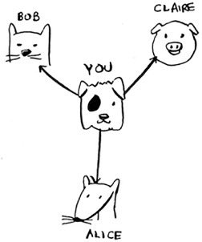
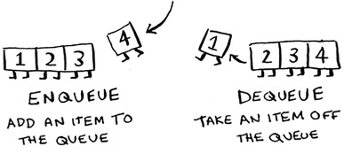
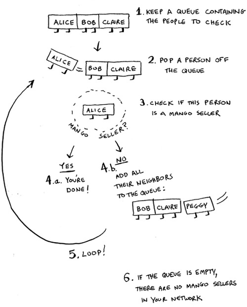
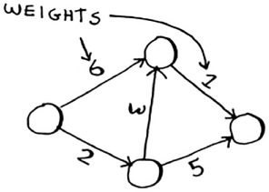
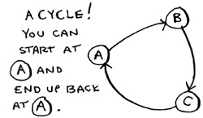
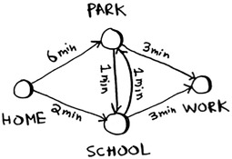
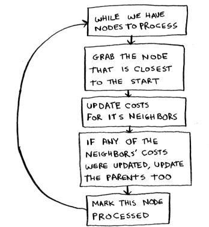

[toc]


# Preface

I first got into programming as a hobby. *Visual Basic 6 for Dummies* taught me the basics, and I kept reading books to learn more. But the subject of algorithms was impenetrable for me. I remember savoring the table of contents of my first algorithms book, thinking “I’m finally going to understand these topics!” But it was dense stuff, and I gave up after a few weeks. It wasn’t until I had my first good algorithms professor that I realized how simple and elegant these ideas were.

> 我第一次接触编程是作为一种爱好。*Visual Basic 6 for Dummies*教会了我一些基础知识，我不断地阅读书籍以了解更多。但是，算法的主题对我来说是难以捉摸的。我记得我仔细阅读了第一本算法书的目录，认为 "我终于可以理解这些主题了！"。但这是很密集的东西，几周后我就放弃了。直到我有了第一个好的算法教授，我才意识到这些想法是多么简单和优雅。

A few years ago, I wrote my first illustrated blog post. I’m a visual learner, and I really liked the illustrated style. Since then, I’ve written a few illustrated posts on functional programming, Git, machine learning, and concurrency. By the way: I was a mediocre writer when I started out. Explaining technical concepts is hard. Coming up with good examples takes time, and explaining a difficult concept takes time. So it’s easiest to gloss over the hard stuff. I thought I was doing a pretty good job, until after one of my posts got popular, a coworker came up to me and said, “I read your post and I still don’t understand this.” I still had a lot to learn about writing.      

> 几年前，我写了我的第一篇插图博客文章。我是一个视觉学习者，我非常喜欢这种插图风格。从那时起，我写了几篇关于函数式编程、Git、机器学习和并发性的图解文章。顺便说一下。我刚开始的时候是个平庸的作家。解释技术概念是很难的。想出好的例子需要时间，解释一个困难的概念也需要时间。因此，最简单的做法是掩盖困难的东西。我认为我做得很好，直到我的一篇文章受到欢迎后，一位同事走过来对我说："我看了你的文章，我还是不明白。" 关于写作，我还有很多东西要学。

Somewhere in the middle of writing these blog posts, Manning reached out to me and asked if I wanted to write an illustrated book. Well, it turns out that Manning editors know a lot about explaining technical concepts, and they taught me how to teach. I wrote this book to scratch a particular itch: I wanted to write a book that explained hard technical topics well, and I wanted an easy-to-read algorithms book. My writing has come a long way since that first blog post, and I hope you find this book an easy and informative read.

> 在写这些博客文章的中间某个地方，曼宁公司联系了我，问我是否想写一本插图书。好吧，事实证明，曼宁公司的编辑在解释技术概念方面了解很多，他们也教我如何教学。我写这本书是为了挠一个特别的痒处。我想写一本能很好地解释难懂的技术话题的书，而且我想写一本容易阅读的算法书。自第一篇博文以来，我的写作已经有了长足的进步，我希望你能发现这本书是一本轻松而有内容的读物。

## kind of algorithms

binary search 二分查找

recursion

hash tables

graph algorithms: Breadth-first search ([chapter 6](ms-local-stream://EpubReader_AC72D530066DA71DBA289EF8C2FE2E4D915D872E9F520716C4ECA9F5D94B14/Content/OEBPS/kindle_split_012.xhtml#ch06)) and Dijkstra’s algorithm ([chapter 7](ms-local-stream://EpubReader_AC72D530066DA71DBA289EF8C2FE2E4D915D872E9F520716C4ECA9F5D94B14/Content/OEBPS/kindle_split_013.xhtml#ch07)) 

machine learning algorithm: K-nearest neighbors (KNN)

## Data structure

array

linked list


# About this book

This book is designed to be easy to follow. I avoid big leaps of thought. Any time a new concept is introduced, I explain it right away or tell you when I’ll explain it. Core concepts are reinforced with exercises and multiple explanations so that you can check your assumptions and make sure you’re following along.      

> 这本书的设计是为了让人容易理解。我避免大的思维跳跃。任何时候引入一个新的概念，我都会马上解释，或者告诉你我什么时候会解释它。核心概念通过练习和多种解释得到加强，这样你就可以检查你的假设，确保你能跟上。     

I lead with examples. Instead of writing symbol soup, my goal is to make it easy for you to visualize these concepts. I also think we learn best by being able to recall something we already know, and examples make recall easier. So when you’re trying to remember the difference between arrays and linked lists (explained in [chapter 2](ms-local-stream://EpubReader_AC72D530066DA71DBA289EF8C2FE2E4D915D872E9F520716C4ECA9F5D94B14/Content/OEBPS/kindle_split_008.xhtml#ch02)), you can just think about getting seated for a movie. Also, at the risk of stating the obvious, I’m a visual learner. This book is chock-full of images. 

> 我用例子来引导。我的目标是让你轻松地将这些概念可视化，而不是写符号汤。我还认为，我们学习的最好方式是能够回忆起我们已经知道的东西，而例子使回忆更容易。因此，当你试图记住数组和链表之间的区别（在[第二章](ms-local-stream://EpubReader_AC72D530066DA71DBA289EF8C2FE2E4D915D872E9F520716C4ECA9F5D94B14/Content/OEBPS/kindle_split_008.xhtml#ch02)中解释过），你可以只想着入座看电影。另外，冒昧地说一句，我是一个视觉学习者。这本书中充满了图片。

The contents of the book are carefully curated. There’s no need to write a book that covers every sorting algorithm—that’s why we have Wikipedia and Khan Academy. All the algorithms I’ve included are practical. I’ve found them useful in my job as a software engineer, and they provide a good foundation for more complex topics. Happy reading!

> 这本书的内容是经过精心策划的。没有必要写一本涵盖所有排序算法的书--这就是为什么我们有维基百科和可汗学院。我所包含的所有算法都是实用的。我发现它们在我作为软件工程师的工作中很有用，而且它们为更复杂的主题提供了良好的基础。阅读愉快！

## Roadmap

The first three chapters of this book lay the foundations:

- **[Chapter 1](ms-local-stream://EpubReader_AC72D530066DA71DBA289EF8C2FE2E4D915D872E9F520716C4ECA9F5D94B14/Content/OEBPS/kindle_split_007.xhtml#ch01)**—You’ll learn your first practical algorithm: binary search. You also learn to analyze the speed of an algorithm using Big O notation. Big O notation is used throughout the book to analyze how slow or fast an algorithm is.                     
- **[Chapter 2](ms-local-stream://EpubReader_AC72D530066DA71DBA289EF8C2FE2E4D915D872E9F520716C4ECA9F5D94B14/Content/OEBPS/kindle_split_008.xhtml#ch02)**—You’ll learn about two fundamental data structures: arrays and linked lists. These data structures are used throughout the book, and they’re used to make more advanced data structures like hash tables ([chapter 5](ms-local-stream://EpubReader_AC72D530066DA71DBA289EF8C2FE2E4D915D872E9F520716C4ECA9F5D94B14/Content/OEBPS/kindle_split_011.xhtml#ch05)).                     
- **[Chapter 3](ms-local-stream://EpubReader_AC72D530066DA71DBA289EF8C2FE2E4D915D872E9F520716C4ECA9F5D94B14/Content/OEBPS/kindle_split_009.xhtml#ch03)**—You’ll learn about recursion, a handy technique used by many algorithms (such as quicksort, covered in [chapter 4](ms-local-stream://EpubReader_AC72D530066DA71DBA289EF8C2FE2E4D915D872E9F520716C4ECA9F5D94B14/Content/OEBPS/kindle_split_010.xhtml#ch04)).                   

In my experience, Big O notation and recursion are challenging topics for beginners. So I’ve slowed down and spent extra time on these sections.

> 本书的前三章奠定了基础。
>
> - **[第1章](ms-local-stream://EpubReader_AC72D530066DA71DBA289EF8C2FE2E4D915D872E9F520716C4ECA9F5D94B14/Content/OEBPS/kindle_split_007.xhtml#ch01)**-你将学习第一个实用算法：二分查找。你还将学习使用大O符号来分析算法的速度。大O符号在全书中被用来分析一个算法的慢与快。                    
> - **[第2章](ms-local-stream://EpubReader_AC72D530066DA71DBA289EF8C2FE2E4D915D872E9F520716C4ECA9F5D94B14/Content/OEBPS/kindle_split_008.xhtml#ch02)**-你将学习两个基本数据结构：数组和链表。这些数据结构贯穿全书，它们被用来制作更高级的数据结构，如哈希表（[第五章](ms-local-stream://EpubReader_AC72D530066DA71DBA289EF8C2FE2E4D915D872E9F520716C4ECA9F5D94B14/Content/OEBPS/kindle_split_011.xhtml#ch05)）。                    
> - **[Chapter 3](ms-local-stream://EpubReader_AC72D530066DA71DBA289EF8C2FE2E4D915D872E9F520716C4ECA9F5D94B14/Content/OEBPS/kindle_split_009. xhtml#ch03)**-你将学习递归，这是许多算法使用的一种方便的技术（例如quicksort，在[第四章](ms-local-stream://EpubReader_AC72D530066DA71DBA289EF8C2FE2E4D915D872E9F520716C4ECA9F5D94B14/Content/OEBPS/kindle_split_010.xhtml#ch04)中涉及）。                  
>
> 根据我的经验，**大O符号和递归**对初学者来说是具有挑战性的话题。所以我放慢了速度，在这些部分花了额外的时间。

The rest of the book presents algorithms with broad applications:

- **Problem-solving techniques—** Covered in [chapters 4](ms-local-stream://EpubReader_AC72D530066DA71DBA289EF8C2FE2E4D915D872E9F520716C4ECA9F5D94B14/Content/OEBPS/kindle_split_010.xhtml#ch04), [8](ms-local-stream://EpubReader_AC72D530066DA71DBA289EF8C2FE2E4D915D872E9F520716C4ECA9F5D94B14/Content/OEBPS/kindle_split_014.xhtml#ch08), and [9](ms-local-stream://EpubReader_AC72D530066DA71DBA289EF8C2FE2E4D915D872E9F520716C4ECA9F5D94B14/Content/OEBPS/kindle_split_015.xhtml#ch09). If you come across a problem and aren’t sure how to solve it efficiently, try divide and conquer ([chapter 4](ms-local-stream://EpubReader_AC72D530066DA71DBA289EF8C2FE2E4D915D872E9F520716C4ECA9F5D94B14/Content/OEBPS/kindle_split_010.xhtml#ch04)) or dynamic programming ([chapter 9](ms-local-stream://EpubReader_AC72D530066DA71DBA289EF8C2FE2E4D915D872E9F520716C4ECA9F5D94B14/Content/OEBPS/kindle_split_015.xhtml#ch09)). Or you may realize there’s no efficient solution, and get an approximate answer using a greedy algorithm instead ([chapter 8](ms-local-stream://EpubReader_AC72D530066DA71DBA289EF8C2FE2E4D915D872E9F520716C4ECA9F5D94B14/Content/OEBPS/kindle_split_014.xhtml#ch08)).                     
- **Hash tables—** Covered in [chapter 5](ms-local-stream://EpubReader_AC72D530066DA71DBA289EF8C2FE2E4D915D872E9F520716C4ECA9F5D94B14/Content/OEBPS/kindle_split_011.xhtml#ch05). A hash table is a very useful data structure. It contains sets of key and value pairs, like a person’s name and their email address, or a username and the associated password. It’s hard to overstate hash tables’ usefulness. When I want to solve a problem, the two plans of attack I start with are “Can I use a hash table?” and “Can I model this as a graph?”                     
- **Graph algorithms—** Covered in [chapters 6](ms-local-stream://EpubReader_AC72D530066DA71DBA289EF8C2FE2E4D915D872E9F520716C4ECA9F5D94B14/Content/OEBPS/kindle_split_012.xhtml#ch06) and [7](ms-local-stream://EpubReader_AC72D530066DA71DBA289EF8C2FE2E4D915D872E9F520716C4ECA9F5D94B14/Content/OEBPS/kindle_split_013.xhtml#ch07). Graphs are a way to model a network: a social network, or a network of roads, or neurons, or any other set of connections.            Breadth-first search ([chapter 6](ms-local-stream://EpubReader_AC72D530066DA71DBA289EF8C2FE2E4D915D872E9F520716C4ECA9F5D94B14/Content/OEBPS/kindle_split_012.xhtml#ch06)) and Dijkstra’s algorithm ([chapter 7](ms-local-stream://EpubReader_AC72D530066DA71DBA289EF8C2FE2E4D915D872E9F520716C4ECA9F5D94B14/Content/OEBPS/kindle_split_013.xhtml#ch07)) are ways to find the shortest distance between two points in a network: you can use this approach to calculate the degrees of separation between two people or the shortest route to a destination.                     
- **K-nearest neighbors (KNN)—** Covered in [chapter 10](ms-local-stream://EpubReader_AC72D530066DA71DBA289EF8C2FE2E4D915D872E9F520716C4ECA9F5D94B14/Content/OEBPS/kindle_split_016.xhtml#ch10). This is a simple machine-learning algorithm. You can use KNN to build a recommendations system, an OCR engine, a system to predict stock values—anything that involves predicting a value (“We think Adit will rate this movie 4 stars”) or classifying an object (“That letter is a Q”).                     
- **Next steps—** [Chapter 11](ms-local-stream://EpubReader_AC72D530066DA71DBA289EF8C2FE2E4D915D872E9F520716C4ECA9F5D94B14/Content/OEBPS/kindle_split_017.xhtml#ch11) goes over 10 algorithms that would make good further reading.

> 本书的其余部分介绍了具有广泛用途的算法：
>
> - **Problem-solving techniques—** Covered in [chapters 4](ms-local-stream://EpubReader_AC72D530066DA71DBA289EF8C2FE2E4D915D872E9F520716C4ECA9F5D94B14/Content/OEBPS/kindle_split_010. xhtml#ch04), [8](ms-local-stream://EpubReader_AC72D530066DA71DBA289EF8C2FE2E4D915D872E9F520716C4ECA9F5D94B14/Content/OEBPS/kindle_split_014. xhtml#ch08), and [9](ms-local-stream://EpubReader_AC72D530066DA71DBA289EF8C2FE2E4D915D872E9F520716C4ECA9F5D94B14/Content/OEBPS/kindle_split_015.xhtml#ch09). 如果你遇到一个问题，但不确定如何有效地解决它，可以尝试分而治之（[第四章](ms-local-stream://EpubReader_AC72D530066DA71DBA289EF8C2FE2E4D915D872E9F520716C4ECA9F5D94B14/Content/OEBPS/kindle_split_010. xhtml#ch04)) or dynamic programming ([chapter 9](ms-local-stream://EpubReader_AC72D530066DA71DBA289EF8C2FE2E4D915D872E9F520716C4ECA9F5D94B14/Content/OEBPS/kindle_split_015.xhtml#ch09)). 或者你可能意识到没有有效的解决方案，而使用贪婪算法得到一个近似的答案（[第8章](ms-local-stream://EpubReader_AC72D530066DA71DBA289EF8C2FE2E4D915D872E9F520716C4ECA9F5D94B14/Content/OEBPS/kindle_split_014.xhtml#ch08) ）。                    
> - **哈希表-**涵盖在[第五章](ms-local-stream://EpubReader_AC72D530066DA71DBA289EF8C2FE2E4D915D872E9F520716C4ECA9F5D94B14/Content/OEBPS/kindle_split_011.xhtml#ch05)。哈希表是一个非常有用的数据结构。它包含键和值对的集合，如一个人的名字和他们的电子邮件地址，或一个用户名和相关密码。很难夸大哈希表的作用。当我想解决一个问题时，我的两个解决计划是："我可以使用哈希表吗？"和 "我可以把这个问题建模为一个图吗？"                     
> - **图算法-**涵盖在[第6章](ms-local-stream://EpubReader_AC72D530066DA71DBA289EF8C2FE2E4D915D872E9F520716C4ECA9F5D94B14/Content/OEBPS/kindle_split_012. xhtml#ch06) and [7](ms-local-stream://EpubReader_AC72D530066DA71DBA289EF8C2FE2E4D915D872E9F520716C4ECA9F5D94B14/Content/OEBPS/kindle_split_013.xhtml#ch07). 图是对网络进行建模的一种方式：社会网络，或道路网络，或神经元，或任何其他连接的集合。Breadth-first search ([chapter 6](ms-local-stream://EpubReader_AC72D530066DA71DBA289EF8C2FE2E4D915D872E9F520716C4ECA9F5D94B14/Content/OEBPS/kindle_split_012. xhtml#ch06)) and Dijkstra’s algorithm (chapter 7）都是寻找网络中两点之间最短距离的方法：你可以用这种方法来计算两个人之间的分离程度，或者计算到目的地的最短路线。                    
> - **K-最近的邻居（KNN）-**涵盖在第10章。这是一个简单的机器学习算法。你可以用KNN建立一个推荐系统、一个OCR引擎、一个预测股票价值的系统--任何涉及预测价值（"我们认为Adit会给这部电影打4星"）或对物体进行分类（"这个字母是Q"）的东西。                    
> - **下一步-** [第11章](ms-local-stream://EpubReader_AC72D530066DA71DBA289EF8C2FE2E4D915D872E9F520716C4ECA9F5D94B14/Content/OEBPS/kindle_split_017.xhtml#ch11)讲述了10种算法，这些算法将成为很好的进一步阅读。

## How to use this book

The order and contents of this book have been carefully designed. If you’re interested in a topic, feel free to jump ahead. Otherwise, read the chapters in order—they build on each other.      

I strongly recommend executing the code for the examples yourself. I can’t stress this part enough. Just type out my code samples verbatim (or download them from [www.manning.com/books/grokking-algorithms](http://www.manning.com/books/grokking-algorithms) or https://github.com/egonschiele/grokking_algorithms), and execute them. You’ll retain a lot more if you do.          

I also recommend doing the exercises in this book. The exercises are short—usually just a minute or two, sometimes 5 to 10 minutes. They will help you check your thinking, so you’ll know when you’re off track before you’ve gone too far.

> 本书的顺序和内容都是精心设计的。如果你对某一主题感兴趣，可以随意跳到前面。否则，请按顺序阅读各章--它们是相互关联的。     
>
> 我强烈建议你自己执行例子的代码。我怎么强调这一部分都不为过。只要逐字逐句地打出我的代码样本（或者从[www.manning.com/books/grokking-algorithms](http://www.manning.com/books/grokking-algorithms)或https://github.com/egonschiele/grokking_algorithms)下载它们，然后执行它们。如果你这样做，你会保留更多的东西。         
>
> 我还建议你做这本书中的练习。这些练习很短，通常只有一两分钟，有时是5到10分钟。它们会帮助你检查你的思维，所以你会在你走得太远之前知道你何时偏离了轨道。

## Who should read this book

This book is aimed at anyone who knows the basics of coding and wants to understand algorithms. Maybe you already have a coding problem and are trying to find an algorithmic solution. Or maybe you want to understand what algorithms are useful for. Here’s a short, incomplete list of people who will probably find this book useful:      

- Hobbyist coders                     
- Coding boot camp students                     
- Computer science grads looking for a refresher                     
- Physics/math/other grads who are interested in programming

> 本书针对的是任何了解编码基础知识并想了解算法的人。也许你已经有了一个编码问题，正试图找到一个算法解决方案。或者你想了解算法有什么用处。下面是一个简短的、不完整的名单，可能会发现这本书有用的人。     
>
> - 爱好者编码者                     
> - 编码训练营的学生                     
> - 寻求复习的计算机科学毕业生                     
> - 对编程感兴趣的物理/数学/其他专业的学生

**Code conventions and downloads**

All the code examples in this book use Python 2.7. All code in the book is presented in a fixed-width font like this to separate it from ordinary text. Code annotations accompany some of the listings, highlighting important concepts.

You can download the code for the examples in the book from the publisher’s website at [www.manning.com/books/grokking-algorithms](http://www.manning.com/books/grokking-algorithms) or from https://github.com/egonschiele/grokking_algorithms.       

I believe you learn best when you really enjoy learning—so have fun, and run the code samples!

> 本书中的所有代码实例都使用Python 2.7。书中所有的代码都以固定宽度的字体呈现，像这样将其与普通文本分开。代码注释伴随着一些列表，强调了重要的概念。
>
> 你可以从出版商的网站[www.manning.com/books/grokking-algorithms](http://www.manning.com/books/grokking-algorithms)上下载书中实例的代码，或者从https://github.com/egonschiele/grokking_algorithms。      
>
> 我相信，当你真正享受到学习的乐趣时，你的学习效果是最好的--所以请尽情享受，并运行这些代码样本吧!

**About the author**

*Aditya Bhargava* is a software engineer at Etsy, an online marketplace for handmade goods. He has a master’s degree in computer science from the University of Chicago. He also runs a popular illustrated tech blog at adit.io.      

> *Aditya Bhargava*是Etsy的一名软件工程师，Etsy是一个手工制品的在线市场。他拥有芝加哥大学的计算机科学硕士学位。他还在adit.io经营一个受欢迎的图文并茂的科技博客。   

**Author Online **

Purchase of *Grokking Algorithms* includes free access to a private web forum run by Manning Publications where you can make comments about the book, ask technical         questions, and receive help from the author and from other users. To access the forum and subscribe to it, point your web browser to [www.manning.com/books/grokking-algorithms](http://www.manning.com/books/grokking-algorithms). This page provides information on how to get on the forum once you are registered, what kind of help is available, and the rules of conduct on the forum.    

Manning’s commitment to our readers is to provide a venue where a meaningful dialog between individual readers and between readers and the author can take place. It isn’t a commitment to any specific amount of participation on the part of the author, whose contribution to Author Online remains voluntary (and unpaid). We suggest you try asking the author some challenging questions lest his interest stray! The Author Online forum and the archives of previous discussions will be accessible from the publisher’s website as long as the book is in print.

> 购买*Grokking Algorithms*包括免费访问由Manning Publications管理的私人网络论坛，在这里你可以对该书发表评论，提出技术问题，并从作者和其他用户那里获得帮助。要访问该论坛并订阅它，请将您的网络浏览器指向[www.manning.com/books/grokking-algorithms](http://www.manning.com/books/grokking-algorithms)。本页提供了关于注册后如何进入论坛的信息，有哪些帮助，以及论坛的行为规则。   
>
> 曼宁对读者的承诺是提供一个场所，让个别读者之间以及读者与作者之间可以进行有意义的对话。这不是对作者的任何具体参与量的承诺，作者对作者在线的贡献仍然是自愿的（和无偿的）。我们建议你试着向作者提出一些有挑战性的问题，以免他的兴趣偏离了！"。只要这本书还在印刷，作者在线论坛和以前的讨论档案就可以从出版商的网站上访问。

# **Chapter 1.** **Introduction to Algorithms**

**In this chapter**

- You get a foundation for the rest of the book.                     
- You write your first search algorithm (binary search).                     
- You learn how to talk about the running time of an algorithm (Big O notation).                     
- You’re introduced to a common technique for designing algorithms (recursion).

> **在本章中**
>
> - 你为本书的其余部分打下了基础。                    
> - 你编写了你的第一个搜索算法（二进制搜索）。                    
> - 你学会了如何谈论一个算法的运行时间（Big O符号）。                    
> - 你将了解到设计算法的一种常用技术（递归）。

## **Introduction**

An *algorithm* is a set of instructions for accomplishing a task. Every piece of code could be called an algorithm, but this book covers the more interesting bits. I chose the algorithms in this book for inclusion because they’re fast, or they solve interesting problems, or both. Here are some highlights:      

- [Chapter 1](ms-local-stream://EpubReader_AC72D530066DA71DBA289EF8C2FE2E4D915D872E9F520716C4ECA9F5D94B14/Content/OEBPS/kindle_split_007.xhtml#ch01) talks about binary search and shows how an algorithm can speed up your code. In one example, the number of steps needed goes from 4 billion down to 32!                     
- A GPS device uses graph algorithms (as you’ll learn in [chapters 6](ms-local-stream://EpubReader_AC72D530066DA71DBA289EF8C2FE2E4D915D872E9F520716C4ECA9F5D94B14/Content/OEBPS/kindle_split_012.xhtml#ch06), [7](ms-local-stream://EpubReader_AC72D530066DA71DBA289EF8C2FE2E4D915D872E9F520716C4ECA9F5D94B14/Content/OEBPS/kindle_split_013.xhtml#ch07), and [8](ms-local-stream://EpubReader_AC72D530066DA71DBA289EF8C2FE2E4D915D872E9F520716C4ECA9F5D94B14/Content/OEBPS/kindle_split_014.xhtml#ch08)) to calculate the shortest route to your destination.                     
- You can use dynamic programming (discussed in [chapter 9](ms-local-stream://EpubReader_AC72D530066DA71DBA289EF8C2FE2E4D915D872E9F520716C4ECA9F5D94B14/Content/OEBPS/kindle_split_015.xhtml#ch09)) to write an AI algorithm that plays checkers.    

In each case, I’ll describe the algorithm and give you an example. Then I’ll talk about the running time of the algorithm in Big O notation. Finally, I’ll explore what other types of problems could be solved by the same algorithm.

> *算法*是完成一项任务的一组指令。每一段代码都可以被称为算法，但本书涵盖了更有趣的部分。我选择本书中的算法是因为它们速度快，或者它们能解决有趣的问题，或者两者都是。这里有一些亮点。     
>
> - 第1章谈论了二元查找，并展示了一个算法如何加速你的代码。在一个例子中，所需的步骤数从40亿降到了32个              
> - 一个GPS设备使用图算法（正如你将在[第6章](ms-local-stream://EpubReader_AC72D530066DA71DBA289EF8C2FE2E4D915D872E9F520716C4ECA9F5D94B14/Content/OEBPS/kindle_split_012. xhtml#ch06), 7和8来计算到目的地的最短路线。                    
> - 你可以使用动态编程（在[第9章](ms-local-stream://EpubReader_AC72D530066DA71DBA289EF8C2FE2E4D915D872E9F520716C4ECA9F5D94B14/Content/OEBPS/kindle_split_015.xhtml#ch09)中讨论）来编写一个玩跳棋的AI算法。   
>
> 在每一种情况下，我都会描述该算法并给你一个例子。然后，我将用大O符号谈论算法的运行时间。最后，我将探讨同一算法可以解决哪些其他类型的问题。

### What you’ll learn about performance

The good news is, an implementation of every algorithm in this book is probably available in your favorite language, so you don’t have to write each algorithm yourself! But those implementations are useless if you don’t understand the trade-offs. In this book, you’ll learn to compare trade-offs between different algorithms: Should you use merge sort or quicksort? Should you use an array or a list? Just using a different data structure can make a big difference.

> 好消息是，本书中每一种算法的实现可能在你最喜欢的语言中都有，所以你不必自己去写每一种算法！但是，如果你不明白如何取舍，这些实现就没有用。但是，如果你不了解权衡，这些实现是没有用的。在本书中，你将学会比较不同算法之间的取舍。你应该使用合并排序还是quicksort？你应该使用数组还是列表？只要使用不同的数据结构，就能产生很大的不同。

###  What you’ll learn about solving problems

You’ll learn techniques for solving problems that might have been out of your grasp until now. For example:

- If you like making video games, you can write an AI system that follows the user around using graph algorithms.                     
- You’ll learn to make a recommendations system using k-nearest neighbors.                     
- Some problems aren’t solvable in a timely manner! The part of this book that talks about NP-complete problems shows you how to identify those problems and come up with an algorithm that gives you an approximate answer.                    

More generally, by the end of this book, you’ll know some of the most widely applicable algorithms. You can then use your new knowledge to learn about more specific algorithms for AI, databases, and so on. Or you can take on bigger challenges at work.

> 你会学到解决那些在此之前可能无法掌握的问题的技巧。比如说：
>
> - 如果你喜欢制作视频游戏，你可以编写一个人工智能系统，使用图算法跟随用户走动。                    
> - 你将学会使用k-nearest neighbors制作一个推荐系统。                    
> - 有些问题是无法及时解决的! 本书中关于NP-complete问题的部分向你展示了如何识别这些问题，并想出一个能给你一个近似答案的算法。                   
>
> 更广泛地说，在本书结束时，你会知道一些最广泛适用的算法。然后，你可以利用你的新知识来学习人工智能、数据库等方面的更具体的算法。或者你可以在工作中接受更大的挑战。

**What you need to know**

You’ll need to know basic algebra before starting this book. In particular, take this function: f(*x*) = *x* × 2. What is f(5)? If you answered 10, you’re set.

Additionally, this chapter (and this book) will be easier to follow if you’re familiar with one programming language. All the examples in this book are in Python. If you don’t know any programming languages and want to learn one, choose Python—it’s great for beginners. If you know another language, like Ruby, you’ll be fine.

> 在开始阅读这本书之前，你需要了解基本的代数知识。特别是拿这个函数来说：f(*x*)=*x*×2。f(5)是多少？如果你回答是10，你就可以了。
>
> 此外，如果你熟悉一种编程语言，本章（以及本书）将更容易理解。本书中的所有例子都是用Python语言。如果你不懂任何编程语言，又想学习一种，请选择Python，它很适合初学者。如果你知道另一种语言，如Ruby，你就会很好。

## **Binary search**

Suppose you’re searching for a person in the phone book (what an old-fashioned sentence!). Their name starts with *K*. You could start at the beginning and keep flipping pages until you get to the *K*s. But you’re more likely to start at a page in the middle, because you know the *K*s are going to be near the middle of the phone book.

> 假设你在电话簿中搜索一个人（多么老式的句子！）。他们的名字以*K*开头。你可以从头开始翻，一直翻到*K*。但你更有可能从中间的一页开始，因为你知道*K*的名字会在电话簿的中间附近。

Or suppose you’re searching for a word in a dictionary, and it starts with *O*. Again, you’ll start near the middle.

Now suppose you log on to Facebook. When you do, Facebook has to verify that you have an account on the site. So, it needs to search for your username in its database. Suppose your username is karlmageddon. Facebook could start from the *A*s and search for your name—but it makes more sense for it to begin somewhere in the middle.  

This is a search problem. And all these cases use the same algorithm to solve the problem: *binary search.*

> 或者假设你在字典中搜索一个词，它以*O*开头。同样，你会从靠近中间的位置开始。
>
> 现在，假设你登录到Facebook。当你这样做时，Facebook必须验证你在该网站上有一个账户。因此，它需要在其数据库中搜索你的用户名。假设你的用户名是karlmageddon。Facebook可以从*A*开始搜索你的名字--但它从中间的某个地方开始搜索更有意义。 
>
> 这就是一个搜索问题。而所有这些情况都使用相同的算法来解决这个问题。*二分查找*。

Binary search is an algorithm; its input is a sorted list of elements (I’ll explain later why it needs to be sorted). If an element you’re looking for is in that list, binary search returns the position where it’s located. Otherwise, binary search returns null.

For example:

> 二进制搜索是一种算法；它的输入是一个经过排序的元素列表（我将在后面解释为什么它需要排序）。如果你要找的元素在这个列表中，二进制搜索会返回它所在的位置。否则，二进制搜索返回空。
>
> 比如说

Looking for companies in a phone book with binary search

Here’s an example of how binary search works. I’m thinking of a number between 1 and 100.

> 用二分查找在电话簿中寻找公司
>
> 这里有一个二分查找工作的例子。我想的是一个1到100之间的数字。

You have to try to guess my number in the fewest tries possible. With every guess, I’ll tell you if your guess is too low, too high, or correct.       

Suppose you start guessing like this: 1, 2, 3, 4 .... Here’s how it would go.

> 你必须在尽可能少的尝试中猜出我的号码。每一次猜测，我都会告诉你，你的猜测是太低，太高，还是正确。      
>
> 假设你像这样开始猜。1, 2, 3, 4 .... 事情会是这样的。

A bad approach to number guessing    

This is *simple search* (maybe *stupid search* would be a better term). With each guess, you’re eliminating only one number. If my number was 99, it could take you 99 guesses to get there!

> 猜测数字的糟糕方法    
>
> 这是*简单的搜索*（也许*愚蠢的搜索*是一个更好的术语）。每一次猜测，你都只排除了一个数字。如果我的数字是99，你可能要花99次猜测才能达到目的!

### A better way to search

Here’s a better technique. Start with 50.

Too low, but you just eliminated *half* the numbers! Now you know that 1–50 are all too low. Next guess: 75.

Too high, but again you cut down half the remaining numbers! *With binary search, you guess the middle number and eliminate half the remaining numbers every time*. Next is 63 (halfway between 50 and 75).

This is binary search. You just learned your first algorithm! Here’s how many numbers you can eliminate every time.

Eliminate half the numbers every time with binary search.

Whatever number I’m thinking of, you can guess in a maximum of seven guesses—because you eliminate so many numbers with every guess!

> 这里有一个更好的技巧。从50开始。
>
> 太低了，但你刚刚排除了*一半的*数字！现在你知道1-50都太低了。现在你知道，1-50都是太低了。下一个猜测：75。
>
> 太高了，但是你又一次把剩下的数字减掉了一半！*通过二分查找，你每次都能猜到中间的数字，并消除一半的剩余数字*。接下来是63（50和75之间的一半）。
>
> 这就是二分查找。你刚刚学会了你的第一个算法! 下面是你每次能消除多少个数字。
>
> 每次用二分查找消除一半的数字。
>
> 无论我想的是什么数字，你最多只需猜测七次--因为你每次猜测都能消除这么多的数字!

Suppose you’re looking for a word in the dictionary. The dictionary has 240,000 words. *In the worst case*, how many steps do you think each search will take?

Simple search could take 240,000 steps if the word you’re looking for is the very last one in the book. With each step of binary search, you cut the number of words in half until you’re left with only one word.

So binary search will take 18 steps—a big difference! In general, for any list of *n*, binary search will take log2 *n* steps to run in the worst case, whereas simple search will take *n* steps.

> 假设你要在字典里找一个词。字典中有24万个词。*在最坏的情况下*，你认为每次搜索要花多少步？
>
> 如果你要找的词是书中的最后一个，简单的搜索可能需要24万步。每走一步二分查找，你就把字数减半，直到你只剩下一个字。
>
> 因此，二分查找需要18个步骤--这是一个很大的区别! 一般来说，对于任何*n*的列表，二进制搜索在最坏的情况下需要log<sub>2</sub>^n^步，而简单搜索则需要*n*步。

**Logarithms**

You may not remember what logarithms are, but you probably know what exponentials are. log10 100 is like asking, “How many 10s do we multiply together to get 100?” The answer is 2: 10 × 10. So log10 100 = 2. Logs are the flip of exponentials.

> 你可能不记得什么是对数，但你可能知道什么是指数。"log10 100 "就像问："我们把多少个10相乘得到100？" 答案是2：10×10。所以log10 100=2。对数是指数的翻转。

In this book, when I talk about running time in Big O notation (explained a little later), log always means log2. When you search for an element using simple search, in the worst case you might have to look at every single element. So for a list of 8 numbers, you’d have to check 8 numbers at most. For binary search, you have to check log *n* elements in the worst case. For a list of 8 elements, log 8 == 3, because 23 == 8. So for a list of 8 numbers, you would have to check 3 numbers at most. For a list of 1,024 elements, log 1,024 = 10, because 210 == 1,024. So for a list of 1,024 numbers, you’d have to check 10 numbers at most.

> 在本书中，当我用大O符号（稍后解释）谈论运行时间时，log总是指log2。当你使用简单搜索来搜索一个元素时，在最坏的情况下，你可能不得不查看每一个元素。所以对于一个有8个数字的列表，你最多要检查8个数字。对于二进制搜索，在最坏的情况下，你必须检查log *n*元素。对于一个8个元素的列表，对数8==3，因为23==8，所以对于一个8个数字的列表，你最多只能检查3个数字。对于一个1,024个元素的列表，对数1,024=10，因为210==1,024。所以对于一个1,024个数字的列表，你最多需要检查10个数字。

I’ll talk about log time a lot in this book, so you should understand the concept of logarithms. If you don’t, Khan Academy (khanacademy.org) has a nice video that makes it clear.

Binary search only works when your list is in sorted order. For example, the names in a phone book are sorted in alphabetical order, so you can use binary search to look for a name. What would happen if the names weren’t sorted?

> 我在这本书中会经常谈及对数时间，所以你应该了解对数的概念。如果你不懂，可汗学院（khanacademy.org）有一个很好的视频，可以让你明白。
>
> 二进制搜索只有在你的列表是按排序的情况下才有效。例如，电话簿中的名字是按字母顺序排序的，所以你可以用二进制搜索来寻找一个名字。如果名字没有被排序，会发生什么？

Let’s see how to write binary search in Python. The code sample here uses arrays. If you don’t know how arrays work, don’t worry; they’re covered in the next chapter. You just need to know that you can store a sequence of elements in a row of consecutive buckets called an array. The buckets are numbered starting with 0: the first bucket is at position #0, the second is #1, the         third is #2, and so on.

The binary_search function takes a sorted array and an item. If the item is in the array, the function returns its position. You’ll keep track of what part of the array you have to search through. At the beginning, this is the entire array:

> 让我们看看如何用Python写二进制搜索。这里的代码样本使用了数组。如果你不知道数组是如何工作的，不用担心；它们在下一章中会涉及。你只需要知道你可以把一连串的元素存储在一排连续的桶中，称为数组。这些桶的编号从0开始：第一个桶的位置是#0，第二个是#1，第三个是#2，以此类推。
>
> binary_search函数接收一个排序的数组和一个项目。如果项目在数组中，函数会返回其位置。你将跟踪你要搜索的数组的哪一部分。在开始的时候，这就是整个数组。

Each time, you check the middle element:

> 每一次，你都要检查中间的元素：

If the guess is too low, you update low accordingly:

> 如果猜测太低，你就相应地更新低：

And if the guess is too high, you update high. Here’s the full code:

> 而如果猜测太高，你就更新高。下面是完整的代码：

**Exercises**

**1.1** 

Suppose you have a sorted list of 128 names, and you’re searching through it using binary search. What’s the maximum number of steps it would take?

**1.2** 

Suppose you double the size of the list. What’s the maximum number of steps now?

> **1.1** 
>
> 假设你有一个128个名字的排序列表，你要用二进制搜索来搜索它。它最多需要多少步？
>
> **1.2** 
>
> 假设你把列表的大小增加一倍。现在的最大步数是多少？

### Running time

Any time I talk about an algorithm, I’ll discuss its running time. Generally you want to choose the most efficient algorithm—whether you’re trying to optimize for time or space.

Back to binary search. How much time do you save by using it? Well, the first approach was to check each number, one by one. If this is a list of 100 numbers, it takes up to 100 guesses. If it’s a list of 4 billion numbers, it takes up to 4 billion guesses. So the maximum number of guesses is the same as the size of the list. This is called *linear time*.

Binary search is different. If the list is 100 items long, it takes at most 7 guesses. If the list is 4 billion items, it takes at most 32 guesses. Powerful, eh? Binary search runs in *logarithmic time* (or *log time*, as the natives call it). Here’s a table summarizing our findings today.

> 任何时候，当我谈论一种算法时，我都会讨论它的运行时间。一般来说，你想选择最有效的算法--无论你是想对时间还是空间进行优化。
>
> 回到二分查找。使用它能节省多少时间？好吧，第一个方法是逐一检查每个数字。如果这是一个由100个数字组成的列表，它需要多达100次的猜测。如果这是一个由40亿个数字组成的列表，它最多需要40亿次猜测。因此，最大的猜测次数与列表的大小是一样的。这被称为*线性时间*。
>
> 二分查找则不同。如果列表有100个项目，它最多需要7次猜测。如果列表是40亿个项目，它最多需要32次猜测。很强大，是吗？二分查找在*对数时间*（或*对数时间*，当地人称之为*log time*）内运行。这里有一个表格，总结了我们今天的发现。

## **Big O notation**

*Big O* notation is special notation that tells you how fast an algorithm is. Who cares? Well, it turns out that you’ll use other people’s algorithms often—and when you do, it’s nice to understand how fast or slow they are. In this section, I’ll explain what Big O notation is and give you a list of the most common running times for algorithms using it.

> *大O*符号是特殊符号，告诉你一个算法有多快。谁在乎呢？事实证明，你会经常使用其他人的算法--当你使用时，了解他们的速度有多快或多慢是件好事。在本节中，我将解释什么是大O符号，并给你一个使用它的算法的最常见的运行时间列表。

### Algorithm running times grow at different rates

Bob is writing a search algorithm for NASA. His algorithm will kick in when a rocket is about to land on the Moon, and it will help calculate where to land.

This is an example of how the run time of two algorithms can grow at different rates. Bob is trying to decide between simple search and binary search. The algorithm needs to be both fast and correct. On one hand, binary search is faster. And Bob has only *10 seconds* to figure out where to land—otherwise, the rocket will be off course. On the other hand, simple search is easier to write, and there is less chance of bugs being introduced. And Bob *really* doesn’t want bugs in the code to land a rocket! To be extra careful, Bob decides to time both algorithms with a list of 100 elements.      

Let’s assume it takes 1 millisecond to check one element. With simple search, Bob has to check 100 elements, so the search takes 100 ms to run. On the other hand, he only has to check 7 elements with binary search (log2 100 is roughly 7), so that search takes 7 ms to run. But realistically, the list will have more like a billion elements. If it does, how long will simple search take? How long will binary search take? Make sure you have an answer for each question         before reading on.

Bob runs binary search with 1 billion elements, and it takes 30 ms (log2 1,000,000,000 is roughly 30). “32 ms!” he thinks. “Binary search is about 15 times faster than simple search, because simple search took 100 ms with 100 elements, and binary search took 7 ms. So simple search will take 30 × 15 = 450 ms, right? Way under my threshold of 10 seconds.” Bob decides to go with simple search. Is that the right choice?           

No. Turns out, Bob is wrong. Dead wrong. The run time for simple search with 1 billion items will be 1 billion ms, which is 11 days! The problem is, the run times for binary search and simple search *don’t grow at the same rate*.

> 鲍勃正在为美国宇航局编写一个搜索算法。他的算法将在火箭即将登陆月球时启动，它将帮助计算在哪里登陆。
>
> 这是一个说明两种算法的运行时间如何以不同速度增长的例子。鲍勃正试图在简单搜索和二进制搜索之间做出决定。该算法需要既快又正确。一方面，二进制搜索更快。而且鲍勃只有*10秒的时间来确定降落地点--否则，火箭就会偏离航线。另一方面，简单搜索更容易编写，而且引入错误的机会更少。而鲍勃*真的不希望在代码中出现bug来让火箭着陆! 为了格外小心，鲍勃决定用一个有100个元素的列表对两种算法进行计时。     
>
> 让我们假设检查一个元素需要1毫秒。通过简单的搜索，鲍勃必须检查100个元素，所以搜索需要100毫秒的时间来运行。另一方面，用二进制搜索，他只需要检查7个元素（log2 100大约是7），所以搜索需要7毫秒运行。但现实中，这个列表会有十亿个元素。如果是这样，简单搜索需要多长时间？二进制搜索需要多长时间？在继续阅读之前，请确保你对每个问题都有一个答案。
>
> 鲍勃用10亿个元素运行二进制搜索，需要30毫秒（log2 1,000,000,000大约是30）。"32毫秒！"他想。"二进制搜索比简单搜索快15倍左右，因为简单搜索用100个元素花了100毫秒，而二进制搜索花了7毫秒。所以简单搜索将花费30×15=450毫秒，对吗？远远低于我的阈值10秒。" 鲍勃决定采用简单搜索。这是个正确的选择吗？          
>
> 不，事实证明，鲍勃是错的。大错特错。有10亿个项目的简单搜索的运行时间将是10亿毫秒，也就是11天! 问题是，二进制搜索和简单搜索的运行时间*不会以同样的速度增长*。


Run times grow at very different speeds!

That is, as the number of items increases, binary search takes a little more time to run. But simple search takes a *lot* more time to run. So as the list of numbers gets bigger, binary search suddenly becomes a *lot* faster than simple search. Bob thought binary search was 15 times faster than simple search, but that’s not correct. If the list has 1 billion items, it’s more like 33 million times faster. That’s why it’s not enough to know how long an algorithm takes to run—you need to know how the running time increases as the list size increases. That’s where Big O notation comes in.

Big O notation tells you how fast an algorithm is. For example, suppose you have a list of size *n*. Simple search needs to check each element, so it will take *n* operations. The run time in Big O notation is O(*n*). Where are the seconds? There are none—Big O doesn’t tell you the speed in seconds. *Big O notation lets you compare the number of operations.* It tells you how fast the algorithm grows.

> 也就是说，随着项目数量的增加，二分查找需要更多的时间来运行。但是简单搜索需要*多的时间来运行。因此，随着数字列表越来越大，二进制搜索突然变得比简单搜索快了*多。鲍勃认为二进制搜索比简单搜索快15倍，但这并不正确。如果列表中有10亿个项目，它就会快3300万倍。这就是为什么仅仅知道一个算法的运行时间是不够的，你需要知道随着列表大小的增加，运行时间是如何增加的。这就是大O记号的作用。
>
> 大O符号告诉你一个算法有多快。例如，假设你有一个大小为*n*的列表。简单搜索需要检查每个元素，所以需要*n*次操作。大O记法的运行时间是O(*n*)。秒在哪里？没有--大O并没有告诉你速度是多少秒。*大O符号让你比较操作的数量。*它告诉你算法的增长速度。

Here’s another example. Binary search needs log *n* operations to check a list of size *n*. What’s the running time in Big O notation? It’s O(log *n*). In general, Big O notation is written as follows.

> 这里有另一个例子。二进制搜索需要记录*n*次操作来检查一个大小为*n*的列表。用大O表示的运行时间是多少？是O(log *n*)。一般来说，大O记数法的写法是这样的。

This tells you the number of operations an algorithm will make. It’s called Big O notation because you put a “big O” in front of the number of operations (it sounds like a joke, but it’s true!). 

Now let’s look at some examples. See if you can figure out the run time for these algorithms.

> 这告诉你一个算法将进行多少次运算。它被称为 "大O "符号，因为你在操作数前面加了一个 "大O"（这听起来像个笑话，但这是真的！）。
>
> 现在让我们看看一些例子。看看你是否能计算出这些算法的运行时间。

### Visualizing different Big O run times

Here’s a practical example you can follow at home with a few pieces of paper and a pencil. Suppose you have to draw a grid of 16 boxes.

What’s a good algorithm to draw this grid?

> 这里有一个实际的例子，你可以在家里用几张纸和一支铅笔来做。假设你要画一个由16个盒子组成的网格。
>
> 画这个网格的好算法是什么？

**Algorithm 1**

One way to do it is to draw 16 boxes, one at a time. Remember, Big O notation counts the number of operations. In this example, drawing one box is one operation. You have to draw 16 boxes. How many operations will it take, drawing one box at a time?

It takes 16 steps to draw 16 boxes. What’s the running time for this algorithm?

> **算法1**
>
> 一种方法是画16个盒子，一次一个。记住，大O符号计算的是操作的数量。在这个例子中，画一个盒子就是一个操作。你必须要画16个盒子。每次画一个盒子需要多少次操作？
>
> 绘制16个盒子需要16个步骤。这个算法的运行时间是多少？

**Algorithm 2**    

Try this algorithm instead. Fold the paper.

In this example, folding the paper once is an operation. You just made two boxes with that operation!      

Fold the paper again, and again, and again.

Unfold it after four folds, and you’ll have a beautiful grid! Every fold doubles the number of boxes. You made 16 boxes with 4 operations!

You can “draw” twice as many boxes with every fold, so you can draw 16 boxes in 4 steps. What’s the running time for this algorithm? Come up with running times for both algorithms before moving on.

> **算法2**    
>
> 试试这个算法吧。折叠纸张。
>
> 在这个例子中，把纸折一次是一个操作。你刚刚用这个操作做了两个盒子      
>
> 再折一次，再折一次，再折一次。
>
> 折叠四次后再展开，你就会有一个漂亮的网格了 每折一次，盒子的数量就增加一倍。你用4次操作做了16个盒子!
>
> 你每折一次就可以 "画 "出两倍的盒子，所以你可以用4步画出16个盒子。这个算法的运行时间是多少？在继续之前，请提出两种算法的运行时间。

*Answers:* Algorithm 1 takes O(*n*) time, and algorithm 2 takes O(log *n*) time.

### Big O establishes a worst-case run time

Suppose you’re using simple search to look for a person in the phone book. You know that simple search takes O(*n*) time to run, which means in the worst case, you’ll have to look through every single entry in your phone book. In this case, you’re looking for Adit. This guy is the first entry in your phone book. So you didn’t have to look at every entry—you found it on the first try. Did this algorithm take O(*n*) time? Or did it take O(1) time because you found the person on the first try?

Simple search still takes O(*n*) time. In this case, you found what you were looking for instantly. That’s the best-case scenario. But Big O notation is about the *worst-case* scenario. So you can say that, in the *worst case*, you’ll have to look at every entry in the phone book once. That’s O(*n*) time. It’s a reassurance—you know that simple search will never be slower than O(*n*) time.

> 假设你正在使用简单搜索在电话簿中寻找一个人。你知道简单搜索需要O(*n*)时间来运行，这意味着在最坏的情况下，你必须翻看电话簿中的每一个条目。在这种情况下，你要找的是Adit。这个人是你电话簿中的第一个条目。所以你不必看每一个条目--你第一次就找到了它。这个算法花了O(*n*)时间吗？还是因为你第一次就找到了这个人而花费了O(1)时间？
>
> 简单的搜索仍然需要O(*n*)时间。在这种情况下，你立刻就找到了你要找的东西。这就是最好的情况。但大O符号是关于*糟糕的情况*的场景的。所以你可以说，在*糟糕的情况下*，你必须看一次电话簿中的每一个条目。这就是O(*n*)时间。这是一个保证--你知道简单的搜索永远不会慢于O(*n*)时间。

Along with the worst-case run time, it’s also important to look at the average-case run time. Worst case versus average case is discussed in [chapter 4](ms-local-stream://EpubReader_AC72D530066DA71DBA289EF8C2FE2E4D915D872E9F520716C4ECA9F5D94B14/Content/OEBPS/kindle_split_010.xhtml#ch04).

> 除了最坏情况下的运行时间外，看一下平均情况下的运行时间也很重要。最坏情况与平均情况的对比在第4章中讨论。

### Some common Big O run times

Here are five Big O run times that you’ll encounter a lot, sorted from fastest to slowest:

- O(log *n*), also known as *log time.* Example: Binary search.                     
- O(*n*), also known as *linear time*. Example: Simple search.                     
- O(*n* * log *n*). Example: A fast sorting algorithm, like quicksort (coming up in [chapter 4](ms-local-stream://EpubReader_AC72D530066DA71DBA289EF8C2FE2E4D915D872E9F520716C4ECA9F5D94B14/Content/OEBPS/kindle_split_010.xhtml#ch04)).                     
- O(*n*2). Example: A slow sorting algorithm, like selection sort (coming up in [chapter 2](ms-local-stream://EpubReader_AC72D530066DA71DBA289EF8C2FE2E4D915D872E9F520716C4ECA9F5D94B14/Content/OEBPS/kindle_split_008.xhtml#ch02)).                     
- O(*n*!). Example: A really slow algorithm, like the traveling salesperson (coming up next!).

> 下面是你会经常遇到的五个大O运行时间，从最快到最慢排序：
>
> - O(log *n*)，也被称为*log时间*。例如：二分查找。                    
> - O(*n*)，也被称为*线性时间*。例子：简单搜索。                    
> - O(*n* * log *n*)。例子。快速排序算法，如quicksort（即将在[第四章](ms-local-stream://EpubReader_AC72D530066DA71DBA289EF8C2FE2E4D915D872E9F520716C4ECA9F5D94B14/Content/OEBPS/kindle_split_010.xhtml#ch04)）。                    
> - O(*n*^2^)。例子：一个缓慢的排序算法，如选择排序（即将在第二章）。                    
> - O(*n*!)。例子：一个非常慢的算法，比如旅行推销员（接下来会出现！）。

Suppose you’re drawing a grid of 16 boxes again, and you can choose from 5 different algorithms to do so. If you use the first algorithm, it will take you O(log *n*) time to draw the grid. You can do 10 operations per second. With O(log *n*) time, it will take you 4 operations to draw a grid of 16 boxes (log 16 is 4). So it will take you 0.4 seconds to draw the grid. What if you have to draw 1,024 boxes? It will take you log 1,024 = 10 operations, or 1 second to draw a grid of 1,024 boxes. These numbers are using the first algorithm.

The second algorithm is slower: it takes O(*n*) time. It will take 16 operations to draw 16 boxes, and it will take 1,024 operations to draw 1,024 boxes. How much time is that in seconds?

Here’s how long it would take to draw a grid for the rest of the algorithms, from fastest to slowest:

> 假设你又要画一个由16个盒子组成的网格，你可以从5种不同的算法中进行选择。如果你使用第一种算法，你将花费O(log *n*)时间来绘制网格。你每秒钟可以做10次操作。用O(log *n*)的时间，你将需要4次操作来绘制16个盒子的网格（log 16是4）。所以你需要0.4秒来绘制网格。如果你要画1,024个盒子呢？你将需要对数1,024=10次操作，或1秒来绘制1,024个盒子的网格。这些数字使用的是第一种算法。
>
> 第二种算法更慢：它需要O(*n*)时间。画16个盒子需要16次操作，而画1024个盒子需要1,024次操作。那是多少时间，以秒为单位？
>
> 下面是其余算法绘制一个网格所需的时间，从最快到最慢：


There are other run times, too, but these are the five most common.

This is a simplification. In reality you can’t convert from a Big O run time to a number of operations this neatly, but this is good enough for now. We’ll come back to Big O notation in [chapter 4](ms-local-stream://EpubReader_AC72D530066DA71DBA289EF8C2FE2E4D915D872E9F520716C4ECA9F5D94B14/Content/OEBPS/kindle_split_010.xhtml#ch04), after you’ve learned a few more algorithms. For now, the main takeaways are as follows:

- Algorithm speed isn’t measured in seconds, but **in growth of the number of operations.**                     
- Instead, we talk about how quickly the run time of an algorithm increases as the size of the input increases.                     
- Run time of algorithms is expressed in Big O notation.
- O(log *n*) is faster than O(*n*), but it gets a lot faster as the list of items you’re searching grows.

> 也有其他的运行时间，但这是最常见的五个。
>
> 这是一种简化。在现实中，你不可能如此整齐地从大O运行时间转换为操作数，但现在这已经足够好了。我们会在[第四章](ms-local-stream://EpubReader_AC72D530066DA71DBA289EF8C2FE2E4D915D872E9F520716C4ECA9F5D94B14/Content/OEBPS/kindle_split_010.xhtml#ch04)中再来讨论大O符号，在你学到更多的算法后。就目前而言，主要的收获有以下几点：
>
> - 算法的速度不是以秒为单位，而是以**操作数的增长**来衡量。                    
> - 相反，我们谈论的是随着输入规模的增加，算法的运行时间增加的速度。                    
> - 算法的运行时间用大O符号表示。
> - O(log *n*)比O(*n*)更快，但随着你搜索的项目列表的增加，它的速度也会变快很多。

​      

**Exercises**

Give the run time for each of these scenarios in terms of Big O. 

**1.3** 

You have a name, and you want to find the person’s phone number in the phone book.

**1.4** 

You have a phone number, and you want to find the person’s name in the phone book. (Hint: You’ll have to search through the whole book!)

**1.5** 

You want to read the numbers of every person in the phone book.

**1.6** 

You want to read the numbers of just the *A*s. (This is a tricky one! It involves concepts that are covered more in [chapter 4](ms-local-stream://EpubReader_AC72D530066DA71DBA289EF8C2FE2E4D915D872E9F520716C4ECA9F5D94B14/Content/OEBPS/kindle_split_010.xhtml#ch04). Read the answer—you may be surprised!)

> **练习**
>
> 以大O为单位给出每个场景的运行时间：
>
> **1.3** 
>
> 你有一个名字，你想在电话簿中找到这个人的电话号码。
>
> **1.4** 
>
> 你有一个电话号码，而你想在电话簿中找到这个人的名字。(提示：你必须把整本书都找一遍！)
>
> **1.5** 
>
> 你想读取电话簿中每个人的号码。
>
> **1.6** 
>
> 你要读的只是*A*的数字。(这是个棘手的问题! 它涉及的概念在[第4章](ms-local-stream://EpubReader_AC72D530066DA71DBA289EF8C2FE2E4D915D872E9F520716C4ECA9F5D94B14/Content/OEBPS/kindle_split_010.xhtml#ch04)中涉及较多。阅读答案-你可能会感到惊讶！)

### The traveling salesperson

You might have read that last section and thought, “There’s no way I’ll ever run into an algorithm that takes O(*n*!) time.” Well, let me try to prove you wrong! Here’s an example of an algorithm with a really bad running time. This is a famous problem in computer science, because its growth is appalling and some very smart people think it can’t be improved. It’s called the *traveling salesperson* problem.

You have a salesperson. The salesperson has to go to five cities.

This salesperson, whom I’ll call Opus, wants to hit all five cities while traveling the minimum distance. Here’s one way to do that: look at every possible order in which he could travel to the cities.

> 你可能读了最后一节后想，"我不可能遇到一个需要O(*n*!)时间的算法"。好吧，让我试着证明你是错的! 这里有一个运行时间非常糟糕的算法的例子。这是计算机科学中一个著名的问题，因为它的增长速度令人震惊，而且一些非常聪明的人认为它不能被改进。这就是所谓的*旅行中的销售人员*问题。
>
> 你有一个销售人员。这个销售员必须去五个城市。
>
> 这个销售员，我叫他Opus，想在最短的距离内到达所有五个城市。这里有一个方法：看看他去这些城市的所有可能的顺序。


He adds up the total distance and then picks the path with the lowest distance. There are 120 permutations with 5 cities, so it will take 120 operations to solve the problem for 5 cities. For 6 cities, it will take 720 operations (there are 720 permutations). For 7 cities, it will take 5,040 operations!

> 他把总距离加起来，然后选取距离最小的路径。5个城市有120种排列组合，所以5个城市的问题需要120次运算才能解决。对于6个城市，它将需要720次操作（有720个排列组合）。对于7个城市，将需要5,040次操作!


The number of operations increases drastically.

In general, for *n* items, it will take *n*! (*n* factorial) operations to compute the result. So this is O(*n*!) time, or *factorial time*. It takes a lot of operations for everything except the smallest numbers. Once you’re dealing with 100+ cities, it’s impossible to calculate the answer in time—the Sun will collapse first.

This is a terrible algorithm! Opus should use a different one, right? But he can’t. This is one of the unsolved problems in computer science. There’s no fast known algorithm for it, and smart people think it’s *impossible* to have a smart algorithm for this problem. The best we can do is come up with an approximate solution; see [chapter 10](ms-local-stream://EpubReader_AC72D530066DA71DBA289EF8C2FE2E4D915D872E9F520716C4ECA9F5D94B14/Content/OEBPS/kindle_split_016.xhtml#ch10) for more.

> 操作的数量急剧增加。
>
> 一般来说，对于*n*项，将需要*n*! (*n*阶乘)操作来计算结果。所以这就是O(*n*!)时间，或者说是*因子阶乘*时间。除了最小的数字，其他的都需要大量的操作。一旦你要处理100个以上的城市，就不可能在时间内计算出答案--太阳会首先崩溃。
>
> 这是个糟糕的算法! 奥普斯应该使用一个不同的算法，对吗？但他不能。这是计算机科学中的一个未解决的问题。没有快速的已知算法，而且聪明人认为*不可能*有一个聪明的算法来解决这个问题。我们能做的最好的事情就是想出一个近似的解决方案；更多内容请参见第10章。

One final note: if you’re an advanced reader, check out binary search trees! There’s a brief description of them in the last chapter.

> 最后一点：如果你是一个高级读者，可以看看二分查找树！在最后一章中有对它们的简要描述。

## **Recap**

- Binary search is a lot faster than simple search.                     
- O(log *n*) is faster than O(*n*), but it gets a lot faster once the list of items you’re searching through grows.                     
- Algorithm speed isn’t measured in seconds.                     
- Algorithm times are measured in terms of *growth* of an algorithm.                     
- Algorithm times are written in Big O notation.

> - 二分查找比简单搜索快得多。                    
> - O(log *n*)比O(*n*)快，但一旦你要搜索的项目列表增加，它就会变得快很多。                    
> - 算法速度不是以秒来衡量的。                    
> - 算法时间是以算法的*增长*来衡量的。                    
> - 算法时间是用大O符号写的。

---

# Chapter 2. Selection Sort

**In this chapter**

- You learn about arrays and linked lists—two of the most basic data structures. They’re used absolutely everywhere. You already used arrays in [chapter 1](ms-local-stream://EpubReader_AC72D530066DA71DBA289EF8C2FE2E4D915D872E9F520716C4ECA9F5D94B14/Content/OEBPS/kindle_split_007.xhtml#ch01), and you’ll use them in almost every chapter in this book. Arrays are a crucial topic, so pay attention! But sometimes it’s            better to use a linked list instead of an array. This chapter explains the pros and cons of both so you can decide which one is right for your algorithm.                     
- You learn your first sorting algorithm. A lot of algorithms only work if your data is sorted. Remember binary search? You can run binary search only on a sorted list of elements. This chapter teaches you selection sort. Most languages have a sorting algorithm built in, so you’ll rarely need to write your own version from scratch. But selection sort is a stepping stone to quicksort, which I’ll cover in the next chapter. Quicksort is an important algorithm, and it will be easier to understand if you know one sorting algorithm already.

> **在本章中**
>
> - 你学习数组和链表--两种最基本的数据结构。它们绝对无处不在。你已经在[第1章](ms-local-stream://EpubReader_AC72D530066DA71DBA289EF8C2FE2E4D915D872E9F520716C4ECA9F5D94B14/Content/OEBPS/kindle_split_007.xhtml#ch01)中使用了数组，而且你将在本书的几乎所有章节中使用它们。数组是一个至关重要的话题，所以要注意！在本书中，你会发现，你在使用数组的过程中，会遇到很多问题。但有时使用一个链表而不是数组会更好。本章解释了两者的优点和缺点，这样你就可以决定哪一种适合你的算法了。                    
> - 你学会了你的第一个排序算法。很多算法只有在你的数据被排序后才能工作。还记得二分查找吗？你只能在一个排序的元素列表上运行二分查找。本章将教你选择排序。大多数语言都有一个内置的排序算法，所以你很少需要从头开始编写自己的版本。但选择排序是通向quicksort的垫脚石，我将在下一章介绍。Quicksort是一种重要的算法，如果你已经知道一种排序算法，就会更容易理解它。

**What you need to know**                  

To understand the performance analysis bits in this chapter, you need to know Big O notation and logarithms. If you don’t know those, I suggest you go back and read [chapter 1](ms-local-stream://EpubReader_AC72D530066DA71DBA289EF8C2FE2E4D915D872E9F520716C4ECA9F5D94B14/Content/OEBPS/kindle_split_007.xhtml#ch01). Big O notation will be used throughout the rest of the book.

> **你需要知道的 **              
>
> 为了理解本章的性能分析位，你需要知道大O符号和对数。如果你不知道这些，我建议你回去阅读[第1章](ms-local-stream://EpubReader_AC72D530066DA71DBA289EF8C2FE2E4D915D872E9F520716C4ECA9F5D94B14/Content/OEBPS/kindle_split_007.xhtml#ch01) 。大O符号将在本书的其余部分使用。

## How memory works

Imagine you go to a show and need to check your things. A chest of drawers is available. Each drawer can hold one element. You want to store two things, so you ask for two drawers. You store your two things here. And you’re ready for the show! This is basically how your computer’s memory works. Your computer looks like a giant set of drawers, and each drawer has an address.

> 想象一下，你去参加一个展会，需要检查你的东西。有一个抽屉的箱子。每个抽屉可以容纳一个元素。你想储存两样东西，所以你要求有两个抽屉。你把你的两样东西放在这里。然后你就可以开始表演了! 这基本上就是你的电脑内存的工作方式。你的电脑看起来像一组巨大的抽屉，每个抽屉都有一个地址。

Each time you want to store an item in memory, you ask the computer for some space, and it gives you an address where you can store your item. If you want to store multiple items, there are two basic ways to do so: arrays and lists. I’ll talk about arrays and lists next, as well as the pros and cons of each. There isn’t one right way to store items for every use case, so it’s important to know the differences.

> 每次你想在内存中存储一个项目时，你都会向计算机要一些空间，它就会给你一个可以存储项目的地址。如果你想存储多个项目，有两种基本方法：数组和列表。接下来我将讨论数组和列表，以及它们各自的优点和缺点。对于每一种用例来说，并没有一种正确的方法来存储项目，所以了解其中的区别很重要。

## Arrays and linked list

Sometimes you need to store a list of elements in memory. Suppose you’re writing an app to manage your todos. You’ll want to store the todos as a list in memory.

Should you use an array, or a linked list? Let’s store the todos in an array first, because it’s easier to grasp. Using an array means all your tasks are stored contiguously (right next to each other) in memory.

> 有时你需要在内存中存储一个元素的列表。假设你正在写一个应用程序来管理你的todos。你会想把todos作为一个列表存储在内存中。
>
> 你应该使用一个数组，还是一个链表？让我们先把todos存储在一个数组中，因为它更容易掌握。使用数组意味着你所有的任务都被连续地存储在内存中（彼此紧挨着）。

Now suppose you want to add a fourth task. But the next drawer is taken up by someone else’s stuff!

> 现在假设你想增加第四项任务。但下一个抽屉被别人的东西占据了!


It’s like going to a movie with your friends and finding a place to sit—but another friend joins you, and there’s no place for them. You have to move to a new spot where you all fit. In this case, you need to ask your computer for a different chunk of memory that can fit four tasks. Then you need to move all your tasks there.   

If another friend comes by, you’re out of room again—and you all have to move a second time! What a pain. Similarly, adding new items to an array can be a big pain. If you’re out of space and need to move to a new spot in memory every time, adding a new item will be really slow. One easy fix is to “hold seats”: even if you have only 3 items in your task list, you can ask the computer for 10 slots, just in case. Then you can add 10 items to your task list without having to move. This is a good workaround, but you should be aware of a couple of downsides:  

- You may not need the extra slots that you asked for, and then that memory will be wasted. You aren’t using it, but no one else can use it either.                     
- You may add more than 10 items to your task list and have to move anyway.                            

So it’s a good workaround, but it’s not a perfect solution. Linked lists solve this problem of adding items.

> 这就像和你的朋友一起去看电影，找到一个地方坐下，但另一个朋友加入你，没有地方给他们。你必须移动到一个新的位置，让你们都能坐下。在这种情况下，你需要要求你的电脑提供一个不同的内存块，可以容纳四个任务。然后你需要把你的所有任务移到那里。  
>
> 如果另一个朋友来了，你的空间又不够了--你必须第二次移动！这是多么痛苦的事情。多么痛苦啊。同样，向一个数组添加新的项目也是一个很大的痛苦。如果你没有空间了，而且每次都需要移动到内存中的一个新位置，那么添加一个新项目就会非常慢。一个简单的解决办法是 "保留席位"：即使你的任务列表中只有3个项目，你也可以向计算机要10个插槽，以备不时之需。然后你就可以在你的任务列表中增加10个项目而不必移动。这是一个很好的解决方法，但你应该注意到一些缺点。 
>
> - 你可能不需要你要求的额外插槽，那么这些内存就被浪费了。你没有使用它，但其他人也不能使用它。                    
> - 你可能会在你的任务列表中添加超过10个项目，无论如何都要移动。                           
>
> 所以，这是一个很好的变通办法，但它不是一个完美的解决方案。链表解决了这个添加项目的问题。

### linked lists

With linked lists, your items can be anywhere in memory. Each item stores the address of the next item in the list. A bunch of random memory addresses are linked together.

It’s like a treasure hunt. You go to the first address, and it says, “The next item can be found at address 123.” So you go to address 123, and it says, “The next item can be found at address 847,” and so on. Adding an item to a linked list is easy: you stick it anywhere in memory and store the address with the previous item.

With linked lists, you never have to move your items. You also avoid another problem. Let’s say you go to a popular movie with five of your friends. The six of you are trying to find a place to sit, but the theater is packed. There aren’t six seats together. Well, sometimes this happens with arrays. Let’s say you’re trying to find 10,000 slots for an array. Your memory has 10,000 slots, but it doesn’t have 10,000 slots together. You can’t get space for your array! A linked list is like saying, “Let’s split up and watch the movie.” If there’s space in memory, you have space for your linked list.

If linked lists are so much better at **inserts**, what are arrays good for?

> 使用链接列表，你的项目可以在内存的任何地方。每个项目都存储着列表中下一个项目的地址（也称为指针pointer）。一堆随机的内存地址被链接在一起。
>
> 这就像一个寻宝游戏。你走到第一个地址，它说："下一个项目可以在地址123找到。" 所以你去找地址123，它说，"下一个项目可以在地址847处找到"，以此类推。在一个链表中添加一个项目是很容易的：你把它贴在内存的任何地方，并把地址与前一个项目一起存储。
>
> 有了链表，你永远不必移动你的项目。你还可以避免另一个问题。比方说，你和你的五个朋友去看一部流行的电影。你们六个人想找一个地方坐下，但影院里已经挤满了人。没有六个座位在一起。好吧，有时候阵列也会出现这种情况。假设你想为一个数组找到10,000个槽位。你的内存有10,000个插槽，但它没有10,000个插槽在一起。你无法为你的数组获得空间！这就是所谓的链表。一个链表就像说："让我们分开坐着看电影"。如果内存中有空间，你就有空间给你的链表。
>
> 如果链表在**插入**方面有这么大的优势，那么数组有什么用呢？

### Arrays

Websites with top-10 lists use a scummy tactic to get more page views. Instead of showing you the list on one page, they put one item on each page and make you click Next to get to the next item in the list. For example, Top 10 Best TV Villains won’t show you the entire list on one page. Instead, you start at #10 (Newman), and you have to click Next on each page to reach #1 (Gustavo Fring). This technique gives the websites 10 whole pages on which to show you ads, but it’s boring to click Next 9 times to get to #1. It would be much better if the whole list was on one page and you could click each person’s name for more info.

Linked lists have a similar problem. Suppose you want to read the last item in a linked list. You can’t just read it, because you don’t know what address it’s at. Instead, you have to go to item #1 to get the address for item #2. Then you have to go to item #2 to get the address for item #3. And so on, until you get to the last item. Linked lists are great if you’re going to read all the items one at a time: you can read one item, follow the address to the next item, and so on. But if you’re going to keep jumping around, linked lists are terrible. 

Arrays are different. You know the address for every item in your array. For example, suppose your array contains five items, and you know it starts at address 00. What is the address of item #5?

Simple math tells you: it’s 04. **Arrays are great if you want to read random elements**, because you can look up any element in your array instantly. With a linked list, the elements aren’t next to each other, so you can’t instantly calculate the position of the fifth element in memory—you have to go to the first element to get the address to the second element, then go to the second element to get the address of the third element, and so on until you get to the fifth element.

> 拥有前十名名单的网站使用一种卑鄙的策略来获得更多的页面浏览量。他们不是在一个页面上向你展示名单，而是在每个页面上放一个项目，让你点击 "下一步 "以进入名单的下一个项目。例如，"十大最佳电视恶棍 "不会在一个页面上向你展示整个名单。相反，你从第10位（纽曼）开始，你必须在每一页上点击下一步才能到达第1位（古斯塔夫-福林）。这种技术给网站提供了10个整页来向你展示广告，但要点击9次 "下一步 "才能到达第1位，这很无聊。如果整个名单在一个页面上，你可以点击每个人的名字获得更多信息，那会好得多。
>
> 链表也有一个类似的问题。假设你想读取一个链表中的最后一个项目。你不能直接读它，因为你不知道它在什么地址。相反，你必须转到第1项以获得第2项的地址。然后你必须去找第2项，以得到第3项的地址。以此类推，直到你到达最后一个项目。如果你要一个一个地读所有的项目，链表是很好的：你可以读一个项目，跟着地址到下一个项目，以此类推。但是如果你要不断地跳来跳去，链表就很糟糕了。
>
> 数组则不同。你知道数组中每个项目的地址。例如，假设你的数组包含五个项目，你知道它从地址00开始。5号项的地址是什么？
>
> 简单的数学告诉你：它是04。如果你想**读取随机元素，数组是很好的选择**，因为你可以立即查询数组中的任何元素。对于一个链表，这些元素不是彼此相邻的，所以你不能立即计算出第五个元素在内存中的位置--你必须去第一个元素那里获得第二个元素的地址，然后去第二个元素那里获得第三个元素的地址，以此类推直到你得到第五个元素。

### Terminology

The elements in an array are numbered. This numbering starts from 0, not 1. For example, in this array, 20 is at position 1.

And 10 is at position 0. This usually throws new programmers for a spin. Starting at 0 makes all kinds of array-based code easier to write, so programmers have stuck with it. Almost every programming language you use will number array elements starting at 0. You’ll soon get used to it.

The position of an element is called its *index.* So instead of saying, “20 is at *position* 1,” the correct terminology is, “20 is at *index* 1.” I’ll use *index* to mean *position* throughout this book.      

> 数组中的元素是有编号的。这种编号从0开始，而不是从1开始。例如，在这个数组中，20的位置是1，10的位置是0。
>
> 这通常会让新的程序员感到困惑。从0开始使各种基于数组的代码更容易编写，所以程序员们坚持使用它。几乎所有你使用的编程语言都会从0开始给数组元素编号，你很快就会习惯的。
>
> 一个元素的位置被称为它的*index。*所以不要说 "20在*位置*1"，正确的术语是："20在*index*1"。在本书中，我将使用*index*来表示*位置*。

 

Here are the run times for common operations on arrays and lists.

> 以下是对数组和列表进行常见操作的运行时间。


Question: Why does it take O(*n*) time to insert an element into an array? Suppose you wanted to insert an element at the beginning of an array. How would you do it? How long would it take? Find the answers to these questions in the next section!

> 问题。为什么在一个数组中插入一个元素需要O(*n*)时间？假设你想在一个数组的开头插入一个元素。你会怎么做？要花多长时间？请在下一节找到这些问题的答案!

### Exercise          

**2.1** 

Suppose you’re building an app to keep track of your finances.

Every day, you write down everything you spent money on. At the end of the month, you review your expenses and sum up how much you spent. So, you have lots of inserts and a few reads. Should you use an array or a list?

> **2.1** 
>
> 假设你正在建立一个应用程序来记录你的财务状况。
>
> 每天，你写下所有你花钱的地方。在月末，你回顾你的支出，并总结你花了多少钱。所以，你有很多插入物和一些读取物。你应该使用一个数组还是一个列表？

### Inserting into the middle of a list

Suppose you want your todo list to work more like a calendar. Earlier, you were adding things to the end of the list. Now you want to add them in the order in which they should be done. What’s better if you want to insert elements in the middle: arrays or lists? With lists, it’s as easy as changing what the previous element points to. But for arrays, you have to shift all the rest of the elements down.

And if there’s no space, you might have to copy everything to a new location! Lists are better if you want to insert elements into the middle.

> 假设你想让你的待办事项列表更像一个日历。早些时候，你把事情添加到列表的最后。现在你想按照它们应该完成的顺序来添加它们。如果你想在中间插入元素，哪个更好：数组还是列表？对于列表，这就像改变前一个元素所指向的内容一样简单。但是对于数组来说，你必须把所有剩下的元素往下移。
>
> 如果没有空间，你可能要把所有的东西都复制到一个新的位置! 如果你想在中间插入元素，列表会更好。

### Deletions

What if you want to delete an element? Again, lists are better, because you just need to change what the previous element points to. With arrays, everything needs to be moved up when you delete an element.

Unlike insertions, deletions will always work. Insertions can fail sometimes when there’s no space left in memory. But you can always delete an element.

Here are the run times for common operations on arrays and linked lists.

> 如果你想删除一个元素怎么办？同样，列表是更好的，因为你只需要改变前一个元素所指向的内容。对于数组，当你删除一个元素时，所有的东西都需要被移上去。
>
> 与插入不同，删除总是有效的。当内存中没有剩余空间时，插入有时会失败。但你总是可以删除一个元素。
>
> 下面是数组和链表上常见操作的运行时间。

|           | Arrays | Lists |
| --------- | ------ | ----- |
| Reading   | O(1)   | O(n)  |
| Insertion | O(n)   | O(1)  |
| Deletion  | O(n)   | O(1)  |

It’s worth mentioning that insertions and deletions are O(1) time only if you can instantly access the element to be deleted. It’s a common practice to keep track of the first and last items in a linked list, so it would take only O(1) time to delete those.

Which are used more: arrays or lists? Obviously, it depends on the use case. But arrays see a lot of use because they allow random access. There are two different types of access: *random access* and *sequential access*. Sequential access means reading the elements one by one, starting at the first element. Linked lists can *only* do sequential access. If you want to read the 10th element of a linked list, you have to read the first 9 elements and follow the links to the 10th element. Random access means you can jump directly to the 10th element. You’ll frequently hear me say that arrays are faster at reads. This is because they provide random access. A lot of use cases require random access, so arrays are used a lot. Arrays and lists are used to implement other data structures, too (coming up later in the book).

> 值得一提的是，只有当你能即时访问要删除的元素时，插入和删除才是O(1)时间。通常的做法是跟踪链表中的第一个和最后一个项目，所以删除这些项目只需要O(1)时间。
>
> 哪些是用得比较多的：数组和列表？很明显，这取决于使用情况。但是数组有很多用途，因为它们允许随机访问。有两种不同类型的访问。*随机访问*和*顺序访问*。顺序访问是指从第一个元素开始，一个一个地读取元素。链表*只能*进行顺序访问。如果你想读取一个链表的第10个元素，你必须先读取前9个元素，然后沿着链接到第10个元素。随机访问意味着你可以直接跳到第10个元素。你会经常听到我说，数组的读取速度比较快。这是因为它们提供了随机访问。很多用例都需要随机访问，所以数组被大量使用。数组和列表也被用来实现其他数据结构（本书后面会提到）。

### **Exercises**

**2.2** 

Suppose you’re building an app for restaurants to take customer orders. Your app needs to store a list of orders. Servers  keep adding orders to this list, and chefs take orders off the list and make them. It’s an order queue: servers add orders to the back of the queue, and the chef takes the first order off the queue and cooks it.

Would you use an array or a linked list to implement this queue? (Hint: Linked lists are good for inserts/deletes, and arrays are good for random access. Which one are you going to be doing here?)  

**2.3** 

Let’s run a thought experiment. Suppose Facebook keeps a list of usernames. When someone tries to log in to Facebook, a search is done for their username. If their name is in the list of usernames, they can log in. People log in to Facebook pretty often, so there are a lot of searches through this list of usernames. Suppose Facebook uses binary search to search the list. Binary search needs random access—you need to be able to get to the middle of the list of usernames instantly. Knowing this, would you implement the list as an array or a linked list?

**2.4** 

People sign up for Facebook pretty often, too. Suppose you decided to use an array to store the list of users. What are the downsides of an array for inserts? In particular, suppose you’re using binary search to search for logins. What happens when you add new users to an array?

**2.5** 

In reality, Facebook uses neither an array nor a linked list to store user information. Let’s consider a hybrid data structure: an array of linked lists. You have an array with 26 slots. Each slot points to a linked list. For example, the first slot in the array points to a linked list containing all the usernames starting with a. The second slot points to a linked list               containing all the usernames starting with b, and so on.

Suppose Adit B signs up for Facebook, and you want to add them to the list. You go to slot 1 in the array, go to the linked list for slot 1, and add Adit B at the end. Now, suppose you want to search for Zakhir H. You go to slot 26, which points to a linked list of all the Z names. Then you search through that list to find Zakhir H.

Compare this hybrid data structure to arrays and linked lists. Is it slower or faster than each for searching and inserting? You don’t have to give Big O run times, just whether the new data structure would be faster or slower.

> **2.2** 
>
> 假设你正在为餐馆建立一个接受顾客订单的应用程序。你的应用程序需要存储一个订单的列表。服务员不断向这个列表添加订单，厨师从列表中取出订单并制作。这是一个订单队列：服务员将订单添加到队列的后面，厨师从队列中取出第一份订单并进行烹饪。
>
> 你会用一个数组还是一个链表来实现这个队列？(提示：链表适合插入/删除，而数组适合随机访问。你打算在这里做哪一个？)  
>
> **2.3** 
>
> 让我们做一个思想实验。假设Facebook保留了一个用户名的列表。当有人试图登录Facebook时，会对他们的用户名进行搜索。如果他们的名字出现在用户名列表中，他们就可以登录了。人们经常登录Facebook，所以有大量的搜索通过这个用户名列表。假设Facebook使用二分查找来搜索这个列表。二分查找需要随机访问--你需要能够立即进入到用户名列表的中间位置。知道了这一点，你会把这个列表实现为一个数组还是一个链表？
>
> **2.4** 
>
> 人们注册Facebook的频率也很高。假设你决定使用一个数组来存储用户列表。数组在插入时有什么缺点？特别是，假设你使用二分查找来搜索登录信息。当你向数组添加新的用户时会发生什么？
>
> **2.5** 
>
> 在现实中，Facebook既没有使用数组，也没有使用链表来存储用户信息。让我们考虑一个混合的数据结构：一个链表的数组。你有一个有26个槽的数组。每个槽都指向一个链表。例如，数组中的第一个槽指向一个包含所有以a开头的用户名的链表，第二个槽指向一个包含所有以b开头的用户名的链表，依此类推。
>
> 假设Adit B注册了Facebook，你想把他们加入到列表中。你去数组中的槽1，转到槽1的链表，并在最后添加Adit B。现在，假设你想搜索Zakhir H，你去槽26，它指向一个所有Z名字的链表。然后你在这个列表中搜索，找到Zakhir H。
>
> 将这种混合数据结构与数组和链表进行比较。在搜索和插入方面，它是比各自的速度慢还是快？你不必给出大O的运行时间，只需说明新的数据结构是快还是慢。

## Selection sort

Let’s put it all together to learn your second algorithm: **selection sort**. To follow this section, you need to understand arrays and lists, as well as Big O notation.

Suppose you have a bunch of music on your computer. For each artist, you have a play count.

> 让我们把这一切放在一起，学习你的第二种算法。**选择排序**。要学习这一部分，你需要了解数组和列表，以及大O符号。
>
> 假设你的电脑上有一堆音乐。对于每个艺术家，你有一个播放次数。

| Artist             | Play Count |
| ------------------ | ---------- |
| Radiohead          | 156        |
| Kishore Kumar      | 141        |
| The black keys     | 35         |
| Neutral milk hotel | 94         |
| Beck               | 88         |
| The strokes        | 61         |
| Wilco              | 111        |

You want to sort this list from most to least played, so that you can rank your favorite artists. How can you do it? One way is to go through the list and find the most-played artist. Add that artist to a new list. Do it again to find the next-most-played artist. Keep doing this, and you’ll end up with a sorted list.

Let’s put on our computer science hats and see how long this will take to run. Remember that O(*n*) time means you touch every element in a list once. For example, running simple search over the list of artists means looking at each artist once.

To find the artist with the highest play count, you have to check each item in the list. This takes O(*n*) time, as you just saw. So you have an operation that takes O(*n*) time, and you have to do that *n* times:

This takes O(*n* × *n*) time or O(*n*^2^) time.

> 你想把这个列表从最多到最少的播放量进行排序，这样你就可以对你最喜欢的艺术家进行排名。你如何做到这一点呢？一种方法是浏览列表，找到播放次数最多的艺术家。将该艺术家添加到一个新的列表中。再做一次，找到下一个播放量最高的艺术家。继续这样做，最后你会得到一个分类的列表。
>
> 让我们戴上计算机科学的帽子，看看这需要多长时间来运行。记住，O(*n*)时间意味着你要对列表中的每个元素进行一次操作。例如，在艺术家列表上运行简单搜索意味着对每个艺术家看一次。
>
> 为了找到播放次数最多的艺术家，你必须检查列表中的每一项。这需要O(*n*)时间，正如你刚才看到的。所以你有一个需要O(*n*)时间的操作，而你必须做*n*次。
>
> 这需要O(*n* × *n*)时间或者O(*n*^2^)时间。

Sorting algorithms are very useful. Now you can sort

- Names in a phone book                     
- Travel dates                     
- Emails (newest to oldest)

> 排序算法是非常有用的。现在你可以对
>
> - 电话簿中的名字                     
> - 旅行日期                     
> - 电子邮件（从最新的到最旧的）

**Checking fewer elements each time**

Maybe you’re wondering: as you go through the operations, the number of elements you have to check keeps decreasing. Eventually, you’re down to having to check just one element. So how can the run time still be O(*n*2)? That’s a good question, and the answer has to do with constants in Big O notation. I’ll get into this more in [chapter 4](ms-local-stream://EpubReader_AC72D530066DA71DBA289EF8C2FE2E4D915D872E9F520716C4ECA9F5D94B14/Content/OEBPS/kindle_split_010.xhtml#ch04), but here’s the gist.         

You’re right that you don’t have to check a list of *n* elements each time. You check *n* elements, then *n* – 1, *n* - 2 ... 2, 1. On average, you check a list that has ½ *n* elements. The runtime is O(*n* × ½ *n*). But constants like ½ are ignored in Big O notation (again, see [chapter 4](ms-local-stream://EpubReader_AC72D530066DA71DBA289EF8C2FE2E4D915D872E9F520716C4ECA9F5D94B14/Content/OEBPS/kindle_split_010.xhtml#ch04) for the full discussion), so you just write O(*n* × *n*) or O(*n*^2^).

> 也许你想知道：当你通过操作时，你必须检查的元素的数量不断减少。最终，你将只需要检查一个元素。那么，运行时间怎么可能仍然是O(*n*2)？这是个好问题，答案与大O符号中的常数有关。我会在[第四章](ms-local-stream://EpubReader_AC72D530066DA71DBA289EF8C2FE2E4D915D872E9F520716C4ECA9F5D94B14/Content/OEBPS/kindle_split_010.xhtml#ch04)中详细介绍，但要点在此。        
>
> 你是对的，你不需要每次都检查*n*个元素的列表。你检查了*n*个元素，然后是*n*-1，*n*-2......2，1。 平均来说，你检查的列表有½*n*个元素。运行时间是O（*n* × ½ *n*）。但是像½这样的常数在大O符号中被忽略了（同样，见第四章的完整讨论），所以你只需写O(*n* × *n*)或O(*n*^2^)。

Selection sort is a neat algorithm, but it’s not very fast. Quicksort is a faster sorting algorithm that only takes O(*n* log *n*) time. It’s coming up in the next chapter!

> 选择排序是一种整洁的算法，但它不是非常快。Quicksort是一种更快的排序算法，只需要O(*n* log *n*)时间。它将在下一章中出现!

### Example Code Listing

We didn’t show you the code to sort the music list, but following is some code that will do something very similar: sort an array from smallest to largest. Let’s write a function to find the smallest element in an array:

> 我们没有向你展示对音乐列表进行排序的代码，但下面的一些代码将做一些非常类似的事情：对一个数组从最小到最大进行排序。让我们写一个函数来寻找数组中最小的元素：

Now you can use this function to write selection sort:

> 现在你可以用这个函数来写选择排序：

## recap

- Your computer’s memory is like a giant set of drawers.                     
- When you want to store multiple elements, use an array or a list.                     
- With an array, all your elements are stored right next to each other.                     
- With a list, elements are strewn all over, and one element stores the address of the next one.                     
- Arrays allow fast reads.                     
- Linked lists allow fast inserts and deletes.
- All elements in the array should be the same type (all ints, all doubles, and so on).

> - 你的计算机的内存就像一组巨大的抽屉。                    
> - 当你想存储多个元素时，使用数组或列表。                    
> - 使用数组，所有的元素都紧挨着存储。                    
> - 在列表中，元素散落在各处，一个元素存储下一个元素的地址。                    
> - 数组允许快速读取。                    
> - 链表允许快速插入和删除。
> - 数组中的所有元素应该是相同的类型（所有都是ints，所有都是double，等等）。

array allow fast reads, but not fast manipulate; linked list allow fast manipulate, but not fast reads.

---

# Chapter 3. Recursion

**In this chapter**

- You learn about recursion. Recursion is a coding technique used in many algorithms. It’s a building block for understanding later chapters in this book.                     
- You learn how to break a problem down into a base case and a recursive case. The divide-and-conquer strategy ([chapter 4](ms-local-stream://EpubReader_AC72D530066DA71DBA289EF8C2FE2E4D915D872E9F520716C4ECA9F5D94B14/Content/OEBPS/kindle_split_010.xhtml#ch04)) uses this simple concept to solve hard problems.

> **在本章中**
>
> - 你学习了递归的知识。递归是许多算法中使用的一种编码技术。它是理解本书后面各章的基础。                    
> - 你要学习如何将一个问题分解成一个基本案例和一个递归案例。分割与征服策略（[第4章](ms-local-stream://EpubReader_AC72D530066DA71DBA289EF8C2FE2E4D915D872E9F520716C4ECA9F5D94B14/Content/OEBPS/kindle_split_010.xhtml#ch04)）使用这一简单概念来解决困难问题。

I’m excited about this chapter because it covers *recursion*, an elegant way to solve problems. Recursion is one of my favorite topics, but it’s divisive. People either love it or hate it, or hate it until they learn to love it a few years later. I personally was in that third camp. To make things easier for you, I have some advice:

- This chapter has a lot of code examples. Run the code for yourself to see how it works.                     
- I’ll talk about recursive functions. At least once, step through a recursive function with pen and paper: something like, “Let’s see, I pass 5 into factorial, and then I return 5 times passing 4 into factorial, which is ...,” and so on. Walking through a function like this will teach you how a recursive function works.

This chapter also includes a lot of pseudocode. *Pseudocode* is a high-level description of the problem you’re trying to solve, in code. It’s written like code, but it’s meant to be closer to human speech.

> 我对这一章感到兴奋，因为它涵盖了*递归*，一种解决问题的优雅方式。递归是我最喜欢的话题之一，但它是有分歧的。人们要么喜欢它，要么讨厌它，或者讨厌它，直到几年后学会喜欢它。我个人属于第三种阵营。为了让你更轻松，我有一些建议：
>
> - 这一章有很多的代码例子。自己**运行代码**，看看它是如何工作的。                    
> - 我将谈论递归函数。至少有一次，用**纸笔把一个递归函数走一遍**：比如 "让我看看，我把5传入阶乘，然后我返回5次，把4传入阶乘，这就是......"，等等。通过这样的一个函数，你会学到递归函数是如何工作的。
>
> 本章还包括大量的**伪代码**。*伪代码*是对你要用代码解决的问题的高层次描述。它写得像代码，但它是为了更接近人类的语言。

## Recursion

Suppose you’re digging through your grandma’s attic and come across a mysterious locked suitcase. Grandma tells you that the key for the suitcase is probably in this other box. This box contains more boxes, with more boxes inside those boxes. The key is in a box somewhere. What’s your algorithm to search for the key? Think of an algorithm before you read on.

> 假设你正在挖掘你奶奶的阁楼，发现了一个神秘的上锁行李箱。奶奶告诉你，这个箱子的钥匙可能在另一个箱子里。这个箱子里有更多的箱子，这些箱子里有更多的箱子。钥匙就在某个箱子里。你寻找钥匙的算法是什么？在你继续阅读之前，请想一想算法。

Here’s one approach.

1. Make a pile of boxes to look through.                     
2. Grab a box, and look through it.                     
3. If you find a box, add it to the pile to look through later.                     
4. If you find a key, you’re done!                     
5. Repeat.

> 这里有一个方法。
>
> 1. 做一堆箱子来翻看。                    
> 2. 拿起一个盒子，翻看一下。                    
> 3. 如果你找到了一个箱子，就把它加到这堆箱子里，以后再看。                    
> 4. 如果你找到一把钥匙，你就完成了!                     
> 5. 重复进行。

Here’s an alternate approach.

1. Look through the box.                     
2. If you find a box, go to step 1.                     
3. If you find a key, you’re done!

> 这里有一个替代的方法。
>
> 1. 透过盒子看。                    
> 2. 如果你找到一个盒子，就进入步骤1。                    
> 3. 如果你找到一把钥匙，你就完成了!

Which approach seems easier to you? The first approach uses a while loop. While the pile isn’t empty, grab a box and look through it:

> 哪种方法在你看来更容易？第一种方法使用一个while循环。趁着这堆东西还没空，抓起一个盒子，翻看一下：

The second way uses recursion. *Recursion* is where a function calls itself. Here’s the second way in pseudocode:

> 第二种方式使用递归。*递归*是指一个函数调用自己。下面是第二种方法的伪代码。

Both approaches accomplish the same thing, but the second approach is clearer to me. Recursion is used when it makes the solution clearer. There’s no performance benefit to using recursion; in fact, loops are sometimes better for performance. I like this quote by Leigh Caldwell on Stack Overflow: “Loops may achieve a performance gain for your program. Recursion may achieve a performance gain for your programmer. Choose which is more important in your situation!”[^1^](http://stackoverflow.com/a/72694/139117)

> 这两种方法都是为了完成同样的事情，但对我来说，第二种方法更清晰。递归是在使解决方案更清晰时使用的。使用递归没有任何性能上的好处；事实上，循环有时对性能更好。我喜欢Leigh Caldwell在Stack Overflow上的这句话。"循环可能为你的程序实现性能增益。递归可能为你的程序员实现性能增益。在你的情况下选择哪个更重要！"[^1^](http://stackoverflow.com/a/72694/139117)

Many important algorithms use recursion, so it’s important to understand the concept.

> 许多重要的算法都使用递归，所以理解这个概念很重要。

## Base case and recursive case

Because a recursive function calls itself, it’s easy to write a function incorrectly that ends up in an infinite loop. For example, suppose you want to write a function that prints a countdown, like this:

> 因为递归函数会自己调用自己，所以很容易错误地编写一个函数，最后陷入无限循环。例如，假设你想写一个打印倒计时的函数，像这样：

You can write it recursively, like so:

> 你可以递归地写它，像这样：

Write out this code and run it. You’ll notice a problem: this function will run forever! Infinite loop

> 写出这段代码并运行它。你会注意到一个问题：这个函数会永远运行下去! 无限循环

(Press Ctrl-C to kill your script.)

When you write a recursive function, you have to tell it when to stop recursing. That’s why *every recursive function has two parts: the base case, and the recursive case.* The recursive case is when the function calls itself. The base case is when the function doesn’t call itself again ... so it doesn’t go into an infinite loop. Let’s add a base case to the countdown function:

> 当你写一个递归函数时，你必须告诉它何时停止递归。这就是为什么*每个递归函数都有两个部分：基本情况和递归情况。*递归情况是指函数自己调用自己。基本情况是当函数不再调用自己时......所以它不会进入一个无限循环。让我们给倒计时函数添加一个基本情况：

Now the function works as expected. It goes something like this.

> 现在，该函数按预期工作。它的内容是这样的


## The stack

This section covers the *call stack*. It’s an important concept in programming. The call stack is an important concept in general programming, and it’s also important to understand when using recursion.

Suppose you’re throwing a barbecue. You keep a todo list for the barbecue, in the form of a stack of sticky notes.

> 本节涉及*调用堆栈*。它是编程中的一个重要概念。调用堆栈是一般编程中的一个重要概念，在使用递归时，理解它也很重要。
>
> 假设你正在举办烧烤活动。你为烤肉保留了一个待办事项清单，以便签纸堆的形式。

Remember back when we talked about arrays and lists, and you had a todo list? You could add todo items anywhere to the list or delete random items. The stack of sticky notes is much simpler. When you insert an item, it gets added to the top of the list. When you read an item, you only read the topmost item, and it’s taken off the list. So your todo list has only two actions:         *push* (insert) and *pop* (remove and read).

This data structure is called a *stack*. The stack is a simple data structure. You’ve been using a stack this whole time without realizing it!

> 还记得我们谈论数组和列表时，你有一个待办事项列表吗？你可以在列表的任何地方添加待办事项或删除随机项目。便条纸的堆叠就简单多了。当你插入一个项目时，它被添加到列表的顶部。当你读一个项目时，你只读最上面的项目，然后它就被从列表中拿掉。所以你的待办事项列表只有两个动作：*push*（插入）和*pop*（删除和读取）。
>
> 这个数据结构被称为*栈*。栈是一个简单的数据结构。你一直都在使用堆栈而没有意识到！

### The call stack

Your computer uses a stack internally called the *call stack.* Let’s see it in action. Here’s a simple function:

> 你的计算机在内部使用一个称为*调用堆栈*的堆栈，让我们看看它的作用。这里有一个简单的函数：

This function greets you and then calls two other functions. Here are those two functions:

> 这个函数向你打招呼，然后调用另外两个函数。下面是这两个函数：

Let’s walk through what happens when you call a function. print is a function in Python, but to make things easier for this example, we’re pretending it isn’t. Just play along. Suppose you call greet("maggie"). First, your computer allocates a box of memory for that function call. 

Now let’s use the memory. The variable name is set to “maggie”. That needs to be saved in memory. Every time you make a function call, your computer saves the values for all the variables for that call in memory like this. Next, you print hello, maggie! Then you call greet2("maggie"). Again, your computer allocates a box of memory for this function call.

Your computer is using a stack for these boxes. The second box is added on top of the first one. You print how are you, maggie? Then you return from the function call. When this happens, the box on top of the stack gets popped off.

> 让我们来看看当你调用一个函数时会发生什么。 print 在 Python 中是一个函数，但为了使这个例子更容易，我们假装它不是。就这样玩吧。假设你调用 greet("Maggie")。首先，你的计算机为这个函数调用分配了一箱内存。
>
> 现在让我们来使用这些内存。变量名称被设置为 "maggie"。这需要被保存在内存中。每次你进行函数调用时，你的计算机都会像这样将该调用的所有变量的值保存在内存中。接下来，你打印出hello, maggie! 然后你调用greet2("maggie")。同样，你的电脑为这个函数调用分配了一箱内存。
>
> 你的计算机为这些盒子使用了一个堆栈。第二个盒子被加在第一个盒子的上面。你打印出你好吗，Maggie？然后你从函数调用中返回。当这种情况发生时，堆栈顶部的盒子被弹出。

A box for that function is added to the top of the stack. Then you print ok bye! and return from the function call.

And you’re back to the greet function. There’s nothing else to be done, so you return from the greet function too. This stack, used to save the variables for multiple functions, is called the *call stack*.

> 该函数的一个盒子被添加到堆栈的顶部。然后你打印ok bye！并从函数调用中返回。
>
> 然后你又回到了greet函数。没有其他事情要做，所以你也从greet函数中返回。这个用于保存多个函数的变量的堆栈，被称为*调用堆栈*。

### **Exercise**

**3.1** 

Suppose I show you a call stack like this.

What information can you give me, just based on this call stack?

```Python
def greet(name):
    print("hello, " + name + "!")
    greet2(name)
```

### The call stack with recursion

Recursive functions use the call stack too! Let’s look at this in action with the factorial function. factorial(5) is written as 5!, and it’s defined like this: 5! = 5 * 4 * 3 * 2 * 1. Similarly, factorial(3) is 3 * 2 * 1. Here’s a recursive function to calculate the factorial of a number:

> 递归函数也使用调用堆栈! 让我们用阶乘函数来看看这一点。 阶乘(5)被写成5！，它的定义是这样的。5! = 5 * 4 * 3 * 2 * 1。同样，阶乘(3)是3 * 2 * 1。 这里有一个递归函数来计算一个数字的阶乘：

Now you call fact(3). Let’s step through this call line by line and see how the stack changes. Remember, the topmost box in the stack tells you what call to fact you’re currently on.

> 现在你调用 fact(3)。让我们逐行浏览这个调用，看看堆栈如何变化。记住，堆栈中最上面的方框告诉你目前对fact的调用。

Notice that each call to fact has its own copy of x. You can’t access a different function’s copy of x. 

The stack plays a big part in recursion. In the opening example, there were two approaches to find the key. Here’s the first way again.

> 注意，对fact的每次调用都有它自己的x的副本，你不能访问不同函数的x的副本。
>
> 堆栈在递归中起着重要作用。在开头的例子中，有两种方法可以找到钥匙。这里又是第一种方法。

This way, you make a pile of boxes to search through, so you always know what boxes you still need to search. But in the recursive approach, there’s no pile.

> 这样一来，你就有了一堆要搜索的盒子，所以你总是知道你还需要搜索哪些盒子。但在递归方法中，没有这堆箱子。


If there’s no pile, how does your algorithm know what boxes you still have to look through? Here’s an example.

> 如果没有堆积，你的算法怎么知道你还有哪些箱子需要查看？这里有一个例子。


At this point, the call stack looks like this.

> 在这一点上，调用栈看起来像这样。


The “pile of boxes” is saved on the stack! This is a stack of half-completed function calls, each with its own half-complete list of boxes to look through. Using the stack is convenient because you don’t have to keep track of a pile of boxes yourself—the stack does it for you.

> 这 "一堆箱子 "被保存在堆栈中！这就是为什么我们要把这些箱子放在堆栈中。这是一个半完成的函数调用的堆栈，每个函数都有自己的半完成的盒子列表可以查看。使用堆栈是很方便的，因为你不必自己去跟踪一堆盒子--堆栈为你做了这个。

Using the stack is convenient, but there’s a cost: saving all that info can take up a lot of memory. Each of those function calls takes up some memory, and when your stack is too tall, that means your computer is saving information for many function calls. At that point, you have two options:

- You can rewrite your code to use a loop instead.
- You can use something called *tail recursion*. That’s an advanced recursion topic that is out of the scope of this book. It’s also only supported by some languages, not all.

> 使用堆栈是很方便的，但有一个代价：保存所有这些信息会占用大量的内存。每个函数调用都会占用一些内存，当你的堆栈太高时，这意味着你的计算机正在为许多函数调用保存信息。在这一点上，你有两个选择。
>
> - 你可以重写你的代码，用一个循环来代替。
> - 你可以使用一种叫做 "尾部递归 "的东西。这是一个高级的递归主题，不在本书的讨论范围之内。它也只被一些语言支持，而不是所有语言。

### **Exercise**

**3.2** 

Suppose you accidentally write a recursive function that runs forever. As you saw, your computer allocates memory on the stack for each function call. What happens to the stack when your recursive function runs forever?

> **3.2** 
>
> 假设你不小心写了一个永远运行的递归函数。正如你所看到的，你的计算机为每个函数调用在堆栈中分配内存。当你的递归函数永远运行时，堆栈会发生什么？

## Recap

- Recursion is when a function calls itself.                     
- Every recursive function has two cases: the base case and the recursive case.                     
- A stack has two operations: push and pop.                     
- All function calls go onto the call stack.                     
- The call stack can get very large, which takes up a lot of memory.

> - 递归是指一个函数调用自己。                    
> - 每个递归函数都有两种情况：基本情况和递归情况。                    
> - 栈有两个操作：推和弹。                    
> - 所有的函数调用都会进入调用栈。                    
> - 调用堆栈可以变得非常大，这占用了大量的内存。

---


# Chapter 4. Quicksort

**In this chapter**

- You learn about divide-and-conquer. Sometimes you’ll come across a problem that can’t be solved by any algorithm you’ve learned. When a good algorithmist comes across such a problem, they don’t just give up. They have a toolbox full of techniques they use on the problem, trying to come up with a solution. Divide-and-conquer is the first general technique you learn.                     
- You learn about quicksort, an elegant sorting algorithm that’s often used in practice. Quicksort uses divide-and-conquer.

> **在本章中**
>
> - 你学习分割与征服的知识。有时你会遇到一个你所学的任何算法都无法解决的问题。当一个好的算法师遇到这样的问题时，他们不会轻易放弃。他们有一个工具箱，里面装满了他们在这个问题上使用的技术，试图想出一个解决方案。分而治之是你学习的第一个通用技术。                    
> - 你学习的是quicksort，这是一种优雅的排序算法，在实践中经常使用。Quicksort使用分割与征服的方法。

You learned all about recursion in the last chapter. This chapter focuses on using your new skill to solve problems. We’ll explore *divide and conquer* (D&C), a well-known recursive technique for solving problems.

This chapter really gets into the meat of algorithms. After all, an algorithm isn’t very useful if it can only solve one type of problem. Instead, D&C gives you a new way to think about solving problems. D&C is another tool in your toolbox. When you get a new problem, you don’t have to be stumped. Instead, you can ask, “Can I solve this if I use divide and conquer?”

At the end of the chapter, you’ll learn your first major D&C algorithm: *quicksort*. Quicksort is a sorting algorithm, and a much faster one than selection sort (which you learned in [chapter 2](ms-local-stream://EpubReader_AC72D530066DA71DBA289EF8C2FE2E4D915D872E9F520716C4ECA9F5D94B14/Content/OEBPS/kindle_split_008.xhtml#ch02)). It’s a good example of elegant code.

> 你在上一章中学习了所有关于递归的知识。本章的重点是使用你的新技能来解决问题。我们将探讨*分割与征服*（D&C），这是一种著名的用于解决问题的递归技术。
>
> 这一章真正进入了算法的实质。毕竟，如果一个算法只能解决一种类型的问题，它就不是很有用。相反，D&C为你提供了一种思考解决问题的新方法。D&C是你工具箱中的另一个工具。当你遇到一个新的问题时，你不需要束手无策。相反，你可以问："如果我使用D&C，我能解决这个问题吗？"
>
> 在本章末尾，你将学习第一个主要的D&C算法。*quicksort*。Quicksort是一种排序算法，而且比选择排序（你在[第二章](ms-local-stream://EpubReader_AC72D530066DA71DBA289EF8C2FE2E4D915D872E9F520716C4ECA9F5D94B14/Content/OEBPS/kindle_split_008.xhtml#ch02)中学到的排序算法快很多。） 这是一个优雅代码的好例子。

## Divide & Conquer

D&C can take some time to grasp. So, we’ll do three examples. First I’ll show you a visual example. Then I’ll do a code example that is less pretty but maybe easier. Finally, we’ll go through quicksort, a sorting algorithm that uses D&C.

> D&C可能需要一些时间来掌握。因此，我们将做三个例子。首先，我将向你展示一个视觉上的例子。然后我将做一个不那么漂亮但可能更容易的代码例子。最后，我们将通过quicksort，一种使用D&C的排序算法。

Suppose you’re a farmer with a plot of land(168×64). You want to divide this farm evenly into *square* plots. You want the plots to be as big as possible. So none of these will work. How do you figure out the largest square size you can use for a plot of land? Use the D&C strategy! D&C algorithms are recursive algorithms. To solve a problem using D&C, there are two steps:

**1**. Figure out the base case. This should be the simplest possible case.      

**2**. Divide or decrease your problem until it becomes the base case.

> 假设你是一个拥有一块土地（168×64）的农民。你想把这块农场均匀地划分为*n*个正方形的地块。你希望这些地块越大越好。所以这些方法都行不通。你如何计算出你可以用在一块土地上的最大正方形尺寸？使用D&C策略! D&C算法是递归算法。要用D&C解决问题，有两个步骤。
>
> **1**. 弄清基本情况。这应该是最简单的情况。     
>
> **2**. 分割或减少你的问题，直到它成为基本情况。

Let’s use D&C to find the solution to this problem. What is the largest square size you can use?

> 让我们用D&C来寻找这个问题的解决方案。你能使用的最大正方形尺寸是多少？

First, figure out the base case. The easiest case would be if one side was a multiple of the other side.

Suppose one side is 25 meters (m) and the other side is 50 m. Then the largest box you can use is 25 m × 25 m. You need two of those boxes to divide up the land.      

Now you need to figure out the recursive case. This is where D&C comes in. According to D&C, with every recursive call, you have to reduce your problem. How do you reduce the problem here? Let’s start by marking out the biggest boxes you can use.

> 首先，弄清基本情况。最简单的情况是如果一条边是另一条边的倍数。
>
> 假设一条边是25米（m），另一条边是50米，那么你可以使用的最大的盒子是25米×25米，你需要两个这样的盒子来划分土地。     
>
> 现在你需要弄清楚递归的情况。这就是D&C的作用。根据D&C，每一次递归调用，你都要减少你的问题。你如何减少这里的问题呢？让我们从标记出你可以使用的最大的箱子开始。

You can fit two 640 × 640 boxes in there, and there’s some land still left to be divided. Now here comes the “Aha!” moment. There’s a farm segment left to divide. *Why don’t you apply the same algorithm to this segment?*

So you started out with a 1680 × 640 farm that needed to be split up. But now you need to split up a smaller segment, 640 × 400. If you *find the biggest box that will work for this size, that will be the biggest box that will work for the entire farm.* You just reduced the problem from a 1680 × 640 farm to a 640 × 400 farm!

> 你可以在那里装下两个640×640的盒子，而且还有一些土地有待分割。现在，"啊哈！"的时刻到了。还有一个农场段需要分割。*你为什么不把同样的算法应用到这一段呢？*
>
> 所以你开始时有一个1680×640的农场需要分割。但现在你需要分割一个更小的片段，640 × 400。如果你*找到对这个尺寸有效的最大的盒子，这将是对整个农场有效的最大的盒子。*你刚刚把问题从1680×640的农场减少到640×400的农场！

**Euclid’s algorithm**                  

“If you find the biggest box that will work for this size, that will be the biggest box that will work for the entire farm.” If it’s not obvious to you why this statement is true, don’t worry. It isn’t obvious. Unfortunately, the proof for why it works is a little too long to include in this book, so you’ll just have to believe me that it works. If you want to understand the proof, look up Euclid’s algorithm. The Khan academy has a good explanation here: https://www.khanacademy.org/computing/computer-science/cryptography/modarithmetic/a/the-euclidean-algorithm.

> "如果你找到对这种规模有效的最大盒子，那将是对整个农场有效的最大盒子。" 如果你不明白为什么这句话是真的，不要担心。它并不明显。不幸的是，关于它为什么有效的证明有点太长了，不能写在这本书里，所以你只能相信我，它是有效的。如果你想了解这个证明，可以查一下欧几里得的算法。可汗学院在这里有一个很好的解释：https://www.khanacademy.org/computing/computer-science/cryptography/modarithmetic/a/the-euclidean-algorithm。

Let’s apply the same algorithm again. Starting with a 640 × 400m farm, the biggest box you can create is 400 × 400 m.

And that leaves you with a smaller segment, 400 × 240 m.

And you can draw a box on that to get an even smaller segment, 240 × 160 m.

And then you draw a box on that to get an even *smaller* segment.

Hey, you’re at the base case: 80 is a factor of 160. If you split up this segment using boxes, you don’t have anything left over!

Hey, you’re at the base case: 80 is a factor of 160. If you split up this segment using boxes, you don’t have anything left over! So, for the original farm, the biggest plot size you can use is 80 × 80 m.

> 让我们再次应用同样的算法。从一个640×400米的农场开始，你可以创建的最大方框是400×400米。
>
> 这就给你留下了一个更小的区段，400×240米。
>
> 你可以在上面画一个方框，得到一个更小的区段，240×160米。
>
> 然后你再在这上面画一个方框，得到一个更*小*的线段。
>
> 嘿，你是在基本情况下。80是160的一个系数。如果你用盒子来分割这一段，你就没有任何剩余的东西了！这就是你的想法。
>
> 嘿，你现在是在基本情况下。80是160的一个系数。如果你用箱子分割这一段，你就没有任何剩余的东西了! 所以，对于原来的农场，你可以使用的最大地块面积是80×80米。（其实就是求640和400这两个数的最大公约数）

To recap, here’s how D&C works:

1. Figure out a simple case as the base case.                     
2. Figure out how to reduce your problem and get to the base case.                      

D&C isn’t a simple algorithm that you can apply to a problem. Instead, it’s a way to think about a problem. Let’s do one more example.

> 简而言之，以下是D&C的工作方式。
>
> 1. 想出一个简单的案例作为基础案例。                    
> 2. 想出如何减少你的问题并达到基本情况。                     
>
> D&C并不是一个简单的算法，你可以应用于一个问题。相反，它是一种思考问题的方式。让我们再做一个例子。

You’re given an array of numbers. like: [2, 4, 6]; You have to add up all the numbers and return the total. It’s pretty easy to do this with a loop:

> 给你一个数字数组。比如。[2, 4, 6]; 你必须把所有的数字相加并返回总数。用一个循环来做这件事是很容易的。

But how would you do this with a recursive function?

**Step 1:** Figure out the base case. What’s the simplest array you could get? Think about the simplest case, and then read on. If you get an array with 0 or 1 element, that’s pretty easy to sum up. So that will be the base case.

**Step 2:** You need to move closer to an empty array with every recursive call. How do you reduce your problem size? Here’s one way.

> 但你如何用一个递归函数来做这件事呢？
>
> **第1步：**弄清楚基本情况。你能得到的最简单的数组是什么？想一想最简单的情况，然后继续阅读。如果你得到一个有0或1个元素的数组，那就很容易总结了。所以这将是基本情况。
>
> **第二步：**你需要通过每次递归调用来接近一个空数组。你如何减少问题的大小呢？这里有一个方法。

It’s the same as this.

sum([2,4,5]) = 12; 2+sum([4,6]) = 2+10=12

In either case, the result is 12. But in the second version, you’re passing a smaller array into the sum function. That is, *you decreased the size of your problem!*

Your sum function could work like this.

> 这与此相同。
>
> sum([2,4,5]) = 12; 2+sum([4,6]) = 2+10=12
>
> 无论哪种情况，结果都是12。但在第二个版本中，你将一个较小的数组传入了sum函数。也就是说，*你减少了问题的大小！*。
>
> 你的求和函数可以这样工作。

#give a list, 

if the list is empty, return zero,

otherwise the total sum is the first number in the list + the sum of the rest of the list

Here it is in action.


Remember, recursion keeps track of the state.


**Tip**

When you’re writing a recursive function involving an array, the base case is often an empty array or an array with one element. If you’re stuck, try that first.

> 当你写一个涉及数组的递归函数时，基本情况往往是一个空数组或一个有一个元素的数组。如果你被卡住了，先试试这个。

**Sneak peak at functional programming**                  

“Why would I do this recursively if I can do it easily with a loop?” you may be thinking. Well, this is a sneak peek into functional programming! Functional programming languages like Haskell don’t have loops, so you have to use recursion to write functions like this. If you have a good understanding of recursion, functional languages will be easier to learn. For example,            here’s how you’d write a sum function in Haskell:

> **函数式编程初探**             
>
> 你可能在想："如果我可以用循环来做，为什么还要用递归来做呢？"好吧，这是对函数式编程的一次偷窥! 像Haskell这样的函数式编程语言是没有循环的，所以你必须使用递归来编写这样的函数。如果你对递归有很好的理解，函数式语言就会更容易学习。例如，这里是你如何在Haskell中写一个和函数。

```haskell
sum[] = o
sum(x:xs) = x + (sum xs)
```

Notice that it looks like you have two definitions for the function. The first definition is run when you hit the base case. The second definition runs at the recursive case. You can also write this function in Haskell using an if statement:

> 注意，看起来你有两个函数的定义。第一个定义是在你遇到基本情况时运行。第二个定义在递归情况下运行。你也可以在Haskell中使用if语句来写这个函数。

```haskell
sum arr = if arr == []
            then 0
            else (head arr) + (sum (tail arr))
```

But the first definition is easier to read. Because Haskell makes heavy use of recursion, it includes all kinds of niceties like this to make recursion easy. If you like recursion, or you’re interested in learning a new language, check out Haskell.

> 但第一个定义更容易阅读。因为Haskell大量使用递归，它包括各种像这样的好处，使递归变得简单。如果你喜欢递归，或者你对学习一门新的语言感兴趣，可以去看看Haskell。

### Exercises

**4.1** 

Write out the code for the earlier sum function.            

**4.2** 

Write a recursive function to count the number of items in a list.

**4.3** 

Find the maximum number in a list.   

**4.4** 

Remember binary search from [chapter 1](ms-local-stream://EpubReader_AC72D530066DA71DBA289EF8C2FE2E4D915D872E9F520716C4ECA9F5D94B14/Content/OEBPS/kindle_split_007.xhtml#ch01)? It’s a divide-and-conquer algorithm, too. Can you come up with the base case and recursive case for binary search?

> **4.1** 
>
> 写出前面的和函数的代码。           
>
> **4.2** 
>
> 写一个递归函数来计算一个列表中的项目数。
>
> **4.3** 
>
> 找出一个列表中的最大数量。  
>
> **4.4** 
>
> Remember binary search from [chapter 1](ms-local-stream://EpubReader_AC72D530066DA71DBA289EF8C2FE2E4D915D872E9F520716C4ECA9F5D94B14/Content/OEBPS/kindle_split_007.xhtml#ch01)? 这也是一种分而治之的算法。你能想出二分查找的基本情况和递归情况吗？

## Quicksort

Quicksort is a sorting algorithm. It’s much faster than selection sort and is frequently used in real life. For example, the C standard library has a function called qsort, which is its implementation of quicksort. Quicksort also uses D&C.

> Quicksort是一种排序算法。它比选择排序快得多，而且在现实生活中经常使用。例如，C语言标准库中有一个叫做qsort的函数，这是它对quicksort的实现。Quicksort也使用D&C。

Let’s use quicksort to sort an array. What’s the simplest array that a sorting algorithm can handle (remember my tip from the previous section)? Well, some arrays don’t need to be sorted at all.

Empty arrays and arrays with just one element will be the base case. You can just return those arrays as is—there’s nothing to sort:

> 让我们用quicksort来对一个数组进行排序。一个排序算法能处理的最简单的数组是什么（还记得我在上一节中的提示吗）？好吧，有些数组根本不需要被排序。
>
> 空数组和只有一个元素的数组将是基本情况。你可以按原样返回这些数组--没有什么可排序的。

```python
def quicksort(array):
    if len(array) < 2:
        return array
```

Let’s look at bigger arrays. An array with two elements is pretty easy to sort, too. What about an array of three elements?

Remember, you’re using D&C. So you want to break down this array until you’re at the base case. Here’s how quicksort works. First, pick an element from the array. This element is called the *pivot.*

We’ll talk about how to pick a good pivot later. For now, let’s say the first item in the array is the pivot. Now find the elements smaller than the pivot and the elements larger than the pivot.

> 我们来看看更大的数组。一个有两个元素的数组也是很容易排序的。那么一个有三个元素的数组呢？
>
> 记住，你正在使用D&C。所以你要把这个数组分解，直到你在基本情况下。下面是quicksort的工作方法。首先，从数组中挑选一个元素。这个元素被称为*支点*。
>
> 我们稍后会讨论如何挑选一个好的支点。现在，让我们假设数组中的第一个项目是支点。现在找出比支点小的元素和比支点大的元素。

```python
33 # the pivot
[15,10], 33, []
```


This is called *partitioning.* Now you have      

- A sub-array of all the numbers less than the pivot                     
- The pivot                     
- A sub-array of all the numbers greater than the pivot

> 这被称为*分区。*现在你有      
>
> - 一个包含所有小于枢轴的数字的子数组                     
> - 枢轴                     
> - 一个包含所有大于中枢的数字的子数组

The two sub-arrays aren’t sorted. They’re just partitioned. But if they *were* sorted, then sorting the whole array would be pretty easy.

If the sub-arrays are sorted, then you can combine the whole thing like this—left array + pivot + right array—and you get a sorted array. In this case, it’s [10, 15] + [33] + [] = [10, 15, 33], which is a sorted array.

How do you sort the sub-arrays? Well, the quicksort base case already knows how to sort arrays of two elements (the left sub-array) and empty arrays (the right sub-array). So if you call quicksort on the two sub-arrays and then combine the results, you get a sorted array!

> 这两个子数并没有被排序。它们只是被分区了。但是如果它们*是*排序的，那么对整个数组进行排序就非常容易了。
>
> 如果子数组是排序的，那么你就可以像这样把整个数组结合起来--左数组+中枢+右数组--你就得到了一个排序的数组。在这个例子中，它是[10, 15]+[33]+[]=[10, 15, 33]，这是一个排序的数组。
>
> 你如何对子数组进行排序？嗯，quicksort基例已经知道如何对两个元素的数组（左边的子数组）和空数组（右边的子数组）进行排序。因此，如果你在两个子数组上调用quicksort，然后将结果结合起来，你就得到了一个排序的数组

```python
quicksort([10, 15]) + [33] + quicksort([])
> [10,15,33]
```

This will work with any pivot. Suppose you choose 15 as the pivot instead.

Both sub-arrays have only one element, and you know how to sort those. So now you know how to sort an array of three elements. Here are the steps:

**1**. Pick a pivot.                             

**2**. Partition the array into two sub-arrays: elements less than the pivot and elements greater than the pivot.                     

**3**. Call quicksort recursively on the two sub-arrays.

> 这将适用于任何枢轴。假设你选择15作为支点。
>
> 这两个子数组都只有一个元素，而且你知道如何对这些元素进行排序。所以现在你知道如何对一个有三个元素的数组进行排序。下面是步骤。
>
> **1**. 选择一个支点。                            
>
> **2**. 将数组分成两个子数组：小于支点的元素和大于支点的元素。                    
>
> **3**. 在这两个子数组上递归地调用quicksort。

What about an array of four elements? Suppose you choose 33 as the pivot again. The array on the left has three elements. You already know how to sort an array of three elements: call quicksort on it recursively. So you can sort an array of four elements. And if you can sort an array of four elements, you can sort an array of five elements. Why is that? Suppose you have this array of five elements. Here are all the ways you can partition this array, depending on what pivot you choose.

> 那么一个有四个元素的数组呢？假设你再次选择33作为支点。左边的数组有三个元素。你已经知道如何对三个元素的数组进行排序：递归地调用quicksort。所以你可以对一个四元素的数组进行排序。如果你能对一个四元素的数组进行排序，你就能对一个五元素的数组进行排序。为什么会这样呢？假设你有一个五个元素的数组。下面是你可以分割这个数组的所有方法，取决于你选择的枢轴。

Notice that all of these sub-arrays have somewhere between 0 and 4 elements. And you already know how to sort an array of 0 to 4 elements using quicksort! So no matter what pivot you pick, you can call quicksort recursively on the two sub-arrays.

> 请注意，所有这些子数组的元素都在0到4之间。而你已经知道如何使用quicksort对0到4个元素的数组进行排序了 因此，无论你选择什么支点，你都可以在两个子数组上递归地调用quicksort。

For example, suppose you pick 3 as the pivot. You call quicksort on the sub-arrays. The sub-arrays get sorted, and then you combine the whole thing to get a sorted array. This works even if you choose 5 as the pivot.

This works with any element as the pivot. So you can sort an array of five elements. Using the same logic, you can sort an array of six elements, and so on.

> 例如，假设你选择3作为支点。你在子数组上调用quicksort。子数组被排序，然后你将整个数组合并，得到一个排序的数组。即使你选择5作为支点，这也是有效的。
>
> 这在任何元素作为枢轴的情况下都有效。所以你可以对一个有五个元素的数组进行排序。使用同样的逻辑，你可以对一个有六个元素的数组进行排序，以此类推。

**Inductive proofs**

You just got a sneak peak into *inductive proofs!* Inductive proofs are one way to prove that your algorithm works. Each inductive proof has two steps: the base case and the inductive case. Sound familiar? For example, suppose I want to prove that I can climb to the top of a ladder. In the inductive case, if my legs are on a rung, I can put my legs on the next rung. So if I’m on rung 2, I can climb to rung 3. That’s the inductive case. For the base case, I’ll say that my legs are on rung 1. Therefore, I can climb the entire ladder, going up one rung at a time.            

You use similar reasoning for quicksort. In the base case, I showed that the algorithm works for the base case: arrays of size 0 and 1. In the inductive case, I showed that if quicksort works for an array of size 1, it will work for an array of size 2. And if it works for arrays of size 2, it will work for arrays of size 3, and so on. Then I can say that quicksort will work for all arrays of any size. I won’t go deeper into inductive proofs here, but they’re fun and go hand-in-hand with            D&C.

> 你刚刚偷看了*归纳证明！*归纳证明是证明你的算法有效的一种方法。每个归纳证明都有两个步骤：基本情况和归纳情况。听起来很熟悉吧？例如，假设我想证明我可以爬到一个梯子的顶端。在归纳情况下，如果我的腿在一个梯级上，我可以把我的腿放在下一个梯级上。因此，如果我在第2个梯级上，我可以爬到第3个梯级。这就是归纳的情况。在基本情况下，我说我的腿在1号梯级上。因此，我可以爬上整个梯子，一次爬一个梯子。           
>
> 你对quicksort使用类似的推理。在基本情况下，我表明该算法对基本情况有效：大小为0和1的数组。在归纳情况下，我表明如果quicksort对大小为1的数组有效，它将对大小为2的数组有效。如果它对大小为2的数组有效，那么它对大小为3的数组也会有效，以此类推。那么我可以说，quicksort对所有大小的数组都有效。我不会在这里深入研究归纳证明，但它们很有趣，而且与D&C并行不悖。

Here’s the code for quicksort:

```Python
def quicksort(array):
    if len(array) < 2:
        return array
    else:
        pivot = array[0]
        less = [i for i in array[1:] if i <= pivot]
        greater = [i for i in array[1:] if i > pivot]
        return quicksort(less) + [pivot] + quicksort(greater)
```

## Big O notation revisited

Quicksort is unique because its speed depends on the pivot you choose. Before I talk about quicksort, let’s look at the most common Big O run times again.


Estimates based on a slow computer that performs 10 operations per second

The example times in this chart are estimates if you perform 10 operations per second. These graphs aren’t precise—they’re just there to give you a sense of how different these run times are. In reality, your computer can do way more than 10 operations per second.

Each run time also has an example algorithm attached. Check out selection sort, which you learned in [chapter 2](ms-local-stream://EpubReader_AC72D530066DA71DBA289EF8C2FE2E4D915D872E9F520716C4ECA9F5D94B14/Content/OEBPS/kindle_split_008.xhtml#ch02). It’s O(*n*2). That’s a pretty slow algorithm. 

There’s another sorting algorithm called *merge sort*, which is O(*n* log *n*). Much faster! Quicksort is a tricky case. In the worst case, quicksort takes O(*n*2) time.

> 这个图表中的例子时间是在你每秒执行10次操作的情况下的估计。这些图表并不精确，它们只是让你感觉到这些运行时间的不同。在现实中，你的电脑每秒能做的操作远远超过10个。
>
> 每个运行时间还附有一个算法的例子。看看选择排序，你在[第2章](ms-local-stream://EpubReader_AC72D530066DA71DBA289EF8C2FE2E4D915D872E9F520716C4ECA9F5D94B14/Content/OEBPS/kindle_split_008.xhtml#ch02)中学习的。它是O(*n*^2^)。这是个相当慢的算法。
>
> 还有一种排序算法叫*merge sort*，它是O(*n* log *n*)。要快得多! Quicksort是一个棘手的案例。在最坏的情况下，quicksort需要O(*n*^2^)时间。

It’s as slow as selection sort! But that’s the worst case. In the average case, quicksort takes O(*n* log *n*) time. So you might be wondering:

- What do *worst case* and *average case* mean here?                     
- If quicksort is O(*n* log *n*) on average, but merge sort is O(*n* log *n*) always, why not use merge sort? Isn’t it faster?

> 它就像选择排序一样慢! 但这是最坏的情况。在平均情况下，quicksort需要O(*n* log *n*)时间。所以你可能想知道。
>
> - 这里的*最坏情况*和*平均情况*是什么意思？                    
> - 如果quicksort平均为O(*n* log *n*)，但合并排序总是O(*n* log *n*)，为什么不使用合并排序？它不是更快吗？

### Merge sort vs. quicksort

Suppose you have this simple function to print every item in a list:

> 假设你有这个简单的函数来打印一个列表中的每一个项目：

```py
def print_items(array):
    for item in array:
        print(item)
```

This function goes through every item in the list and prints it out. Because it loops over the whole list once, this function runs in O(*n*) time. Now, suppose you change this function so it sleeps for 1 second before it prints out an item:

> 这个函数遍历列表中的每一项，并将其打印出来。因为它在整个列表上循环一次，这个函数的运行时间为O(*n*)。现在，假设你改变了这个函数，让它在打印出一个项目之前休眠1秒：

```python
from time import sleep
def print_items2(array):
    for item in array:
        sleep(1)
        print(item)
```

Before it prints out an item, it will pause for 1 second. Suppose you print a list of five items using both functions.

> 在它打印出一个项目之前，它将暂停1秒钟。假设你用这两个函数打印一个有五个项目的列表。

```python
array = [2,4,6,8,10]
print_items: 2 4 6 8 10
print_items2: <sleep> 2 <sleep> 4 <sleep> 6 <sleep> 8 <sleep> 10
```

Both functions loop through the list once, so they’re both O(*n*) time. Which one do you think will be faster in practice? I think print_items will be much faster because it doesn’t pause for 1 second before printing an item. So even though both functions are the same speed in Big O notation, print_items is faster in practice. When you write Big O notation like O(*n*), it really means this.

> 两个函数都在列表中循环一次，所以它们都是O(*n*)时间。你认为哪一个在实践中会更快？我认为print_items会快得多，因为它在打印一个项目之前不会停顿1秒钟。因此，尽管两个函数在大O符号中的速度相同，但print_items在实践中更快。当你写下O(*n*)这样的大O符号时，它的真正含义是这样的。

```python
c * n
# c is "some fixed amount of time"
```

c is some fixed amount of time that your algorithm takes. It’s called the *constant*. For example, it might be 10 milliseconds * *n* for print_items versus 1 second * *n* for print_items2. 

You usually ignore that constant, because if two algorithms have different Big O times, the constant doesn’t matter. Take binary search and simple search, for example. Suppose both algorithms had these constants.

> c是你的算法所需要的一些固定的时间量。它被称为*常数*。例如，对于print_items来说，它可能是10毫秒\**n*，而对于print_items2来说是1秒**n*。
>
> 你通常会忽略这个常数，因为如果两个算法有不同的大O时间，这个常数并不重要。以二进制搜索和简单搜索为例。假设两种算法都有这些常数。

```python
simple search: 10ms * n
binary search: 1sec * log n
```

You might say, “Wow! Simple search has a constant of 10 milliseconds, but binary search has a constant of 1 second. Simple search is way faster!” Now suppose you’re searching a list of 4 billion elements. Here are the times.

> 你可能会说，"哇！简单查找的常数是10毫秒，但二分查找的常数是1秒。简单搜索要快得多！" 现在假设你要搜索一个有40亿个元素的列表。下面是时间。

```python
simple search: 10ms * 4 billion = 463 days
binary search: 1sec * 32        = 32 seconds
```

As you can see, binary search is still way faster. That constant didn’t make a difference at all.

But sometimes the constant *can* make a difference. Quicksort versus merge sort is one example. Quicksort has a smaller constant than merge sort. So if they’re         both O(*n* log *n*) time, quicksort is faster. And quicksort is faster in practice because it hits the average case way more often than the worst case.

So now you’re wondering: what’s the average case versus the worst case?

> 正如你所看到的，二分查找仍然快得多。这个常数根本就没有产生什么影响。
>
> 但是，有时常数*可以*产生差异。Quicksort与merge sort的对比就是一个例子。Quicksort的常数比merge sort小。所以如果它们都是O(*n* log *n*)时间，那么quicksort更快。而quicksort在实践中更快，因为它在平均情况下比在最坏的情况下更容易出现。
>
> 所以你现在想知道：平均情况和最坏情况的对比是什么？

### Average case vs. worst case

The performance of quicksort heavily depends on the pivot you choose. Suppose you always choose the first element as the pivot. And you call quicksort with an array that is *already sorted.* Quicksort doesn’t check to see whether the input array is already sorted. So it will still try to sort it.

> quicksort的性能在很大程度上取决于你选择的支点。假设你总是选择第一个元素作为支点。你用一个*已经排序的数组调用quicksort。* Quicksort不会检查输入的数组是否已经排序。所以它仍然会尝试进行排序。

Notice how you’re not splitting the array into two halves. Instead, one of the sub-arrays is always empty. So the call stack is really long. Now instead, suppose you always picked the middle element as the pivot. Look at the call stack now.

> 请注意，你没有把数组分成两半。相反，其中一个子数组始终是空的。所以调用栈真的很长。而现在，假设你总是选择中间的元素作为支点。看看现在的调用栈。


It’s so short! Because you divide the array in half every time, you don’t need to make as many recursive calls. You hit the base case sooner, and the call stack is much shorter.

> 它是如此之短! 因为你每次都把数组分成两半，你不需要做那么多的递归调用。你更快地找到了基本情况，而且调用栈也更短。

The first example you saw is the worst-case scenario, and the second example is the best-case scenario. In the worst case, the stack size is O(*n*). In the best case, the stack size is O(log *n*).      

Now look at the first level in the stack. You pick one element as the pivot, and the rest of the elements are divided into sub-arrays. You touch all eight elements in the array. So this first operation takes O(*n*) time. You touched all eight elements on this level of the call stack. But actually, you touch O(*n*) elements on every level of the call stack.

> 你看到的第一个例子是最坏的情况，而第二个例子是最好的情况。在最坏的情况下，堆栈的大小是O(*n*)。在最好的情况下，栈的大小是O(log *n*)。     
>
> 现在看一下堆栈中的第一层。你挑选一个元素作为支点，其余的元素被分成子数组。你触摸了数组中的所有八个元素。所以这第一个操作需要O(*n*)时间。你触动了这一层调用栈中的所有八个元素。但实际上，你在调用栈的每一层都接触了O(*n*)个元素。

 elements.png)

Even if you partition the array differently, you’re still touching O(*n*) elements every time.

> 即使你以不同的方式对数组进行分区，你仍然每次都在接触O(*n*)元素。


So each level takes O(*n*) time to complete.

> 所以每个关卡需要O(*n*)时间来完成。


In this example, there are O(log *n*) levels (the technical way to say that is, “The height of the call stack is O(log *n*)”). And each level takes O(*n*) time. The entire algorithm will take O(*n*) * O(log *n*) = O(*n* log *n*) time. This is the best-case scenario.

In the worst case, there are O(*n*) levels, so the algorithm will take O(*n*) * O(*n*) = O(*n*2) time.

Well, guess what? I’m here to tell you that the best case is also the average case. *If you always choose a random element in the array as the pivot*, quicksort will complete in O(*n* log *n*) time on average. Quicksort is one of the fastest sorting algorithms out there, and it’s a very good example of D&C.

> 在这个例子中，有O(log *n*)层（技术上的说法是，"调用栈的高度是O(log *n*)"）。而每一级都需要O(*n*)时间。整个算法将花费O(*n*) * O(log *n*) = O(*n* log *n*) 的时间。这是最好的情况。
>
> 在最坏的情况下，有O(*n*)个级别，所以算法将花费O(*n*) * O(*n*) = O(*n*2)的时间。
>
> 那么，你猜怎么着？我在这里要告诉你，最好的情况也是平均情况。*如果你总是在数组中选择一个随机元素作为支点*，那么quicksort将在O(*n* log *n*)时间内平均完成。Quicksort是目前最快的排序算法之一，它是D&C的一个非常好的例子。

### **Exercises**

How long would each of these operations take in Big O notation? 

**4.5** 

Printing the value of each element in an array.   

**4.6** 

Doubling the value of each element in an array.   

**4.7** 

Doubling the value of just the first element in an array.      

**4.8** 

Creating a multiplication table with all the elements in the array. So if your array is [2, 3, 7, 8, 10], you first multiply every element by 2, then multiply every element by 3, then by 7, and so on.

> 用大O符号表示，这些操作各需要多长时间？
>
> **4.5** 
>
> 打印一个数组中每个元素的值。  
>
> **4.6** 
>
> 将数组中的每个元素的值翻倍。
>
> **4.7** 
>
> 将一个数组中的第一个元素的值翻倍。     
>
> **4.8** 
>
> 用数组中的所有元素创建一个乘法表. 因此，如果你的数组是[2, 3, 7, 8, 10]，你首先将每个元素乘以2，然后将每个元素乘以3，再乘以7，依次类推。

## Recap

- D&C works by breaking a problem down into smaller and smaller pieces. If you’re using D&C on a list, the base case is probably an empty array or an array with one element.                     
- If you’re implementing quicksort, choose a random element as the pivot. The average runtime of quicksort is O(*n* log *n*)!                     
- The constant in Big O notation can matter sometimes. That’s why quicksort is faster than merge sort.                     
- The constant almost never matters for simple search versus binary search, because O(log *n*) is so much faster than O(*n*) when your list gets big.

> - D&C的工作原理是将问题分解成越来越小的部分。如果你在一个列表上使用D&C，基本情况可能是一个空数组或一个有一个元素的数组。                    
> - 如果你要实现quicksort，选择一个随机元素作为支点。quicksort的平均运行时间是O(*n* log *n*)!                     
> - 大O符号中的常数有时会很重要。这就是为什么quicksort比merge sort快。                    
> - 对于简单查找和二分查找来说，常数几乎不重要，因为当你的列表变大时，O(log *n*)比O(*n*)快很多。

---

# Chapter 5. Hash Tables

**In this chapter**

- You learn about hash tables, one of the most useful basic data structures. Hash tables have many uses; this chapter covers the common use cases.                     
- You learn about the internals of hash tables: implementation, collisions, and hash functions. This will help you understand how to analyze a hash table’s performance.

> **在本章中**
>
> - 你学习了哈希表，它是最有用的基本数据结构之一。散列表有许多用途；本章涵盖了常见的使用情况。                    
> - 你将了解到哈希表的内部结构：实现、碰撞和hash函数。这将有助于你了解如何分析哈希表的性能。

Suppose you work at a grocery store. When a customer buys produce, you have to look up the price in a book. If the book is unalphabetized, it can take you a long time to look through every single line for *apple*. You’d be doing simple search from [chapter 1](ms-local-stream://EpubReader_AC72D530066DA71DBA289EF8C2FE2E4D915D872E9F520716C4ECA9F5D94B14/Content/OEBPS/kindle_split_007.xhtml#ch01), where you have to look at every line. Do you remember how long that would take? O(*n*) time. If the book is alphabetized, you could run binary search to find the price of an apple. That would only take O(log *n*) time.

> 假设你在一家杂货店工作。当顾客购买农产品时，你必须在一本书上查找价格。如果这本书没有按字母顺序排列，你可能要花很长时间来翻阅每一行的*苹果*。你会从[第1章](ms-local-stream://EpubReader_AC72D530066DA71DBA289EF8C2FE2E4D915D872E9F520716C4ECA9F5D94B14/Content/OEBPS/kindle_split_007.xhtml#ch01)做简单搜索，你必须看每行。你还记得这要花多长时间吗？O(*n*)时间。如果这本书是按字母顺序排列的，你可以运行二分查找来找到一个苹果的价格。这只需要O(log *n*)时间。

As a reminder, there’s a big difference between O(*n*) and O(log *n*) time! Suppose you could look through 10 lines of the book per second. Here’s how long simple search and binary search would take you.

> 作为提醒，O(*n*)和O(log *n*)时间之间有很大的区别! 假设你每秒钟可以翻阅10行书。下面是简单搜索和二分查找会花费你多长时间。


You already know that binary search is darn fast. But as a cashier, looking things up in a book is a pain, even if the book is sorted. You can feel the customer steaming up as you search for items in the book. What you really need is a buddy who has all the names and prices memorized. Then you don’t need to look up anything: you ask her, and she tells you the answer         instantly.

Your buddy Maggie can give you the price in O(1) time for any item, no matter how big the book is. She’s even faster than binary search.

What a wonderful person! How do you get a “Maggie”?

> 你已经知道，二进制搜索是非常快的。但是作为一个收银员，在书中寻找东西是一件很痛苦的事情，即使书是分类的。当你在书中寻找物品时，你能感觉到顾客在冒烟。你真正需要的是一个能记住所有名称和价格的伙伴。这样你就不需要查任何东西了：你问她，她就会立刻告诉你答案。
>
> 你的伙伴麦琪可以在O(1)时间内给你任何物品的价格，不管这本书有多大。她甚至比二分查找还要快。
>
> 多么好的一个人啊! 如何获得 "麦琪"？

Let’s put on our data structure hats. You know two data structures so far: arrays and lists (I won’t talk about stacks because you can’t really “search” for something in a stack). You could implement this book as an array.

> 让我们戴上数据结构的帽子。到目前为止，你知道两种数据结构：数组和列表（我不会谈论堆栈，因为你不能真正在堆栈中 "搜索 "东西）。你可以把这本书作为一个数组来实现。


Each item in the array is really two items: one is the name of a kind of produce, and the other is the price. If you sort this array by name, you can run binary search on it to find the price of an item. So you can find items in O(log *n*) time. But you want to find items in O(1) time. That is, you want to make a “Maggie.” That’s where hash functions come in.

> 数组中的每个项目实际上是两个项目：一个是一种农产品的名称，另一个是价格。如果你按名称对这个数组进行排序，你就可以在上面运行二进制搜索来找到一个项目的价格。所以你可以在O(log *n*)时间内找到物品。但是你想在O(1)时间内找到物品。也就是说，你想做一个 "麦琪"。这就是哈希函数的作用。

## Hash functions

A hash function is a function where you put in a string and you get back a number. *String* here means any kind of data—a sequence of bytes.

> 哈希函数是一个函数，你把一个字符串放进去，你得到一个数字。这里的*String*指的是任何一种数据--一个字节的序列。

In technical terminology, we’d say that a hash function “maps strings to numbers.” You might think there’s no discernable pattern to what number you get out when you put a string in. But there are some requirements for a hash function:      

- It needs to be consistent. For example, suppose you put in “apple” and get back “4”. Every time you put in “apple”, you should get “4” back. Without this, your hash table won’t work.                     
- It should map different words to different numbers. For example, a hash function is no good if it always returns “1” for any word you put in. In the best case, every different word should map to a different number.

> 用技术术语来说，我们会说哈希函数 "将字符串映射为数字"。你可能会认为，当你把一个字符串放进去时，你得到的数字没有任何可识别的模式。但对哈希函数有一些要求。     
>
> - 它必须是一致的。例如，假设你输入了 "苹果"，得到的是 "4"。每次你输入 "苹果"，你都应该得到 "4 "。没有这一点，你的哈希表就不会工作。                    
> - 它应该把不同的词映射到不同的数字。例如，如果一个哈希函数总是为你输入的任何单词返回 "1"，那么它就不是好东西。在最好的情况下，每个不同的词都应该映射到一个不同的数字。

So a hash function maps strings to numbers. What is that good for? Well, you can use it to make your “Maggie”! Start with an empty array: 

> 因此，哈希函数将字符串映射为数字。这有什么用呢？嗯，你可以用它来制作你的 "Maggie"! 从一个空数组开始。

You’ll store all of your prices in this array. Let’s add the price of an apple. Feed “apple” into the hash function. The hash function outputs “3”. So let’s store the price of an apple at index 3 in the array. Let’s add milk. Feed “milk” into the hash function. The hash function says “0”. Let’s store the price of milk at index 0. Keep going, and eventually the whole array will be full of prices.

Now you ask, “Hey, what’s the price of an avocado?” You don’t need to search for it in the array. Just feed “avocado” into the hash function. It tells you that the price is stored at index 4. And sure enough, there it is.

> 你将在这个数组中存储你所有的价格。让我们添加一个苹果的价格。将 "苹果 "输入哈希函数。哈希函数输出 "3"。因此，让我们把苹果的价格存储在数组中的索引3。让我们添加牛奶。将 "牛奶 "输入哈希函数。哈希函数显示 "0"。让我们把牛奶的价格存储在索引0处。继续下去，最终整个数组将充满价格。
>
> 现在你问，"嘿，牛油果的价格是多少？" 你不需要在数组中搜索它。只要把 "牛油果 "输入哈希函数。它告诉你，价格被存储在索引4处。果然，它就在那里。

The hash function tells you exactly where the price is stored, so you don’t have to search at all! This works because      

- The hash function consistently maps a name to the same index. Every time you put in “avocado”, you’ll get the same number back. So you can use it the first time to find where to store the price of an avocado, and then you can use it to find where you stored that price.                     
- The hash function maps different strings to different indexes. “Avocado” maps to index 4. “Milk” maps to index 0. Everything maps to a different slot in the array where you can store its price.                     
- The hash function knows how big your array is and only returns valid indexes. So if your array is 5 items, the hash function doesn’t return 100 ... that wouldn’t be a valid index in the array.

> 哈希函数准确地告诉你价格的存储位置，所以你根本不需要搜索! 这样做的原因是      
>
> - 哈希函数始终将一个名字映射到相同的索引。每次你输入 "牛油果"，你都会得到相同的数字。因此，你可以在第一次使用它来寻找储存牛油果价格的地方，然后你可以使用它来寻找你储存该价格的地方。                    
> - 哈希函数将不同的字符串映射到不同的索引中。"牛油果 "映射到索引4。"牛奶 "映射到索引0。所有东西都映射到数组中不同的槽，你可以在那里存储它的价格。                    
> - 哈希函数知道你的数组有多大，只返回有效的索引。因此，如果你的数组有5个项目，哈希函数不会返回100......那就不是数组中的有效索引。

You just built a “Maggie”! Put a hash function and an array together, and you get a data structure called a *hash table*. A hash table is the first data structure you’ll learn that has some extra logic behind it. Arrays and lists map straight to memory, but hash tables are smarter. They use a hash function to intelligently figure out where to store elements.

Hash tables are probably the most useful complex data structure you’ll learn. They’re also known as hash maps, maps, dictionaries, and associative arrays. And hash tables are fast! Remember our discussion of arrays and linked lists back in [chapter 2](ms-local-stream://EpubReader_AC72D530066DA71DBA289EF8C2FE2E4D915D872E9F520716C4ECA9F5D94B14/Content/OEBPS/kindle_split_008.xhtml#ch02)? You can get an item from an array instantly. And hash tables use an array to store the data, so they’re equally fast.

You’ll probably never have to implement hash tables yourself. Any good language will have an implementation for hash tables. Python has hash tables; they’re called *dictionaries*. You can make a new hash table using the dict function:

> 你刚刚建立了一个 "麦琪"! 把一个哈希函数和一个数组放在一起，你就得到了一个叫做*哈希表*的数据结构。哈希表是你将学习的第一个数据结构，它背后有一些额外的逻辑。数组和列表直接映射到内存，但哈希表更聪明。它们使用一个哈希函数来智能地计算出元素的存储位置。
>
> 哈希表可能是你将要学习的最有用的复杂数据结构。它们也被称为哈希图、地图、字典和关联数组。而且，哈希表的速度非常快! 还记得我们在[第2章](ms-local-stream://EpubReader_AC72D530066DA71DBA289EF8C2FE2E4D915D872E9F520716C4ECA9F5D94B14/Content/OEBPS/kindle_split_008.xhtml#ch02)中对数组和链接列表的讨论吗？你可以立即从一个数组中获得一个项目。而哈希表使用数组来存储数据，所以它们同样快速。
>
> 你可能永远不需要自己去实现哈希表。任何好的语言都会有哈希表的实现。Python 有哈希表；它们被称为 *dictionaries*。你可以使用 dict 函数制作一个新的哈希表：

book is a new hash table. Let’s add some prices to book:

```python
book["apple"] = 0.67    # an apple cost 67 cents
book["milk"] = 1.49
book["avocado"] = 1.49
print(book)
```

Pretty easy! Now let’s ask for the price of an avocado:

```python
print(book["avocado"])
```

A hash table has keys and values. In the book hash, the names of produce are the keys, and their prices are the values. A hash table maps keys to values.

In the next section, you’ll see some examples where hash tables are really useful.

> 一个哈希表有键和值。在这本书中，农产品的名称是键，它们的价格是值。哈希表将键映射到值。
>
> 在下一节中，你会看到一些哈希表真正有用的例子。

### Exercises      

It’s important for hash functions to consistently return the same output for the same input. If they don’t, you won’t be able to find your item after you put it in the hash table!      

Which of these hash functions are consistent?

**5.1**

return "1" for all input: f(x) = 1

**5.2**

return a random number every time: f(x) = rand()

**5.3**

return the index of the next empty slot in the hash table: f(x) = next_empty_slot()

**5.4**

uses the length of the string as the index: f(x) = len(x)

## Use cases

Hash tables are used everywhere. This section will show you a few use cases.

### Using hash tables for lookups

Your phone has a handy phonebook built in. Each name has a phone number associated with it.

Suppose you want to build a phone book like this. You’re mapping people’s names to phone numbers. Your phone book needs to have this functionality:

- Add a person’s name and the phone number associated with that person.                     
- Enter a person’s name, and get the phone number associated with that name.

This is a perfect use case for hash tables! Hash tables are great when you want to

- Create a mapping from one thing to another thing                     
- Look something up                     

Building a phone book is pretty easy. First, make a new hash table:

```python
phone_book = dict()
```

By the way, Python has a shortcut for making a new hash table. You can use two curly braces:

```python
phone_book = {}
```

Let’s add the phone numbers of some people into this phone book:

```python
phone_book["jenny"] = 8675309
phone_book["emergency"] = 911
```

That’s all there is to it! Now, suppose you want to find Jenny’s phone number. Just pass the key in to the hash:

```python
print(phone_book["jenny"])
```

Imagine if you had to do this using an array instead. How would you do it? Hash tables make it easy to model a relationship from one item to another.      

Hash tables are used for lookups on a much larger scale. For example, suppose you go to a website like [http://adit.io](http://adit.io/). Your computer has to translate adit.io to an IP address.

> 想象一下，如果你不得不用一个数组来做这件事。你会怎么做呢？哈希表使得建立一个从一个项目到另一个项目的关系变得容易。     
>
> 哈希表被用于更大规模的查询。例如，假设你去一个网站，如[http://adit.io](http://adit.io/)。你的电脑必须把adit.io翻译成一个IP地址。

adit.io -> 173.255.248.55

For any website you go to, the address has to be translated to an IP address.

Wow, mapping a web address to an IP address? Sounds like a perfect use case for hash tables! This process is called *DNS resolution*. Hash tables are one way to provide this functionality.

### Preventing duplicate entries

Suppose you’re running a voting booth. Naturally, every person can vote just once. How do you make sure they haven’t voted before? When someone comes in to vote, you ask for their full name. Then you check it against the list of people who have voted.

If their name is on the list, this person has already voted—kick them out! Otherwise, you add their name to the list and let them vote. Now suppose a lot of people have come in to vote, and the list of people who have voted is really long.

Each time someone new comes in to vote, you have to scan this giant list to see if they’ve already voted. But there’s a better way: use a hash!      

First, make a hash to keep track of the people who have voted:

> 假设你在经营一个投票站。自然，每个人只能投一次票。你如何确定他们以前没有投过票？当有人来投票时，你要问他们的全名。然后，你将其与已经投票的人的名单进行核对。
>
> 如果他们的名字在名单上，这个人已经投过票了--把他们赶出去！否则，你就把他们的名字加到名单上。否则，你就把他们的名字加到名单上，让他们投票。现在，假设有很多人进来投票，而且已经投票的人的名单非常长。
>
> 每次有新的人进来投票，你都要扫描这个巨大的名单，看看他们是否已经投票了。但是，有一个更好的方法：使用哈希值!      
>
> 首先，建立一个哈希值来跟踪已经投票的人。

```Python
voted = {}
```

When someone new comes in to vote, check if they’re already in the hash:

```python
value = voted.get("tom")
```

The get function returns the value if “tom” is in the hash table. Otherwise, it returns None. You can use this to check if someone has already voted!

Here’s the code:

```python
voted = {}

def check_voter(name):
    if voted.get(name):
        print("kick them out!")
    else:
        voted[name] = True
        print("let them vote!")
```

Let’s test it a few times:

```python
check_voter("tom")
check_voter("mike")
check_voter("mike")
```

The first time Tom goes in, this will print, “let them vote!” Then Mike goes in, and it prints, “let them vote!” Then Mike tries to go a second time, and it prints, “kick them out!”      

Remember, if you were storing these names in a list of people who have voted, this function would eventually become really slow, because it would have to run a simple search over the entire list. But you’re storing their names in a hash table instead, and a hash table instantly tells you whether this person’s name is in the hash table or not. Checking for duplicates is very fast with a hash table.

> 汤姆第一次进去的时候，会打印出 "让他们投票！" 然后迈克进去了，它打印出："让他们投票！" 然后迈克试图第二次进去，它就会打印，"把他们赶出去！"      
>
> 记住，如果你把这些名字存储在一个已经投票的人的列表中，这个函数最终会变得非常慢，因为它必须在整个列表中进行简单的搜索。但是你把他们的名字存储在一个哈希表中，而哈希表会立即告诉你这个人的名字是否在哈希表中。用哈希表检查重复的信息是非常快的。

### Using hash tables as a cache

One final use case: caching. If you work on a website, you may have heard of caching before as a good thing to do. Here’s the idea. Suppose you visit facebook.com:      

1. You make a request to Facebook’s server.                     
2. The server thinks for a second and comes up with the web page to send to you.                     
3. You get a web page.

> 最后一个用例：缓存。如果你在一个网站上工作，你可能已经听说过缓存是一件好事。这是一个想法。假设你访问facebook.com。     
>
> 1. 你向Facebook的服务器发出一个请求。                    
> 2. 2.服务器思考一秒钟，然后想出要发送给你的网页。                    
> 3. 你得到一个网页。

For example, on Facebook, the server may be collecting all of your friends’ activity to show you. It takes a couple of seconds to collect all that activity and shows it to you. That couple of seconds can feel like a long time as a user. You might think, “Why is Facebook being so slow?” On the other hand, Facebook’s servers have to serve millions of people, and that couple of seconds adds up for them. Facebook’s servers are really working hard to serve all of those websites. Is there a way to make Facebook faster and have its servers do less work at the same time? 

Suppose you have a niece who keeps asking you about planets. “How far is Mars from Earth?” “How far is the Moon?” “How far is Jupiter?” Each time, you have to do a Google search and give her an answer. It takes a couple of minutes. Now, suppose she always asked, “How far is the Moon?” Pretty soon, you’d memorize that the Moon is 238,900 miles away. You wouldn’t have to look it up on Google ... you’d just remember and answer. This is how caching works: websites remember the data instead of recalculating it.         

If you’re logged in to Facebook, all the content you see is tailored just for you. Each time you go to facebook.com, its servers have to think about what content you’re interested in. But if you’re not logged in to Facebook, you see the login page. Everyone sees the same login page. 

Facebook is asked the same thing over and over: “Give me the home page when I’m logged out.” So  it stops making the server do work to figure out what the home page looks like. Instead, it memorizes what the home page looks like and sends it to you.

> 例如，在Facebook上，服务器可能正在收集你所有朋友的活动来向你展示。它需要几秒钟的时间来收集所有的活动并向你展示。作为一个用户，这几秒钟的时间可能会感觉很漫长。你可能会想，"为什么Facebook这么慢？" 另一方面，Facebook的服务器必须为数以百万计的人提供服务，这几秒钟的时间对他们来说是很重要的。Facebook的服务器确实在努力工作，为所有这些网站提供服务。有没有办法让Facebook更快，同时让其服务器做更少的工作？
>
> 假设你有一个侄女，她一直在问你关于行星的问题。"火星离地球有多远？" "月球有多远？" "木星有多远？" 每一次，你都要在谷歌上搜索并给她一个答案。这需要几分钟的时间。现在，假设她总是问，"月球有多远？" 很快，你就会记住月球在238,900英里之外。你不必在谷歌上查找它......你只需记住并回答。这就是缓存的工作原理：网站记住了数据，而不是重新计算它。        
>
> 如果你登录了Facebook，你看到的所有内容都是为你量身定做的。每次你去facebook.com，它的服务器都要思考你对什么内容感兴趣。但是，如果你没有登录到Facebook，你看到的是登录页面。每个人都看到同样的登录页面。
>
> Facebook一次又一次地被要求做同样的事情。"当我注销时，给我主页"。因此，它不再让服务器做工作来弄清主页是什么样子。相反，它记住了主页的模样，并将其发送给你。

This is called *caching*. It has two advantages:  

- You get the web page a lot faster, just like when you memorized the distance from Earth to the Moon. The next time your niece asks you, you won’t have to Google it. You can answer instantly.                     
- Facebook has to do less work.

> 这被称为*缓存*。它有两个好处。 
>
> - 你可以更快地得到网页，就像你记住了从地球到月球的距离。下次你的侄女问你时，你不必再去谷歌。你可以立即回答。                    
> - Facebook要做的工作更少。

Caching is a common way to make things faster. All big websites use caching. And that data is cached in a hash!

Facebook isn’t just caching the home page. It’s also caching the About page, the Contact page, the Terms and Conditions page, and a lot more. So it needs a mapping from page URL to page data.

When you visit a page on Facebook, it first checks whether the page is stored in the hash.

> 缓存是一种常见的使事情变得更快的方法。所有大型网站都使用缓存。而这些数据被缓存在一个哈希值中!
>
> Facebook不只是缓存主页。它还缓存了 "关于 "页面、"联系 "页面、"条款和条件 "页面，以及更多。所以它需要一个从页面URL到页面数据的映射。
>
> 当你访问Facebook上的一个页面时，它首先检查该页面是否被存储在哈希中。


Here it is in code:

```python
cache = {}

def get_page(url):
    if cache.get(url):
        return cache[url]    # return cache data
    else:
        data = get_data_from_server(url)
        cache[url] = data    # save this data in your cache first
        return data
```

Here, you make the server do work only if the URL isn’t in the cache. Before you return the data, though, you save it in the cache. The next time someone requests this URL, you can send the data from the cache instead of making the server do the work.

> 在这里，你让服务器只在URL不在缓存中的情况下进行工作。不过在你返回数据之前，你把它保存在缓存中。下次有人请求这个URL时，你可以从缓存中发送数据，而不是让服务器做这些工作。

### Recap

To recap, hashes are good for  

- Modeling relationships from one thing to another thing                     
- Filtering out duplicates                     
- Caching/memorizing data instead of making your server do work

> 简而言之，哈希值适用于  
>
> - 建立从一个事物到另一个事物的关系模型                     
> - 过滤掉重复的数据                     
> - 缓存/记忆数据，而不是让你的服务器做工作

## Collisions

Like I said earlier, most languages have hash tables. You don’t need to know how to write your own. So, I won’t talk about the internals of hash tables too much. But you still care about performance! To understand the performance of hash tables, you first need to understand what collisions are. The next two sections cover collisions and performance.

First, I’ve been telling you a white lie. I told you that a hash function always maps different keys to different slots in the array.

> 就像我之前说的，大多数语言都有哈希表。你不需要知道如何写你自己的。所以，我不会过多地谈论哈希表的内部结构。但是，你仍然关心性能问题! 要了解哈希表的性能，你首先需要了解什么是冲突。接下来的两节将介绍冲突和性能。
>
> 首先，我一直在告诉你一个善意的谎言。我告诉你，一个哈希函数总是将不同的键映射到数组中的不同槽。


In reality, it’s almost impossible to write a hash function that does this. Let’s take a simple example. Suppose your array contains 26 slots. And your hash function is really simple: it assigns a spot in the array alphabetically.

Maybe you can already see the problem. You want to put the price of apples in your hash. You get assigned the first slot. Then you want to put the price of bananas in the hash. You get assigned the second slot. Everything is going so well! But now you want to put the price of avocados in your hash. You get assigned the first slot again.

Oh no! Apples have that slot already! What to do? This is called a *collision*: two keys have been assigned the same slot. This is a problem. If you store the price of avocados at that slot, you’ll overwrite the price of apples. Then the next time someone asks for the price of apples, they will get the price of avocados instead! Collisions are bad, and you need to work around them. There are many different ways to deal with collisions. The simplest one is this: if multiple keys map to the same slot, start a linked list at that slot.

In this example, both “apple” and “avocado” map to the same slot.(why?) So you start a linked list at that slot. If you need to know the price of bananas, it’s still quick. If you need to know the price of apples, it’s a little slower. You have to search through this linked list to find “apple”. If the linked list is small, no big deal—you have to search through three or four elements. But suppose you work at a grocery store where you only sell produce that starts with the letter *A*.

Hey, wait a minute! The entire hash table is totally empty except for one slot. And that slot has a giant linked list! Every single element in this hash table is in the linked list. That’s as bad as putting everything in a linked list to begin with. It’s going to slow down your hash table.

There are two lessons here:

- ***Your hash function is really important.*** Your hash function mapped all the keys to a single slot. Ideally, your hash function would map keys evenly all over the hash.                     
- If those linked lists get long, it slows down your hash table a lot. But they won’t get long if you *use a good hash function*!                     

Hash functions are important. A good hash function will give you very few collisions. So how do you pick a good hash function? That’s coming up in the next section!

## Performance

You started this chapter at the grocery store. You wanted to build something that would give you the prices for produce *instantly*. Well, hash tables are really fast.

In the average case, hash tables take O(1) for everything. O(1) is called *constant time*. You haven’t seen constant time before. It doesn’t mean instant. It means the time taken will stay the same, regardless of how big the hash table is. For example, you know that simple search takes linear time. Binary search is faster—it takes log time: Looking something up in a hash table takes constant time.

See how it’s a flat line? That means it doesn’t matter whether your hash table has 1 element or 1 billion elements—getting something out of a hash table will take the same amount of time. Actually, you’ve seen constant time before. Getting an item out of an array takes constant time. It doesn’t matter how big your array is; it takes the same amount of time to get an element. In the average case, hash tables are really fast.      

In the worst case, a hash table takes O(*n*)—linear time—for everything, which is really slow. Let’s compare hash tables to arrays and lists.

Look at the average case for hash tables. Hash tables are as fast as arrays at searching (getting a value at an index). And they’re as fast as linked lists at inserts and deletes. It’s the best of both worlds! But in the worst case, hash tables are slow at all of those. So it’s important that you don’t hit worst-case performance with hash tables. And to do that, you need to avoid collisions. To avoid collisions, you need

- A low load factor                     
- A good hash function


**Note**

Before you start this next section, know that this isn’t required reading. I’m going to talk about how to implement a hash table, but you’ll never have to do that yourself. Whatever programming language you use will have an implementation of hash tables built in. You can use the built-in hash table and assume it will have good performance. The next section gives you a peek under the hood.

### Load factor

The load factor of a hash table is easy to calculate. Hash tables use an array for storage, so you count the number of occupied slots in an array. For example, this hash table has a load factor of ⅖, or 0.4.

What’s the load factor of this hash table? If you said ⅓, you’re right. Load factor measures how many empty slots remain in your hash table.

Suppose you need to store the price of 100 produce items in your hash table, and your hash table has 100 slots. In the best case, each item will get its own slot. This hash table has a load factor of 1. What if your hash table has only 50 slots? Then it has a load factor of 2. There’s         no way each item will get its own slot, because there aren’t enough slots! Having a load factor greater than 1 means you have more items than slots in your array. 

Once the load factor starts to grow, you need to add more slots to your hash table. This is called *resizing*. For example, suppose you have this hash table that is getting pretty full.

You need to resize this hash table. First you create a new array that’s bigger. The rule of thumb is to make an array that is twice the size. Now you need to re-insert all of those items into this new hash table using the hash function:

This new table has a load factor of ⅜. Much better! With a lower load factor, you’ll have fewer collisions, and your table will perform better. A good rule of thumb is, resize when your load factor is greater than 0.7.      

You might be thinking, “This resizing business takes a lot of time!” And you’re right. Resizing is expensive, and you don’t want to resize too often. But averaged out, hash tables take O(1) even with resizing.

### A good hash function

A good hash function distributes values in the array evenly. A bad hash function groups values together and produces a lot of collisions. What is a good hash function? That’s something you’ll never have to worry about—old men (and women) with big beards sit in         dark rooms and worry about that. If you’re really curious, look up the SHA function (there’s a short description of it in the last chapter). You could use that as your hash function.

### **Exercises**

It’s important for hash functions to have a good distribution. They should map items as broadly as possible. The worst case is a hash function that maps all items to the same slot in the hash table.      

Suppose you have these four hash functions that work with strings:

1. Return “1” for all input.
2. Use the length of the string as the index.                     
3. Use the first character of the string as the index. So, all strings starting with *a* are hashed together, and so on.                     
4. Map every letter to a prime number: a = 2, b = 3, c = 5, d = 7, e = 11, and so on. For a string, the hash function is the sum of all the characters modulo the size of the hash. For example, if your hash size is 10, and the string is “bag”, the index is (3 + 2 + 17) % 10 = 22 % 10 = 2.

For each of these examples, which hash functions would provide a good distribution? Assume a hash table size of 10 slots.

> 散列函数有一个良好的分布是很重要的。它们应该尽可能广泛地映射项目。最糟糕的情况是，一个散列函数将所有项目都映射到散列表中的同一个槽。     
>
> 假设你有这四个处理字符串的哈希函数。
>
> 1. 对所有输入返回 "1"。
> 2. 使用字符串的长度作为索引。                    
> 3. 使用字符串的第一个字符作为索引。因此，所有以*a*开始的字符串都被散列在一起，以此类推。                    
> 4. 将每个字母映射为一个质数：a=2，b=3，c=5，d=7，e=11，以此类推。对于一个字符串来说，哈希函数是所有字符的总和，再加上哈希的大小。例如，如果你的散列大小是10，而字符串是 "bag"，索引是(3 + 2 + 17) % 10 = 22 % 10 = 2。
>
> 对于这些例子中的每一个，哪些哈希函数会提供一个好的分布？假设哈希表的大小为10个槽。


**5.5** 

A phonebook where the keys are names and values are phone numbers. The names are as follows: Esther, Ben, Bob, and Dan.

**5.6** 

A mapping from battery size to power. The sizes are A, AA, AAA, and AAAA.

**5.7** 

A mapping from book titles to authors. The titles are *Maus*, *Fun Home*, and *Watchmen*.

> **5.5** 
>
> 一个电话簿，其中的键是名字，值是电话号码。这些名字如下。Esther, Ben, Bob, and Dan.
>
> **5.6** 
>
> 一个从电池尺寸到功率的映射。尺寸为A、AA、AAA和AAAA。
>
> **5.7** 
>
> 从书名到作者的映射。书名是*Maus*，*Fun Home*，和*Watchmen*。

## Recap

You’ll almost never have to implement a hash table yourself. The programming language you use should provide an implementation for you. You can use Python’s hash tables and assume that you’ll get the average case performance: constant time.      

Hash tables are a powerful data structure because they’re so fast and they let you model data in a different way. You might soon find that you’re using them all the time:      

- You can make a hash table by combining a hash function with an array.                     
- Collisions are bad. You need a hash function that minimizes collisions.                     
- Hash tables have really fast search, insert, and delete.                     
- Hash tables are good for modeling relationships from one item to another item.                     
- Once your load factor is greater than .07, it’s time to resize your hash table.                     
- Hash tables are used for caching data (for example, with a web server).                     
- Hash tables are great for catching duplicates.

---

# Chapter 6. Breadth-first algorithms

**In this chapter**

- You learn how to model a network using a new, abstract data structure: graphs.                     
- You learn breadth-first search, an algorithm you can run on graphs to answer questions like, “What’s the shortest path to go to X?”                     
- You learn about directed versus undirected graphs.                     
- You learn topological sort, a different kind of sorting algorithm that exposes dependencies between nodes.

> **在本章中**
>
> - 你将学习如何使用一种新的、抽象的数据结构为网络建模：图。                    
> - 你学习广度优先搜索，这是一种你可以在图上运行的算法，用来回答诸如 "去X的最短路径是什么 "这样的问题。                    
> - 你要学习有向图和无向图的知识。                    
> - 你学习拓扑排序，这是一种不同的排序算法，暴露节点之间的依赖关系。

This chapter introduces graphs. First, I’ll talk about what graphs are (they don’t involve an X or Y axis). Then I’ll show you your first graph algorithm. It’s called *breadth-first search* (BFS).

Breadth-first search allows you to find the shortest distance between two things. But shortest distance can mean a lot of things! You can use breadth-first search to      

- Write a checkers AI that calculates the fewest moves to victory                     
- Write a spell checker (fewest edits from your misspelling to a real word—for example, READED -> READER is one edit)                     
- Find the doctor closest to you in your network                     

Graph algorithms are some of the most useful algorithms I know. Make sure you read the next few chapters carefully—these are algorithms you’ll be able to apply again and again.

> 本章介绍了图形。首先，我将谈谈什么是图形（它们不涉及X或Y轴）。然后，我将向你展示你的第一个图形算法。它叫做*宽度优先搜索*（BFS）。
>
> 广度优先搜索允许你找到两个事物之间的最短距离。但最短的距离可以意味着很多东西！你可以使用广度优先搜索。你可以使用广度优先搜索来      
>
> - 编写一个跳棋人工智能，计算出通往胜利的最少的棋步                     
> - 编写一个拼写检查器（从你的错误拼写到一个真正的单词的最少的编辑--例如，READED->READER是一个编辑）                     
> - 在你的网络中找到离你最近的医生                     
>
> 图谱算法是我所知道的最有用的一些算法。请确保你仔细阅读接下来的几章--这些是你能够反复应用的算法。

## Introduction to graphs

Suppose you’re in San Francisco, and you want to go from Twin Peaks to the Golden Gate Bridge. You want to get there by bus, with the minimum number of transfers. Here are your options.

> 假设你在旧金山，你想从双峰山到金门大桥。你想乘坐公交车去那里，并尽量减少转车的次数。以下是你的选择。


What’s your algorithm to find the path with the fewest steps?

Well, can you get there in one step? Here are all the places you can get to in one step.


The bridge isn’t highlighted; you can’t get there in one step. Can you get there in two steps?


Again, the bridge isn’t there, so you can’t get to the bridge in two steps. What about three steps?


Aha! Now the Golden Gate Bridge shows up. So it takes three steps to get from Twin Peaks to the bridge using this route.


There are other routes that will get you to the bridge too, but they’re longer (four steps). The algorithm found that the shortest route to the bridge is three steps long. This type of problem is called a *shortest-path problem*. You’re always trying to find the shortest something. It could be the shortest route to your friend’s house. It could be the smallest number of moves to checkmate in a game of chess. The algorithm to solve a shortest-path problem is called *breadth-first search*.

> 还有其他路线也能让你到桥上，但它们更长（四步）。算法发现，到桥的最短路线是三步长。这种类型的问题被称为*最短路径问题*。你总是试图找到最短的东西。它可能是去你朋友家的最短路线。它可能是国际象棋游戏中的最小的将棋步数。解决最短路径问题的算法被称为*广度优先搜索*。
>

To figure out how to get from Twin Peaks to the Golden Gate Bridge, there are two steps:

**1**. Model the problem as a graph.                              

**2**. Solve the problem using breadth-first search.

Next I’ll cover what graphs are. Then I’ll go into breadth-first search in more detail.


## what is a graph?

A graph models a set of connections. For example, suppose you and your friends are playing poker, and you want to model who owes whom money. Here’s how you could say, “Alex owes Rama money.”

> 图为一组连接的模型。例如，假设你和你的朋友在玩扑克牌，你想模拟谁欠谁的钱。你可以这样说："Alex欠Rama的钱"。


The full graph could look something like this.


Graph of people who owe other people poker money


Alex owes Rama money, Tom owes Adit money, and so on. Each graph is made up of *nodes* and *edges*.

> Alex欠Rama的钱，Tom欠Adit的钱，以此类推。每个图都是由*节点*和*边*组成的。


That’s all there is to it! Graphs are made up of nodes and edges. A node can be directly connected to many other nodes. Those nodes are called its *neighbors*. In this graph, Rama is Alex’s neighbor. Adit isn’t Alex’s neighbor, because they aren’t directly connected. But Adit is         Rama’s and Tom’s neighbor.

Graphs are a way to model how different things are connected to one another. Now let’s see breadth-first search in action.

> 这就是它的全部内容! 图是由节点和边线组成的。一个节点可以直接连接到许多其他节点。这些节点被称为它的*邻居*。在这个图中，Rama是Alex的邻居。Adit不是Alex的邻居，因为他们没有直接联系。但阿迪特是拉玛和汤姆的邻居。
>
> 图是一种模拟不同事物之间相互联系的方式。现在让我们看看广度优先搜索的操作。
>

### Breadth-first search

We looked at a search algorithm in chapter 1: binary search. Breadth-first search is a different kind of search algorithm: one that runs on graphs. It can help answer two types of questions:      

- Question type 1: Is there a path from node A to node B?                     
- Question type 2: What is the shortest path from node A to node B?                     

You already saw breadth-first search once, when you calculated the shortest route from Twin Peaks to the Golden Gate Bridge. That was a question of type 2: “What is the shortest path?” Now let’s look at the algorithm in more detail. You’ll ask a question of type 1: “Is there a path?”

> 我们在第一章看了一种搜索算法：二进制搜索。广度优先搜索是一种不同的搜索算法：一种在图上运行的算法。它可以帮助回答两种类型的问题。     
>
> - 问题类型1：是否有一条从节点A到节点B的路径？                    
> - 问题类型2：从节点A到节点B的最短路径是什么？                    
>
> 你已经看过一次广度优先搜索，当时你计算了从双峰山到金门大桥的最短路线。那是一个类型2的问题："什么是最短路径？" 现在让我们更详细地看一下这个算法。你会问一个类型1的问题："是否有一条路径？"

Suppose you’re the proud owner of a mango farm. You’re looking for a mango seller who can sell your mangoes. Are you connected to a mango seller on Facebook? Well, you can search through your friends.

> 假设你是一个芒果农场的自豪主人。你正在寻找一个可以出售你的芒果的芒果卖家。你与Facebook上的芒果卖家有联系吗？那么，你可以通过你的朋友搜索。



This search is pretty straightforward. First, make a list of friends to search.


Now, go to each person in the list and check whether that person sells mangoes.


Suppose none of your friends are mango sellers. Now you have to search through your friends’ friends.


Each time you search for someone from the list, add all of their friends to the list.


This way, you not only search your friends, but you search their friends, too. Remember, the goal is to find one mango seller in your network. So if Alice isn’t a mango seller, you add her friends to the list, too. That means you’ll eventually search her friends—and then their friends, and so on. With this algorithm, you’ll search your entire network until you come across a mango seller. This algorithm is breadth-first search.

> 这样一来，你不仅可以搜索你的朋友，而且还可以搜索他们的朋友。记住，目标是在你的网络中找到一个芒果卖家。因此，如果爱丽丝不是芒果卖家，你也把她的朋友加入到列表中。这意味着你最终会搜索她的朋友，然后是他们的朋友，以此类推。通过这种算法，你会搜索你的整个网络，直到你遇到一个芒果卖家。这种算法是广度优先的搜索。

### Finding the shortest path

As a recap, these are the two questions that breadth-first search can answer for you:

- Question type 1: Is there a path from node A to node B? (Is there a mango seller in your network?)                     
- Question type 2: What is the shortest path from node A to node B? (Who is the closest mango seller?)                     

You saw how to answer question 1; now let’s try to answer question 2. Can you find the closest mango seller? For example, your friends are first-degree connections, and their friends are second-degree connections.

> 作为总结，这就是广度优先搜索可以为你回答的两个问题。
>
> - 问题类型1：从节点A到节点B是否有路径？ (你的网络中是否有一个芒果卖家？)                     
> - 问题类型2：从节点A到节点B的最短路径是什么？ (谁是最近的芒果卖家？)                     
>
> 你看到了如何回答问题1；现在让我们试着回答问题2。你能找到最近的芒果卖家吗？例如，你的朋友是一级关系，而他们的朋友是二级关系。
>


You’d prefer a first-degree connection to a second-degree connection, and a second-degree connection to a third-degree connection, and so on. So you shouldn’t search any second-degree connections before you make sure you don’t have a first-degree connection who is a mango seller. Well, breadth-first search already does this! The way breadth-first search works, the search radiates out from the starting point. So you’ll check first-degree connections before second-degree connections. Pop quiz: who will be checked first, Claire or Anuj? Answer: Claire is a first-degree connection, and Anuj is a second-degree connection. So Claire will be checked before Anuj.

> 你更喜欢一级关系而不是二级关系，二级关系而不是三级关系，以此类推。因此，在你确定你没有一个卖芒果的一级关系之前，你不应该搜索任何二级关系。那么，广度优先搜索已经做到了这一点! 广度优先搜索的工作方式是，搜索从起点向外辐射。所以你会在二级关系之前检查一级关系。流行问答：谁会先被检查，Claire还是Anuj？答案：Claire是一级关系。克莱尔是一级关系，而阿努吉是二级关系。所以Claire会在Anuj之前被检查。


Another way to see this is, first-degree connections are added to the search list before second-degree connections.

You just go down the list and check people to see whether each one is a mango seller. The first-degree connections will be searched before the second-degree connections, so you’ll find the mango seller closest to you. Breadth-first search not only finds a path from A to B, it also finds the shortest path.

Notice that this only works if you search people in the same order in which they’re added. That is, if Claire was added to the list before Anuj, Claire needs to be searched before Anuj. What happens if you search Anuj before Claire, and they’re both mango sellers? Well, Anuj is a second-degree contact, and Claire is a first-degree contact. You end up with a mango seller         who isn’t the closest to you in your network. So you need to search people in the order that they’re added. There’s a data structure for this: it’s called *a queue*.

> 另一种方法是，第一级关系在第二级关系之前被添加到搜索列表中。
>
> 你只需顺着列表检查人们，看每一个人是否是芒果卖家。第一层关系会在第二层关系之前被搜索到，所以你会找到离你最近的芒果卖家。广度优先搜索不仅可以找到从A到B的路径，还可以找到最短路径。
>
> 请注意，这只有在你按照人们被添加的顺序进行搜索时才有效。也就是说，如果Claire是在Anuj之前被添加到列表中的，那么Claire需要在Anuj之前被搜索。如果你在Claire之前搜索Anuj，而他们都是芒果卖家，会发生什么？那么，Anuj是二级联系人，而Claire是一级联系人。你最后得到的芒果卖家并不是你网络中最接近的人。所以你需要按照人们被添加的顺序来搜索他们。这方面有一个数据结构：它被称为*队列*。
>

### Queues

A queue works exactly like it does in real life. Suppose you and your friend are queueing up at the bus stop. If you’re before him in the queue, you get on the bus first. A queue works the same way. Queues are similar to stacks. You can’t access random elements in the queue. Instead, there are two only operations, *enqueue* and *dequeue*.

> 排队的工作原理与现实生活中的一模一样。假设你和你的朋友在公交车站排队。如果你排在他前面，你就先上车。排队的工作方式也是如此。队列类似于堆栈。你不能访问队列中的随机元素。相反，只有两种操作，*enqueue*和*dequeue*。
>



If you enqueue two items to the list, the first item you added will be dequeued before the second item. You can use this for your search list! People who are added to the list first will be dequeued and searched first.      

The queue is called a *FIFO* data structure: First In, First Out. In contrast, a stack is a *LIFO* data structure: Last In, First Out.

> 如果你向列表中的两个项目排队，你添加的第一个项目将在第二个项目之前被取消排队。你可以将此用于你的搜索列表! 先被添加到列表中的人将被取消排队，并先被搜索到。     
>
> 这个队列被称为*FIFO*数据结构。先入先出。与此相反，堆栈是一个*LIFO*数据结构。最后进入，最先出来。


Now that you know how a queue works, let’s implement breadth-first search!

### **Exercises**

Run the breadth-first search algorithm on each of these graphs to find the solution.

**6.1** 

Find the length of the shortest path from start to finish.


**6.2** 

Find the length of the shortest path from “cab” to “bat”.


## Implementing the graph

First, you need to implement the graph in code. A graph consists of several nodes. And each node is connected to neighboring nodes. How do you express a relationship like “you -> bob”? Luckily, you know a data structure that lets you express relationships: *a hash table*!

Remember, a hash table allows you to map a key to a value. In this case, you want to map a node to all of its neighbors. Here’s how you’d write it in Python:

> 首先，你需要在代码中实现图。一个图由多个节点组成。而每个节点都与相邻的节点相连。你如何表达 "你->鲍勃 "这样的关系？幸运的是，你知道一种数据结构可以让你表达关系。*一个哈希表*!
>
> 记住，哈希表允许你将一个键映射到一个值。在这种情况下，你想把一个节点映射到它所有的邻居。下面是你用 Python 写的方法。

```python
graph = {}
graph["you"] = ["alice", "bob", "claire"]
```

Notice that “you” is mapped to an array. So graph["you"] will give you an array of all the neighbors of “you”.   

A graph is just a bunch of nodes and edges, so this is all you need to have a graph in Python. What about a bigger graph, like this one?


Here it is as Python code:

```python
graph = {}
graph["you"] = ["alice", "bob", "claire"]
graph[ "bob"] = ["anuj", "peggy"]
graph["alice"] = ["peggy"]
graph["claire"] = ["thom", "jonny"]
graph["anuj"] = []
graph["peggy"] = []
graph["thom"] = []
graph["jonny"] = []
```

Pop quiz: does it matter what order you add the key/value pairs in? Does it matter if you write

```python
graph["claire"] = ["thom", "jonny"]
graph["anuj"] = []
```

instead of

```python
graph["anuj"] = []
graph["claire"] = ["thom", "jonny"]
```

Think back to the previous chapter. Answer: It doesn’t matter. Hash tables have no ordering, so it doesn’t matter what order you add key/value pairs in.      

Anuj, Peggy, Thom, and Jonny don’t have any neighbors. They have arrows pointing to them, but no arrows from them to someone else. This is called a *directed graph*—the relationship is only one way. So Anuj is Bob’s neighbor, but Bob isn’t Anuj’s neighbor. An undirected graph doesn’t have any arrows, and both nodes are each other’s neighbors. For example, both of these graphs are equal.

> 回想一下上一章。答案是。这并不重要。哈希表没有排序，所以你以什么顺序添加键/值对并不重要。     
>
> Anuj, Peggy, Thom, 和Jonny没有任何邻居。他们有指向他们的箭头，但没有从他们到其他人的箭头。这被称为*定向图*-关系只有一个方向。所以Anuj是Bob的邻居，但Bob不是Anuj的邻居。无定向图没有任何箭头，两个节点都是对方的邻居。例如，这两个图都是相等的。


## Implementing the algorithm

To recap, here’s how the implementation will work.



**Note**

When updating queues, I use the terms *enqueue* and *dequeue*. You’ll also encounter the terms *push* and *pop*. *Push* is almost always the same thing as *enqueue*, and *pop* is almost always the same thing as *dequeue*.

> 在更新队列时，我使用术语*enqueue*和*dequeue*。你还会遇到术语*push*和*pop*。*Push*几乎总是与*enqueue*相同，而*pop*几乎总是与*dequeue*相同。
>

Make a queue to start. In Python, you use the double-ended queue (deque) function for this:

> 做一个队列来启动。在Python中，你使用双端队列(deque)函数来做这个。

```python
from collections import deque
search_queue = deque()    # creates a new queue
search_queue += graph["you"]    # adds all of your neighbors to the search queue
```

Remember, graph["you"] will give you a list of all your neighbors, like ["alice", "bob", "claire"]. Those all get added to the search queue.

Let’s see the rest:

```python
while search_queue:    # while the queue isn't empty
    person = search_queue.popleft()    # grab the first person off the queue
    if person_is_seller(person):    # checks whether the person is a mango seller
        print(person + " is a mango seller!")    # yes, they're mango seller
        return True
    else:
        search_queue += graph[person]    # no, they're not. Add all of this person's friends to search_queue
return False    # if you reached here, no one in the queue was a mango seller
```

One final thing: you still need a person_is_seller function to tell you when someone is a mango seller. Here’s one:

```python
def person_is_seller(name):
    return name[-1] == 'm'
```

This function checks whether the person’s name ends with the letter *m*. If it does, they’re a mango seller. Kind of a silly way to do it, but it’ll do for this example. Now let’s see the breadth-first search in action.

> 这个函数检查这个人的名字是否以字母*m*结尾。如果是，他们就是一个卖芒果的人。这样做有点傻，但对这个例子来说是可以的。现在让我们看看广度优先搜索的操作。
>


```python
def search_mango_seller(person):
    search_queue = deque()
    search_queue += graph[person]
    while search_queue:    # while the queue isn't empty
        person = search_queue.popleft()    # grab the first person off the queue
        if person_is_seller(person):    # checks whether the person is a mango seller
            print(person + " is a mango seller!")    # yes, they're mango seller
            return True
        else:
            search_queue += graph[person]    # no, they're not. Add all of this person's friends to search_queue
    return False    # if you reached here, no one in the queue was a mango seller
```

And so on. The algorithm will keep going until either

- A mango seller is found, or                     
- The queue becomes empty, in which case there is no mango seller.

Alice and Bob share a friend: Peggy. So Peggy will be added to the queue twice: once when you add Alice’s friends, and again when you add Bob’s friends. You’ll end up with two Peggys in the search queue.

> 以此类推。该算法将一直进行下去，直到
>
> - 找到一个芒果卖家，或者                     
> - 队列变空，在这种情况下，就没有芒果卖家了。
>
> 爱丽丝和鲍勃共有一个朋友。佩吉。所以Peggy将被添加到队列中两次：一次是在你添加Alice的朋友时，另一次是在你添加Bob的朋友时。你最终会在搜索队列中出现两个佩吉。


But you only need to check Peggy once to see whether she’s a mango seller. If you check her twice, you’re doing unnecessary, extra work. So once you search a person, you should mark that person as searched and not search them again.

If you don’t do this, you could also end up in an infinite loop. Suppose the mango seller graph looked like this.

> 但是你只需要检查佩吉一次，看看她是否是卖芒果的。如果你检查她两次，你就是在做不必要的、额外的工作。因此，一旦你搜索了一个人，你就应该把这个人标记为已搜索，不再搜索了。
>
> 如果你不这样做，你也可能最终陷入一个无限循环。假设芒果卖家图看起来像这样。
>


To start, the search queue contains all of your neighbors.

> 首先，搜索队列包含了你所有的邻居。

Now you check Peggy. She isn’t a mango seller, so you add all of her neighbors to the search queue. Next, you check yourself. You’re not a mango seller, so you add all of your neighbors to the search queue. And so on. This will be an infinite loop, because the search queue will keep going from you to Peggy.

> 现在你检查佩吉。她不是卖芒果的，所以你把她所有的邻居都加入到搜索队列中。接下来，你检查自己。你不是卖芒果的，所以你把你所有的邻居都加入到搜索队列中。以此类推。这将是一个无限的循环，因为搜索队列将一直从你到佩吉。
>


Before checking a person, it’s important to make sure they haven’t been checked already. To do that, you’ll keep a list of people you’ve already checked.

Here’s the final code for breadth-first search, taking that into account:

> 在检查一个人之前，重要的是要确保他们还没有被检查过。为了做到这一点，你要保留一个你已经检查过的人的列表。
>
> 下面是考虑到这一点的广度优先搜索的最终代码。

```python
def search_mango_seller(name):
    search_queue = deque()
    search_queue += graph[name]
    searched = []    # this arrary is how you keep track of whic person you've searched
    while search_queue:    # while the queue isn't empty
        person = search_queue.popleft()    # grab the first person off the queue
        if not person in searched:
            if person_is_seller(person):    # checks whether the person is a mango seller
                print(person + " is a mango seller!")    # yes, they're mango seller
                return True
            else:
                search_queue += graph[person]    # no, they're not. Add all of this person's friends to search_queue
                searched.append(person)    # marked this person as searched
    return False    # if you reached here, no one in the queue was a mango seller
```

Try running this code yourself. Maybe try changing the person_is_seller function to something more meaningful, and see if it prints what you expect.

> 试着自己运行这段代码。也许可以试着把person_is_seller函数改成更有意义的东西，看看是否能打印出你所期望的东西。

**Running time**

If you search your entire network for a mango seller, that means you’ll follow each edge (remember, an edge is the arrow or connection from one person to another). So the running time is at least O(number of edges).      

You also keep a queue of every person to search. Adding one person to the queue takes constant time: O(1). Doing this for every person will take O(number of people) total. Breadth-first search takes O(number of people + number of edges), and it’s more commonly written as O(V+E) (V for number of vertices, E for number of edges).

> 如果你在整个网络中搜索芒果卖家，这意味着你要跟踪每条边（记住，边是一个人到另一个人的箭头或连接）。所以运行时间至少是O（边的数量）。     
>
> 你还保留了一个每个人的搜索队列。在队列中增加一个人需要恒定的时间。O(1). 对每个人都这样做，总共需要O(人的数量)。广度优先搜索需要O(人的数量+边的数量)，更常见的写法是O(V+E)（V代表顶点的数量，E代表边的数量）。

### Exercise      

Here’s a small graph of my morning routine.

> 这是我的晨练小图。


It tells you that I can’t eat breakfast until I’ve brushed my teeth. So “eat breakfast” *depends on* “brush teeth”.      

On the other hand, showering doesn’t depend on brushing my teeth, because I can shower before I brush my teeth. From this graph, you can make a list of the order in which I need to do my morning routine:     

1. Wake up.                     
2. Shower.                     
3. Brush teeth.
4. Eat breakfast.

Note that “shower” can be moved around, so this list is also valid:    

1. Wake up.                     
2. Brush teeth.                     
3. Shower.                     
4. Eat breakfast.

**6.3** 

For these three lists, mark whether each one is valid or invalid.


**6.4** 

Here’s a larger graph. Make a valid list for this graph.


You could say that this list is sorted, in a way. If task A depends on task B, task A shows up later in the list. This is called a *topological sort*, and it’s a way to make an ordered list out of a graph. Suppose you’re planning a wedding and have a large graph full of tasks to do—and you’re not sure where to start. You could *topologically sort* the graph and get a list of tasks to do, in order.

> 你可以说，这个列表在某种程度上是被排序的。如果任务A依赖于任务B，那么任务A就会在列表的后面显示出来。这被称为*拓扑排序*，它是一种从图中制作有序列表的方法。假设你正在计划一场婚礼，有一个很大的图，里面有很多任务要做，而你不确定从哪里开始。你可以对图进行*拓扑排序*，得到一个按顺序排列的任务列表。

Suppose you have a family tree.

> 假设你有一个家庭树。


This is a graph, because you have nodes (the people) and edges. The edges point to the nodes’ parents. But all the edges go down—it wouldn’t make sense for a family tree to have an edge pointing back up! That would be meaningless—your dad can’t be your grandfather’s dad!

> 这是一个图，因为你有节点（人）和边。边缘指向节点的父母。但是所有的边都是向下的--如果家谱上有一条边指向上面，那就没有意义了！那就没有意义了--你的爸爸不可能是你爷爷的爸爸！"。

This is called a *tree*. A tree is a special type of graph, where no edges ever point back.

> 这被称为*树*。树是一种特殊类型的图，其中没有边缘往回指。

**6.5** 

Which of the following graphs are also trees?


## Recap

- Breadth-first search tells you if there’s a path from A to B.                     
- If there’s a path, breadth-first search will find the shortest path.                     
- If you have a problem like “find the shortest X,” try modeling your problem as a graph, and use breadth-first search to solve.                     
- A directed graph has arrows, and the relationship follows the direction of the arrow (rama -> adit means “rama owes adit money”).                     
- Undirected graphs don’t have arrows, and the relationship goes both ways (ross - rachel means “ross dated rachel and rachel dated ross”).                     
- Queues are FIFO (First In, First Out).                     
- Stacks are LIFO (Last In, First Out).                     
- You need to check people in the order they were added to the search list, so the search list needs to be a queue. Otherwise, you won’t get the shortest path.
- Once you check someone, make sure you don’t check them again. Otherwise, you might end up in an infinite loop.

> - 广度优先搜索告诉你是否有一条从A到B的路径。                    
> - 如果有路径，广度优先搜索将找到最短的路径。                    
> - 如果你有一个类似于 "找到最短的X "的问题，试着将你的问题建模为一个图，并使用广度优先搜索来解决。                    
> - 有向图有箭头，关系遵循箭头的方向（rama -> adit意味着 "rama欠adit的钱"）。                    
> - 无向图没有箭头，关系是双向的（ross - rachel表示 "ross与rachel约会，rachel与ross约会"）。                    
> - 队列是FIFO（先入先出）。                    
> - 堆栈是后进先出（LIFO）。                    
> - 你需要按照人们被添加到搜索列表的顺序来检查他们，所以搜索列表需要是一个队列(queue)。否则，你就不会得到最短的路径。
> - 一旦你检查了某人，确保你不会再检查他们。否则，你可能会陷入一个无限的循环。

---

# Chapter 7. [Dijkstra's algorithm](https://en.wikipedia.org/wiki/Dijkstra%27s_algorithm)

**In this chapter**

- We continue the discussion of graphs, and you learn about weighted graphs: a way to assign more or less weight to some edges.                     
- You learn [Dijkstra’s algorithm](https://en.wikipedia.org/wiki/Dijkstra%27s_algorithm), which lets you answer “What’s the shortest path to X?” for weighted graphs.                     
- You learn about cycles in graphs, where Dijkstra’s algorithm doesn’t work.

> **在本章中**
>
> - 我们继续讨论图的问题，你将学习加权图：一种给某些边分配更多或更少权重的方法。                    
> - 你学习了[Dijkstra算法](https://en.wikipedia.org/wiki/Dijkstra%27s_algorithm)，它可以让你回答 "到X的最短路径是什么？"对于加权图来说。                    
> - 你要学习图中的循环，在这种情况下，Dijkstra的算法不起作用。

In the last chapter, you figured out a way to get from point A to point B. It’s not necessarily the fastest path. It’s the shortest path, because it has the least number of segments (three segments). But suppose you add travel times to those segments. Now you see that there’s a faster path.


> 在上一章中，你想出了一个从A点到B点的方法，这不一定是最快的路径。它是最短的路径，因为它的段数最少（三段）。但是，假设你把旅行时间加到这些段上。现在你会发现有一条更快的路径。


You used breadth-first search in the last chapter. Breadth-first search will find you the path with the fewest segments (the first graph shown here). What if you want the fastest path instead (the second graph)? You can do that *fastest* with a different algorithm called *Dijkstra’s algorithm.*

> 你在上一章中使用了广度优先搜索。广度优先搜索将为你找到段数最少的路径（这里显示的第一个图形）。如果你想要最快的路径呢（第二个图形）？你可以用一种叫做*Dijkstra算法的不同算法来实现*快。

## Working with Dijkstra’s algorithm

Let’s see how it works with this graph.


Each segment has a travel time in minutes. You’ll use Dijkstra’s algorithm to go from start to finish in the shortest possible time.      

If you ran breadth-first search on this graph, you’d get this shortest path.


But that path takes 7 minutes. Let’s see if you can find a path that takes less time! There are four steps to Dijkstra’s algorithm:

**1**. Find the “cheapest” node. This is the node you can get to in the least amount of time.                     

**2**. Update the costs of the neighbors of this node. I’ll explain what I mean by this shortly.                     

**3**. Repeat until you’ve done this for every node in the graph.           

**4**. Calculate the final path.

> 但这条路需要7分钟。让我们看看你能不能找到一条用时更少的路径！"。Dijkstra的算法有四个步骤：
>
> **1**. 找到 "最便宜"的节点。这是你能用最少的时间到达的节点。                    
>
> **2**. 更新这个节点的邻居的成本。我很快会解释我的意思。                    
>
> **3**. 重复这个过程，直到你对图中的每一个节点都做了这个动作。          
>
> **4**. 计算最后的路径。

**Step 1:** Find the cheapest node. You’re standing at the start, wondering if you should go to node A or node B. How long does it take to get to each node?


It takes 6 minutes to get to node A and 2 minutes to get to node B. The rest of the nodes, you don’t know yet.

Because you don’t know how long it takes to get to the finish yet, you put down infinity (you’ll see why soon). Node B is the closest node ... it’s 2 minutes away.

> 到节点A需要6分钟，到节点B需要2分钟，其余的节点，你还不知道。
>
> 因为你还不知道到达终点需要多长时间，所以你就写上了无穷大（你很快就会知道为什么）。节点B是最近的节点......距离2分钟。


**Step 2:** Calculate how long it takes to get to all of node B’s neighbors *by following an edge from B*


Hey, you just found a shorter path to node A! It used to take 6 minutes to get to node A. But if you go through node B, there’s a path that only takes 5 minutes! When you find a shorter path for a neighbor of B, update its cost. In this case, you found

- A shorter path to A (down from 6 minutes to 5 minutes)                     
- A shorter path to the finish (down from infinity to 7 minutes)

**Step 3:** Repeat!

**Step 1 again:** Find the node that takes the least amount of time to get to. You’re done with node B, so node A has the next smallest time estimate.


**Step 2 again:** Update the costs for node A’s neighbors.


Woo, it takes 6 minutes to get to the finish now!

You’ve run Dijkstra’s algorithm for every node (you don’t need to run it for the finish node). At this point, you know

- It takes 2 minutes to get to node B.                     
- It takes 5 minutes to get to node A.                     
- It takes 6 minutes to get to the finish.


I’ll save the last step, calculating the final path, for the next section. For now, I’ll just show you what the final path is.


Breadth-first search wouldn’t have found this as the shortest path, because it has three segments. And there’s a way to get from the start to the finish in two segments.


In the last chapter, you used breadth-first search to find the shortest path between two points. Back then, “shortest path” meant the path with the fewest segments. But in Dijkstra’s algorithm, you assign a number or weight to each segment. Then Dijkstra’s algorithm finds the path with the smallest total weight.


To recap, Dijkstra’s algorithm has four steps:

> **1**. Find the cheapest node. This is the node you can get to in the least amount of time.                     

> **2**. Check whether there’s a cheaper path to the neighbors of this node. If so, update their costs.                     

> **3**. Repeat until you’ve done this for every node in the graph.                     

> **4**. Calculate the final path. (Coming up in the next section!)

## Terminology

I want to show you some more examples of Dijkstra’s algorithm in action. But first let me clarify some terminology.

When you work with Dijkstra’s algorithm, each edge in the graph has a number associated with it. These are called *weights.*

> 我想再给你看一些Dijkstra算法的实际例子。但首先让我澄清一些术语。
>
> 当你使用Dijkstra算法时，图中的每条边都有一个与之相关的数字。这些数字被称为*权重*。



A graph with weights is called a *weighted graph*. A graph without weights is called an *unweighted graph*.

To calculate the shortest path in an unweighted graph, use *breadth-first search*. To calculate the shortest path in a weighted graph, use *Dijkstra’s algorithm*. Graphs can also have *cycles*. A cycle looks like this.

> 一个有权重的图被称为*加权图*。没有权重的图被称为*非加权图*。
>
> 要计算非加权图中的最短路径，请使用*广度优先搜索*。要计算加权图中的最短路径，请使用*Dijkstra算法*。图也可以有*圆环*。一个圆环看起来像这样。
>



It means you can start at a node, travel around, and end up at the same node. Suppose you’re trying to find the shortest path in this graph that has a cycle.


Would it make sense to follow the cycle? Well, you can use the path that avoids the cycle.


Or you can follow the cycle.


You end up at node A either way, but the cycle adds more weight. You could even follow the cycle twice if you wanted. But every time you follow the cycle, you’re just adding 8 to the total weight. So following the cycle will never give you the shortest path.

Finally, remember our conversation about directed versus undirected graphs from chapter 6?


An undirected graph means that both nodes point to each other. That’s a cycle!


With an undirected graph, each edge adds another cycle. Dijkstra’s algorithm only works with *directed acyclic graphs*, called DAGs for short.

## Trading for a piano

Enough terminology, let’s look at another example! Let's suppose Rama is trying to trade a music book for a piano. “I’ll give you this poster for your book,” says Alex. “It’s a poster of my favorite band, Destroyer. Or I’ll give you this rare LP of Rick Astley for your book and $5 more.” “Ooh, I’ve heard that LP has a really great song,” says Amy. “I’ll trade you my guitar or drum set for the poster or the LP.”

> 术语说得够多了，让我们再看看另一个例子! 我们假设拉玛想用一本音乐书换一架钢琴。"我用这张海报换你的书，"亚历克斯说。"这是我最喜欢的乐队《毁灭者》的海报。或者我用这张稀有的里克-阿斯特利的唱片换你的书，再加5美元。" "哦，我听说那张唱片有一首非常棒的歌，"艾米说。"我可以用我的吉他或架子鼓来换取海报或唱片。"

“I’ve been meaning to get into guitar!” exclaims Beethoven. “Hey, I’ll trade you my piano for either of Amy’s things.”

Perfect! With a little bit of money, Rama can trade his way from a piano book to a real piano. Now he just needs to figure out how to spend the least amount of money to make those trades. Let’s graph out what he’s been offered.

> "我一直想接触一下吉他！"贝多芬感叹道。"嘿，我可以用我的钢琴和你交换艾米的任何一件东西。"
>
> 很好! 只要有一点钱，拉玛就可以从一本钢琴书换到一架真正的钢琴。现在他只需要想出如何花最少的钱来进行这些交易。让我们把他所得到的报价画出来。
>


In this graph, the nodes are all the items Rama can trade for. The weights on the edges are the amount of money he would have to pay to make the trade. So he can trade the poster for the guitar for \$30, or trade the LP for the guitar for $15. How is Rama going to figure out the path from the book to the piano where he spends the least dough? Dijkstra’s algorithm to the         rescue! Remember, Dijkstra’s algorithm has four steps. In this example, you’ll do all four steps, so you’ll calculate the final path at the end, too.

> 在这个图中，节点是拉玛可以交易的所有物品。边上的权重是他为进行交易所需支付的金额。所以他可以用海报换取吉他，价格为30美元，或者用LP换取吉他，价格为15美元。Rama如何计算出从书到钢琴的路径，使他花的钱最少？Dijkstra的算法来救场了。记住，Dijkstra的算法有四个步骤。在这个例子中，你要做所有四个步骤，所以你也要在最后计算出最后的路径。


Before you start, you need some setup. Make a table of the cost for each node. The cost of a node is how expensive it is to get to.

You’ll keep updating this table as the algorithm goes on. To calculate the final path, you also need a *parent* column on this table.

> 在你开始之前，你需要一些设置。制作一个每个节点的成本表。一个节点的成本是指它要到达的成本有多高。
>
> 随着算法的进行，你会不断地更新这个表。为了计算出最终的路径，你还需要在这个表格上有一个*父*列。


I’ll show you how this column works soon. Let’s start the algorithm.

**Step 1:** Find the cheapest node. In this case, the poster is the cheapest trade, at \$0. Is there a cheaper way to trade for the poster? This is a really important point, so think about it. Can you see a series of trades that will get Rama the poster for less than $0? Read on when you’re ready. Answer: No. *Because the poster is the cheapest node Rama can get to, there’s no way to make it any cheaper.* Here’s a different way to look at it. Suppose you’re traveling from home to work.

> **第1步：**找到最便宜的节点。在这种情况下，海报是最便宜的交易，价格为0美元。有什么更便宜的方法来换取海报吗？这是非常重要的一点，所以要考虑一下。你能看到一系列的交易能让拉玛以低于0美元的价格得到海报吗？当你准备好了，请继续阅读。答案。不能。*因为海报是拉玛能到达的最便宜的节点，所以没有办法让它变得更便宜。*这里有一个不同的方式来看。假设你从家里去上班。



If you take the path toward the school, that takes 2 minutes. If you take the path toward the park, that takes 6 minutes. Is there any way you can take the path toward the park, and end up at the school, in less than 2 minutes? It’s impossible, because it takes longer than 2 minutes just to get to the park. On the other hand, can you find a faster path to the park? Yup.

> 如果你走学校方向的路，需要2分钟。如果你走小路去公园，那需要6分钟。有什么办法能让你在不到2分钟的时间内走到公园，并最终到达学校？这是不可能的，因为光是到公园就需要2分钟以上的时间。另一方面，你能找到一条更快的路去公园吗？是的。


This is the key idea behind Dijkstra’s algorithm: *Look at the cheapest node on your graph. There is no cheaper way to get to this node!*

Back to the music example. The poster is the cheapest trade.

> 这就是Dijkstra算法的关键思想。*看一下你图上最便宜的节点。没有比这更便宜的方法可以到达这个节点了！*。
>
> 回到音乐的例子上。海报是最便宜的交易。

**Step 2:** Figure out how long it takes to get to its neighbors (the cost).

> **第2步：**算出它到邻居家所需的时间（成本）。


You have prices for the bass guitar and the drum set in the table. Their value was set when you went through the poster, so the poster gets set as their parent. That means, to get to the bass guitar, you follow the edge from the poster, and the same for the drums.

> 你在表中有低音吉他和鼓组的价格。它们的价值是在你通过海报时设置的，所以海报被设置为它们的父本。这意味着，要找到贝斯吉他，你要沿着海报的边走，鼓也一样。
>


**Step 1 again:** The LP is the next cheapest node at $5. 

**Step 2 again:** Update the values of all of its neighbors.

> **第1步再次：** LP是下一个最便宜的节点，价格为5美元。
>
> **第2步：**更新其所有邻居的价值。


Hey, you updated the price of both the drums and the guitar! That means it’s cheaper to get to the drums and guitar by following the edge from the LP. So you set the LP as the new parent for both instruments.   

The bass guitar is the next cheapest item. Update its neighbors.

> 嘿，你把鼓和吉他的价格都更新了! 这意味着沿着LP的边缘去找鼓和吉他会更便宜。所以你把LP设为这两种乐器的新父本。  
>
> 贝斯吉他是下一个最便宜的物品。更新它的邻居。


Ok, you finally have a price for the piano, by trading the guitar for the piano. So you set the guitar as the parent. Finally, the last node, the drum set.

> 好了，你终于有了一个钢琴的价格，通过用吉他换钢琴。所以你把吉他设为父节点。最后，最后一个节点，鼓组。


Rama can get the piano even cheaper by trading the drum set for the piano instead. *So the cheapest set of trades will cost Rama $35*.

Now, as I promised, you need to figure out the path. So far, you know that the shortest path costs $35, but how do you figure out the path? To start with, look at the parent for *piano*.

> 拉玛可以通过用架子鼓来换取钢琴，这样可以更便宜地得到钢琴。*所以最便宜的一套交易将花费拉玛35美元*。
>
> 现在，正如我所承诺的，你需要计算出路径。到目前为止，你知道最短的路径要花35美元，但你如何算出路径呢？首先，看一下*piano*的父本。


The piano has drums as its parent. That means Rama trades the drums for the piano. So you follow this edge.

Let’s see how you’d follow the edges. *Piano* has *drums* as its parent.

> 钢琴以鼓为母体。这意味着拉玛用鼓来换钢琴。所以你要遵循这条边。
>
> 让我们看看你是如何遵循这些边的。*钢琴*有*鼓*作为其父本。


And *drums* has the LP as its parent.

> 而*鼓*以LP为其父本。


So Rama will trade the LP for the drums. And of course, he’ll trade the book for the LP. By following the parents backward, you now have the complete path.

> 所以拉玛会用LP来换鼓。当然，他也会用书来换LP。顺着父节点的思路往后走，你现在就有了完整的道路。


Here’s the series of trades Rama needs to make.

> 这里是拉玛需要做的一系列交易。


So far, I’ve been using the term *shortest path* pretty literally: calculating the shortest path between two locations or between two people. I hope this example showed you         that the shortest path doesn’t have to be about physical distance. It can be about minimizing something. In this case, Rama wanted to minimize the amount of money he spent. Thanks, Dijkstra!

> 到目前为止，我一直在使用*最短路径*这个词的字面意思：计算两个地点之间或两个人之间的最短路径。我希望这个例子告诉你，最短路径不一定是指物理距离。它可以是关于最小化的东西。在这个例子中，Rama想要最小化他所花的钱。谢谢你，Dijkstra!
>

## Negative-weight edges

In the trading example, Alex offered to trade the book for two items.

> 在交易的例子中，亚历克斯提出用这本书来换取两件物品。


Suppose Sarah offers to trade the LP for the poster, and *she’ll give Rama an additional $7.* It doesn’t cost Rama anything to make this trade; instead, he gets $7 back. How would you show this on the graph?

> 假设莎拉提出用LP来换取海报，*她会给拉玛额外的7美元*。你将如何在图上显示这一点？


The edge from the LP to the poster has a negative weight! Rama gets $7 back if he makes that trade. Now Rama has two ways to get to the poster.

> 从LP到海报的边缘有一个负的重量! 如果Rama做这个交易，他可以得到7美元的回报。现在Rama有两条路可以到达海报处。


So it makes sense to do the second trade—Rama gets $2 back that way! Now, if you remember, Rama can trade the poster for the drums. There are two paths he could take.

> 因此，做第二笔交易是有意义的--拉玛通过这种方式得到了2美元的回报! 现在，如果你记得，拉玛可以用海报来换鼓。他有两条路可以走。


The second path costs him $2 less, so he should take that path, right? Well, guess what? If you run Dijkstra’s algorithm on this graph, Rama will take the wrong path. He’ll take the longer path. *You can’t use Dijkstra’s algorithm if you have negative-weight edges.* Negative-weight edges break the algorithm. Let’s see what happens when you run Dijkstra’s algorithm on this. First, make         the table of costs.

> 第二条路的费用比他少2美元，所以他应该走这条路，对吗？好吧，你猜怎么着？如果你在这个图上运行Dijkstra的算法，Rama会走错路。他将采取更长的路径。*如果你有负重的边，你就不能使用Dijkstra的算法。让我们来看看当你在这上面运行Dijkstra算法时会发生什么。首先，制作成本表。


Next, find the lowest-cost node, and update the costs for its neighbors. In this case, the poster is the lowest-cost node. So, according to Dijkstra’s algorithm, *there is no cheaper way to get to the poster than paying $0* (you know that’s wrong!). Anyway, let’s update the costs for its neighbors.

> 接下来，找到成本最低的节点，并更新其邻居的成本。在这种情况下，海报是成本最低的节点。因此，根据Dijkstra的算法，*没有比支付0美元*更便宜的方法来到达海报（你知道这是错的！）。无论如何，让我们更新一下它的邻居的成本。


Ok, the drums have a cost of $35 now. Let’s get the next-cheapest node that hasn’t already been processed.


Update the costs for its neighbors.


You already processed the poster node, but you’re updating the cost for it. This is a big red flag. Once you process a node, it means there’s no cheaper way to get to that node. But you just found a cheaper way to the poster! Drums doesn’t have any neighbors, so that’s the end of the algorithm. Here are the final costs.

> 你已经处理了海报节点，但你正在为它更新成本。这是一个很大的红旗。一旦你处理了一个节点，就意味着没有更便宜的方法可以到达该节点。但是你刚刚找到了一条通往海报的更便宜的路 Drums没有任何邻居，所以这个算法就结束了。下面是最后的成本。


It costs \$35 to get to the drums. You know that there’s a path that costs only $33, but Dijkstra’s algorithm didn’t find it. Dijkstra’s algorithm assumed that because you were processing the poster node, there was no faster way to get to that node. That assumption only works if you have no negative-weight edges. So you *can’t use negative-weight edges with Dijkstra’s algorithm.* If you want to find the shortest path in a graph that has negative-weight edges, there’s an algorithm for that! It’s called the *[Bellman-Ford algorithm](https://en.wikipedia.org/wiki/Bellman%E2%80%93Ford_algorithm)*. Bellman-Ford is out of the scope of this book, but you can find some great explanations online.

> 去鼓要花35美元。你知道有一条路径只需要33美元，但Dijkstra的算法并没有找到它。Dijkstra的算法假设，因为你正在处理海报节点，所以没有更快的方法可以到达该节点。这个假设只有在你没有负重边的情况下才有效。所以你*不能用Dijkstra的算法使用负重边。*如果你想在一个有负重边的图中找到最短路径，有一种算法可以做到！它被称为*[Bell]。这就是所谓的*[Bellman-Ford算法](https://en.wikipedia.org/wiki/Bellman%E2%80%93Ford_algorithm)*。Bellman-Ford超出了本书的范围，但你可以在网上找到一些很好的解释。

## Implementation

Let’s see how to implement Dijkstra’s algorithm in code. Here’s the graph I’ll use for the example.


To code this example, you’ll need three hash tables.


You’ll update the costs and parents hash tables as the algorithm progresses. First, you need to implement the graph. You’ll use a hash table like you did in chapter 6:

> 随着算法的进展，你将更新成本和父母哈希表。首先，你需要实现图。你将使用一个哈希表，就像你在第6章做的那样。

```python
graph = {}
```

In the last chapter, you stored all the neighbors of a node in the hash table, like this:

```python
graph["you"] = ["alice", "bob", "claire"]
```

But this time, you need to store the neighbors *and* the cost for getting to that neighbor. For example, Start has two neighbors, A and B.


How do you represent the weights of those edges? Why not just use another hash table?

> 你如何表示这些边的权重？为什么不直接使用另一个哈希表？

```python
graph["start"] = {}
graph["start"]["a"] = 6
graph["start"]["b"] = 2
```


So graph["start"] is a hash table. You can get all the neighbors for Start like this:

> 所以graph["start"]是一个哈希表。你可以像这样得到Start的所有邻居：

```python
print(graph["start"].keys())
```

There’s an edge from Start to A and an edge from Start to B. What if you want to find the weights of those edges?

> 有一条从Start到A的边和一条从Start到B的边，如果你想找到这些边的权重怎么办？

```python
print(graph["start"]["a"])
print(graph["start"]["b"])
```

Let’s add the rest of the nodes and their neighbors to the graph:

> 让我们把其余的节点和它们的邻居添加到图中：

```python
graph["a"] = {}
graph["a"]["fin"] = 1

graph["b"] = {}
graph["b"]["a"] = 3
graph["b"]["fin"] = 5

graph["fin"] = {}    # the finish node doesn't have any neighbors
```

The full graph hash table looks like this.


Next you need a hash table to store the costs for each node.

The *cost* of a node is how long it takes to get to that node from the start. You know it takes 2 minutes from Start to node B. You know it takes 6 minutes to get to node A (although you may find a path that takes less time). You don’t know how long it takes to get to the finish. If you don’t know the cost yet, you put down infinity. Can you represent *infinity* in Python? Turns out, you can:

> 一个节点的*成本*是指从起点到该节点需要多长时间。你知道从起点到节点B需要2分钟，你知道到达节点A需要6分钟（尽管你可能找到一条用时更少的路径）。你不知道到达终点需要多长时间。如果你还不知道费用，你就写上无穷大。你能用Python表示*无穷大*吗？事实证明，你可以。

```python
infinity = float("inf")
```

Here’s the code to make the costs table:

```python
infinity = float("inf")
costs = {}
costs["a"] = 6
costs["b"] = 2
costs["fin"] = infinity
```

You also need another hash table for the parents:


Here’s the code to make the hash table for the parents:

```python
parents = {}
parents["a"] = "start"
parents["b"] = "start"
parents["fin"] = None
```

Finally, you need an array to keep track of all the nodes you’ve already processed, because you don’t need to process a node more than once:

> 最后，你需要一个数组来记录你已经处理过的所有节点，因为你不需要对一个节点进行多次处理。

```python
processed = []
```

That’s all the setup. Now let’s look at the algorithm.



I’ll show you the code first and then walk through it. Here’s the code:

```python
node = find_lowest_cost_node(costs)    # fintd the lowest-cost node that you haven't process yet 
while node is not None:    # if you've processed all the nodes, this loop is done
    cost = costs[node]
    for n in neighbors.keys():    # go through all neighbors of this node
        new_cost = cost + neighbors[n]
        if costs[n] > new_cost:   # if it's cheaper to get to this neighbor by going through this node 
            costs[n] = new_cost    # update the cost for this node
            parents[n] = node    # this node becomes the new parent for this neighbor
    processed.append(node)    # mark the node as processed
    node = find_lowest_cost_node(costs)    # find the next node to process, and loop
```

That’s Dijkstra’s algorithm in Python! I’ll show you the code for the function later. First, let’s see this find_lowest_cost_node algorithm code in action.

> 这就是Python中的Dijkstra算法! 稍后我将向你展示该函数的代码。首先，让我们看看这个 find_lowest_cost_node 算法代码的实际应用。

Find the node with the lowest cost.


Get the cost and neighbors of that node.


Loop through the neighbors.


Each node has a cost. The cost is how long it takes to get to that node from the start. Here, you’re calculating how long it would take to get to node A if you went Start > node B > node A, instead of Start > node A.

> 每个节点都有一个成本。成本是指从起点到该节点需要多长时间。在这里，你要计算的是，如果你走起点>节点B>节点A，而不是起点>节点A，需要多长时间才能到达节点A。


Let’s compare those costs.


You found a shorter path to node A! Update the cost.


The new path goes through node B, so set B as the new parent.


Ok, you’re back at the top of the loop. The next neighbor for is the Finish node.


How long does it take to get to the finish if you go through node B?


It takes 7 minutes. The previous cost was infinity minutes, and 7 minutes is less than that.


Set the new cost and the new parent for the Finish node.


Ok, you updated the costs for all the neighbors of node B. Mark it as processed.


Find the next node to process.


Get the cost and neighbors for node A.


Node A only has one neighbor: the Finish node.


Currently it takes 7 minutes to get to the Finish node. How long would it take to get there if you went through node A?


It’s faster to get to Finish from node A! Let’s update the cost and parent.


Once you’ve processed all the nodes, the algorithm is over. I hope the walkthrough helped you understand the algorithm a little better. Finding the lowest-cost node is pretty easy with the find_lowest_cost_node function. Here it is in code:

> 一旦你处理完所有的节点，算法就结束了。我希望这个演练能帮助你更好地理解这个算法。使用 find_lowest_cost_node 函数找到成本最低的节点是非常容易的。下面是它的代码。

```python
def find_lowest_cost_node(costs):
    lowest_cost = float("inf")
    lowest_cost_node = None
    for node in costs:    # go through each node
        cost = costs[node]
        if cost < lowest_cost and node not in processed:    # if it's the lowest node and hasn't been processed yet
            lowest_cost = cost    # set it as the new lowest_cost_node
            lowest_cost_node = node
    return lowest_cost_node
```

### Exercise

**7.1** 

In each of these graphs, what is the weight of the shortest path from start to finish?


### Recap

- Breadth-first search is used to calculate the shortest path for an unweighted graph.                     
- Dijkstra’s algorithm is used to calculate the shortest path for a weighted graph.
- Dijkstra’s algorithm works when all the weights are positive.                     
- If you have negative weights, use the Bellman-Ford algorithm.

---


# Chapter 8. Greedy algorithms

**In this chapter**

- You learn how to tackle the impossible: problems that have no fast algorithmic solution (NP-complete problems).                     
- You learn how to identify such problems when you see them, so you don’t waste time trying to find a fast algorithm for them.                     
- You learn about approximation algorithms, which you can use to find an approximate solution to an NP-complete problem quickly.                     
- You learn about the greedy strategy, a very simple problem-solving strategy.

> **在本章中**
>
> - 你要学习如何解决不可能的问题：没有快速算法解决方案的问题（NP-complete问题）。                    
> - 你要学习如何在看到这些问题时识别它们，这样你就不会浪费时间为它们寻找快速算法了。                    
> - 你要学习近似算法，你可以用它来快速找到一个NP-complete问题的近似解。                    
> - 你要学习贪婪策略，这是一种非常简单的问题解决策略。

## The classroom scheduling problem

Suppose you have a classroom and want to hold as many classes here as possible. You get a list of classes.


You can’t hold *all* of these classes in there, because some of them overlap.


You want to hold as many classes as possible in this classroom. How do you pick what set of classes to hold, so that you get the biggest set of classes possible?

> 你想在这个教室里举行尽可能多的课程。你如何选择举办哪一组课程，以便获得尽可能多的课程？

Sounds like a hard problem, right? Actually, the algorithm is so easy, it might surprise you. Here’s how it works:

1. Pick the class that ends the soonest. This is the first class you’ll hold in this classroom.                     
2. Now, you have to pick a class that starts after the first class. Again, pick the class that ends the soonest. This is the second class you’ll hold.

Keep doing this, and you’ll end up with the answer! Let’s try it out. Art ends the soonest, at 10:00 a.m., so that’s one of the classes you pick. Now you need the next class that starts after 10:00 a.m. and ends the soonest. English is out because it conflicts with Art, but Math works. Finally, CS conflicts with Math, but Music works. So these are the three classes you’ll hold in this classroom.


A lot of people tell me that this algorithm seems easy. It’s too obvious, so it must be wrong. But that’s the beauty of greedy algorithms: they’re easy! A greedy algorithm is simple: at each step, pick the optimal move. In this case, each time you pick a class, you pick the class that ends the soonest. In technical terms: *at each step you pick the locally optimal solution*, and in the end you’re left with the globally optimal solution. 

Believe it or not, this simple algorithm finds the optimal solution to this scheduling problem!      

Obviously, greedy algorithms don’t always work. But they’re simple to write! Let’s look at another example.

## The knapsack problem

Suppose you’re a greedy thief. You’re in a store with a knapsack, and there are all these items you can steal. But you can only take what you can fit in your knapsack. The knapsack can hold 35 pounds. You’re trying to maximize the value of the items you put in your knapsack. What algorithm do you use?

Again, the greedy strategy is pretty simple:

1. Pick the most expensive thing that will fit in your knapsack.                     
2. Pick the next most expensive thing that will fit in your knapsack. And so on.

Except this time, it doesn’t work! For example, suppose there are three items you can steal.


Your knapsack can hold 35 pounds of items. The stereo system is the most expensive, so you steal that. Now you don’t have space for anything else.


You got \$3,000 worth of goods. But wait! If you’d picked the laptop and the guitar instead, you could have had $3,500 worth of loot!


Clearly, the greedy strategy doesn’t give you the optimal solution here. But it gets you pretty close. In the next chapter, I’ll explain how to calculate the correct solution. But if you’re a thief in a shopping center, you don’t care about perfect. “Pretty good” is good enough.

Here’s the takeaway from this second example: sometimes, perfect is the enemy of good. Sometimes all you need is an algorithm that solves the problem pretty well. And that’s where greedy algorithms shine, because they’re simple to write and usually get pretty close.

### **Exercises**

**8.1** 

You work for a furniture company, and you have to ship furniture all over the country. You need to pack your truck with boxes. All the boxes are of different sizes, and you’re trying to maximize the space you use in each truck. How would you pick boxes to maximize space? Come up with a greedy strategy. Will that give you the optimal solution?            

**8.2** 

You’re going to Europe, and you have seven days to see everything you can. You assign a point value to each item (how much you want to see it) and estimate how long it takes. How can you maximize the point total (seeing all the things you really want to see) during your stay? Come up with a greedy strategy. Will that give you the optimal solution?

Let’s look at one last example. This is an example where greedy algorithms are absolutely necessary.

## The set-covering problem

Suppose you’re starting a radio show. You want to reach listeners in all 50 states. You have to decide what stations to play on to reach all those listeners. It costs money to be on each station, so you’re trying to minimize the number of stations you play on. You have a list of stations.


Each station covers a region, and there’s overlap.


How do you figure out the smallest set of stations you can play on to cover all 50 states? Sounds easy, doesn’t it? Turns out it’s extremely hard. Here’s how to do it:

1. List every possible subset of stations. This is called the *power set*. There are 2^*n* possible subsets.


2. From these, pick the set with the smallest number of stations that covers all 50 states.

The problem is, it takes a long time to calculate every possible subset of stations. It takes O(2^*n*) time, because there are 2^*n* stations. It’s possible to do if you have a small set of 5 to 10 stations. But with all the examples here, think about what will happen if you have a lot of items. It takes much longer if you have more stations. Suppose you can calculate 10 subsets per second.

There’s *no algorithm that solves it fast enough!* What can you do?


## Approximation algorithms

Greedy algorithms to the rescue! Here’s a greedy algorithm that comes pretty close:

1. Pick the station that covers the most states that haven’t been covered yet. It’s OK if the station covers some states that have been covered already.                     
2. Repeat until all the states are covered.                     

This is called an *approximation algorithm.* When calculating the exact solution will take too much time, an approximation algorithm will work. Approximation algorithms are judged by      

- How fast they are                     
- How close they are to the optimal solution

Greedy algorithms are a good choice because not only are they simple to come up with, but that simplicity means they usually run fast, too. In this case, the greedy algorithm runs in O(*n*^2) time, where *n* is the number of radio stations.

> 贪婪算法来拯救! 这里有一个相当接近的贪婪算法。
>
> 1. 挑选覆盖最多尚未覆盖的州的车站。如果该站覆盖了一些已经被覆盖的州，那也没关系。                    
> 2. 重复进行，直到覆盖所有的州。                    
>
> 这就是所谓的*近似算法。*当计算精确解需要花费太多时间时，近似算法就能发挥作用。判断近似算法的标准是      
>
> - 它们的速度有多快                     
> - 它们与最优解的接近程度
>
> 贪婪算法是一个很好的选择，因为它们不仅简单易行，而且这种简单性意味着它们通常也能快速运行。在这种情况下，贪婪算法在O(*n*^2)时间内运行，其中*n*是电台的数量。

Let’s see how this problem looks in code.      

**Code for setup**         

For this example, I’m going to use a subset of the states and the stations to keep things simple.

First, make a list of the states you want to cover:

> 让我们看看这个问题在代码中是怎样的。     
>
> **设置的代码**         
>
> 在这个例子中，我将使用一个州和站的子集，以使事情简单。
>
> 首先，列一个你想覆盖的州的清单。
>

```python
states_needed = set(["mt", "wa", "or", "id", "nv", "ut", "ca", "az"])
# you pass an array in ,and it gets converted to a set
```

I used a set for this. A set is like a list, except that each item can show up only once in a set. *Sets can’t have duplicates.* 

You also need the list of stations that you’re choosing from. I chose to use a hash for this:

> 我为此使用了一个集合。一个集合就像一个列表，只是每个项目在一个集合中只能出现一次。*集合不能有重复的内容*。
>
> 你还需要有你要选择的站的列表。我选择使用哈希值来做这个：

```python
stations = {}
stations["kone"] = set(["id", "nv", "ut"])
stations["ktwo"] = set(["wa", "id", "mt"])
stations["kthree"] = set(["or", "nv", "ca"])
stations["kfour"] = set(["nv", "ut"])
stations["kfive"] = set(["ca", "az"])
```

The keys are station names, and the values are the states they cover. So in this example, the kone station covers Idaho, Nevada, and Utah. All the values are sets, too. Making everything a set will make your life easier, as you’ll see soon.

Finally, you need something to hold the final set of stations you’ll use:

> 键是站名，值是它们覆盖的州。所以在这个例子中，kone站覆盖爱达荷州、内华达州和犹他州。所有的值也都是集合。使所有的东西都成为一个集合将使你的生活更容易，正如你很快就会看到的。
>
> 最后，你需要一些东西来保存你要使用的最后一组站：

```python
final_stations = set()
```

**Calculating the answer**      

Now you need to calculate what stations you’ll use. Take a look at the image at right, and see if you can predict what stations you should use.


There can be more than one correct solution. You need to go through every station and pick the one that covers the most uncovered states. I’ll call this best_station:

> 可以有不止一个正确的解决方案。你需要遍历每一个车站，并挑选出覆盖最多未被覆盖的州。我把这称为best_station：

```python
best_station = None
states_covered = set()
for station, states_for_station in stations.items():
```

states_covered is a set of all the states this station covers that haven’t been covered yet. The for loop allows you to loop over every station to see which one is the best station. Let’s look at the body of the for loop:

> states_covered是该站覆盖的所有尚未被覆盖的州的集合。for 循环允许你在每一个站点上进行循环，看看哪一个是最好的站点。让我们看一下for循环的主体：

```python
best_station = None
states_covered = set()
for station, states_for_station in stations.items():
    covered = states_needed & states_for_station
    if len(covered) > len(states_covered):    # this is called set intersection
        best_station = station
        states_covered = covered
```

There’s a funny-looking line here:

```python
covered = states_needed & states_for_station
```

What’s going on?

**Sets**

Suppose you have a set of fruits.


You also have a set of vegetables.


When you have two sets, you can do some fun things with them. Here are some things you can do with sets.


- A set **union** means “combine both sets.”                     
- A set **intersection** means “find the items that show up in both sets” (in this case, just the tomato).                     
- A set **difference** means “subtract the items in one set from the items in the other set.”

> - 集合**并集**意味着 "合并两个集合"。                    
> - 集合**交集**是指 "找到在两个集合中都出现的项目"（在本例中，只有番茄）。                    
> - 集合**差**意味着 "用一个集合中的项目减去另一个集合中的项目"。

For example:

```python
fruit = set(["avocado", "tomato", "banana"])
vegetables = set(["beets", "carrots", "tomato"])
fruit | vegetables    # this is a set union
fruit & vegetables    # this is a set intersection
fruit - vegetables    # this is a set difference
vegetables - fruit    # this is also a set difference
```

To recap:    

- Sets are like lists, except sets can’t have duplicates.                     
- You can do some interesting operations on sets, like union, intersection, and difference.

**Back to the code**

Let’s get back to the original example.

This is a set intersection:
